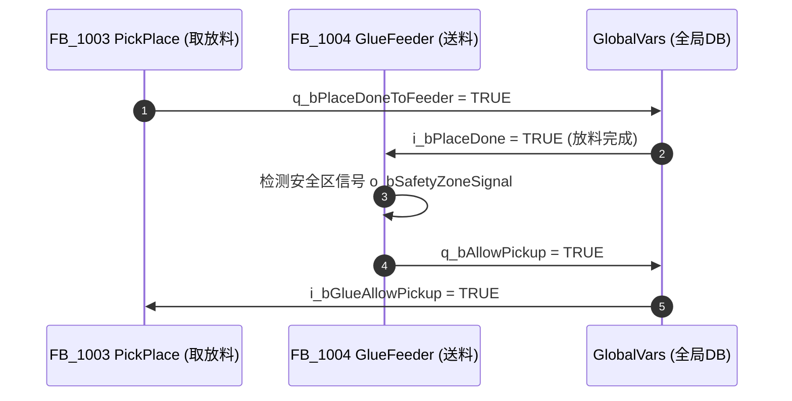

# 工站联锁矩阵、.scltest 智能生成与 008 驾驶舱/PM 联动指南 (refs/interlock-and-handoff-guide.md)

本参考指南定义了西门子 SCL 工程中**工站安全联锁矩阵**、**`.scltest` 4 标段智能测试打底**、**现场交付 Checklist** 的提取规程，以及与 **008 驾驶舱 (`auto-pm`)** 和 **PM 技能 (`pm-workflow`)** 的深度联动机制。

---

## 1. 工站安全联锁矩阵 (Interlock Matrix) 提炼与驾驶舱/CHG 联动

### 1.1 符号语法与提取源
利用 **Dynamic Siemens Language Support** 扩展解析 `OB1.scl` 与 `GlobalVars.db` 中工站间的形参/实参绑定（`:=` / `=>`）与安全区信号（如 `o_bSafetyZoneSignal`）。

### 1.2 联锁矩阵 Markdown 与 Mermaid 表达规范

在提炼多工站交握（如 `DJ-2026-005` 包含 4 层输送、取放料 FB_1003、打胶送料 FB_1004）时，需生成如下标准的交握矩阵与 Mermaid 顺序图：

#### 工站信号交握矩阵表：
| 源工站 / 输出信号 | 目标工站 / 输入信号 | 信号含义 | 安全/互锁依赖 | 极性与逻辑 |
|---|---|---|---|---|
| `fbPickPlace.q_bPlaceDoneToFeeder` | `fbGlueFeeder.i_bPlaceDone` | 取放料放料完成 | 安全区开启 (`o_bSafetyZoneSignal`) | 上升沿触发 |
| `fbGlueFeeder.q_bAllowPickup` | `fbPickPlace.i_bGlueAllowPickup` | 打胶机允许取料 | 打胶机无故障 | 电平有效 |

#### Mermaid 交互交握图：


### 1.3 驾驶舱与 CHG 变更传播链联动
1. **008 驾驶舱回写**：提取的矩阵自动同步回写到 `PM_SESSION_<PID>.md` 的 **§3 系统架构与工站交握视图**。
2. **CHG 传播链计算**：当使用 `pm-workflow` 创建变更单时，自动根据矩阵计算并填入 CHG 变更单 §6.2/§6.3 的“变更传播链 (Propagation Chain)”。

---

## 2. `.scltest` DSL 智能测试生成与 008 驾驶舱质量指标

### 2.1 4 标准段 (4-Standard-Blocks) 测试模板

根据扩展解析的 FB 接口（`VAR_INPUT` / `VAR_OUTPUT` / `VAR_IN_OUT`），智能生成包含以下 4 标段的 `.scltest` 脚本：

```st
// ============================================================================
// 功能块单元测试集: <FB_Name>.scltest
// ============================================================================

// ----------------------------------------------------------------------------
// TC01: 正常工艺主流程 (Auto/Manual Normal Flow)
// ----------------------------------------------------------------------------
TEST_CASE "TC01_NormalFlow"
    SET GlobalVars.stStation.i_bEnable := TRUE;
    SET GlobalVars.stStation.i_bAutoMode := TRUE;
    SET GlobalVars.stStation.i_bStart := TRUE;
    WAIT_CYCLES 3;
    ASSERT GlobalVars.stStation.o_bRunning = TRUE; // 工站进入自动运行中
END_TEST_CASE

// ----------------------------------------------------------------------------
// TC02: 超时与故障响应 (Timeout & Alarm Response)
// ----------------------------------------------------------------------------
TEST_CASE "TC02_TimeoutAlarm"
    SET GlobalVars.stStation.i_bEnable := TRUE;
    SET GlobalVars.stStation.i_bAutoMode := TRUE;
    SET GlobalVars.stStation.i_bSensorTimeout := TRUE; // 故意模拟传感器缺失
    WAIT_CYCLES 5;
    ASSERT GlobalVars.stStation.o_bFault = TRUE;       // 断言触发故障
    ASSERT GlobalVars.stStation.o_iAlarmCode > 0;     // 断言输出报警码
END_TEST_CASE

// ----------------------------------------------------------------------------
// TC03: 故障复位 (RESET Path)
// ----------------------------------------------------------------------------
TEST_CASE "TC03_ResetPath"
    SET GlobalVars.stStation.i_bReset := TRUE;
    WAIT_CYCLES 2;
    ASSERT GlobalVars.stStation.o_bFault = FALSE;      // 故障清除
    ASSERT GlobalVars.stStation.o_iAlarmCode = 0;      // 报警码复位清零
END_TEST_CASE

// ----------------------------------------------------------------------------
// TC04: 急停/开门硬切断 (E-Stop & Safety Interlock)
// ----------------------------------------------------------------------------
TEST_CASE "TC04_SafetyCutoff"
    SET GlobalVars.stStation.i_bEmergencyStop := TRUE;
    WAIT_CYCLES 1;
    ASSERT GlobalVars.stStation.o_bRunning = FALSE;    // 自动运行切断
    ASSERT GlobalVars.stStation.o_bValvesActive = FALSE;// 执行器输出强制清零
END_TEST_CASE
```

### 2.2 008 驾驶舱与 PM 里程碑联动
- **驾驶舱质量仪表盘 (Quality Gauge)**：运行 `auto-pm plc check` 的通过率自动上报至 `PM_SESSION` 驾驶舱。
- **PM 里程碑硬门禁**：`pm-workflow` 在 Release 阶段校验测试分数为 100% 后方允许关单。

---

## 3. 标准化现场交付 Checklist (`PLC_Handoff_Checklist.md`)

文件规范存放在 `06_文档与交付/上机复核/PLC_Handoff_Checklist_<PID>.md`，结构如下：

```markdown
# PLC 现场调试与上机复核 Checklist (<PID>)

## 1. ✅ 本地 LSP 验证承诺区 (100% 自动通过)
- [x] SCL 语法检查：0 Error / 0 Warning (遵循 LSP-905/904/903)
- [x] .plc.json 作用域与 SysLib 依赖解析通过
- [x] .scltest 自动化单元测试 100% 通过

## 2. ⚠️ 现场物理复核重点区 (需调试工程师设备旁打勾)
- [ ] **硬限位与原点**：伺服轴 (Z/X1/X2) 物理正负限位开关极性与 ORG 原点传感器测试
- [ ] **物理 IO 地址映射**：打胶机允许送料 (X76)、取料完成 (X102)、气缸双电磁阀控制逻辑
- [ ] **安全回路与急停**：现场急停按钮按压后，PROFINET 驱动器与电磁阀电源切断断开

## 3. 📝 现场调试参数实测记录表
| 参数名称 | SCL 默认值 | 现场实测最佳值 | 调试人 | 调试日期 |
|---|---|---|---|---|
| 送料超时时间 | 5000 ms | ______ ms | | |
| Z轴取料坐标 | 300.0 mm | ______ mm | | |
```

---

## 4. 双重测试验证要求 (CLI + GUI 缺一不可)

1. **CLI 命令行测试**：
   - 运行 `auto-pm plc check <PID> --json`
   - 运行 `auto-pm ledger reconcile <PID> --fix`
2. **GUI 真实启动测试**：
   - 真实启动窗口界面（如 Chrome/Web 驾驶舱视图或 GUI 窗口进程），在操作系统桌面呈现可视化结果。
