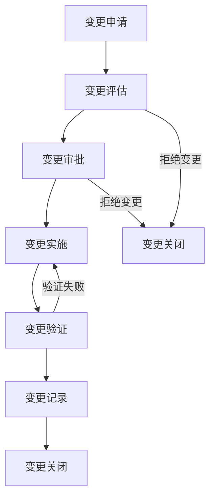
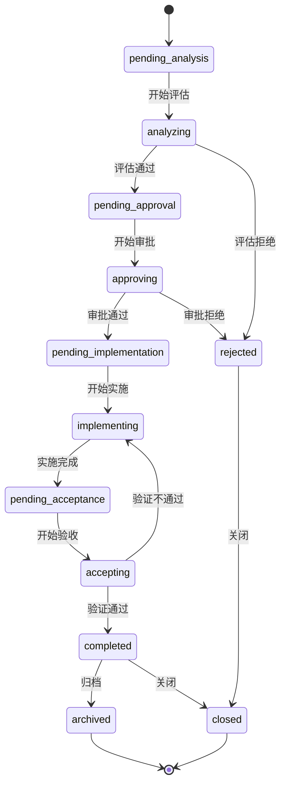

# 变更管理流程规范

## 1. 文档基础信息

**文档标题**：变更管理流程规范
**文档版本**：V2.1.0
**编制日期**: 2026-04-25
**编制人**: Trae (基于V2.0.0升级,来源项目:SW-2026-004)
**审核人**: [审核人姓名]

## 2. 版本变更记录

| 版本号 | 变更内容 | 变更人 | 变更日期 | 详细说明 |
|--------|----------|--------|----------|----------|
| [V1.0.0](#v100) | 初始版本 | 文档专家 | 2026-01-15 | [查看详细变更](#v100) |
| [V1.1.0](#v110) | 优化变更管理流程规范 | 文档专家 | 2026-03-10 | [查看详细变更](#v110) |
| **V2.0.0** | **重大升级: 从"软件变更管理"扩展为"工程变更管理"** | 系统 | 2026-04-12 | **[查看详细变更](#v200)** |
| **V2.1.0** | **增强: 基于SW-2026-004项目AI辅助开发实践新增3个自动化场景** | Trae | 2026-04-25 | **[查看详细变更](#v210)** |

## 3. 范围

本规范适用于所有**自动化工程项目**的变更管理活动，涵盖以下**7大技术领域**和**5种业务性质**：

### 3.1 技术领域（WHO - 哪个专业？）

| 领域代码 | 领域名称 | 典型交付物 |
|---------|----------|-----------|
| **ELEC** | 电气设计 | Eplan原理图、接线图、IO分配表、BOM清单、柜体布局图 |
| **MECH** | 机械结构 | SolidWorks 3D模型、装配图、加工图、结构件选型表 |
| **PLC** | PLC程序 | IEC 61131-3标准程序(SCL/ST/LD/FBD)、GVL变量表、功能块库 |
| **HMI** | HMI程序 | 触摸屏画面(ProFace/WinCC等)、变量映射表、报警配置、配方管理 |
| **SCPT** | Python脚本 | 数据采集程序、MES接口、上位机应用、工具脚本 |
| **DOCU** | 工程文档 | 设计说明书、操作手册、验收报告、培训材料、维护手册 |
| **SAFE** | 安全功能 | 急停回路设计、安全矩阵、SIL等级评估报告、安全PLC程序 |

### 3.2 业务性质（WHY - 为什么变？）

| 性质代码 | 性质名称 | 说明 | 典型场景 |
|---------|----------|------|----------|
| **REQ** | 需求变更 | 客户/市场/工艺驱动的新增或修改 | 客户新增第四段输送线 |
| **DEF** | 缺陷修复 | Bug修复、故障排除、设计纠错 | 现场调试发现联锁逻辑错误 |
| **OPT** | 优化改进 | 性能提升、可维护性改善、用户体验优化 | 重构FB以降低扫描周期占用 |
| **CFG** | 配置调整 | 参数修改、IO地址调整、通信配置变更 | 传感器更换后调整IO地址和延时参数 |
| **EMRG** | 紧急变更 | 安全相关、生产中断等需立即处理 | 急停回路增加安全继电器 |

### 3.3 影响范围（WHERE - 影响到什么程度？）

| 范围代码 | 范围名称 | 说明 | 审批要求 |
|---------|----------|------|----------|
| **LOCAL** | 局部变更 | 仅影响单个POU/单个画面/单个IO点/单行文档 | 项目经理审批 |
| **MODULE** | 模块级变更 | 影响单个设备/单条线/单个子系统 | 项目负责人审批 |
| **SYSTEM** | 系统级变更 | 影响多模块联动/联锁逻辑/通讯接口/全局变量 | 技术总监审批 |
| **CROSS** | 跨系统变更 | 影响PLC+HMI+电气+机械多个子系统(需关联多张变更单) | 高层管理层审批 |
| **SAFE** | 安全相关变更 | 影响急停回路/SIL等级/安全功能(特殊流程) | 安全负责人+高层联合审批 |

### 3.4 适用项目类型

| 项目类型 | 是否适用 | 说明 |
|---------|----------|------|
| 自动化整线项目(ZD) | ✅ 核心适用 | 多领域集成,变更传播链复杂 |
| 单机设备-机器人版 | ✅ 适用 | 机器人+PLC+HMI+安全多领域 |
| 单机设备-PLC-HMI版 | ✅ 适用 | PLC+HMI+电气+安全 |
| 系统升级项目(XT) | ✅ 适用 | 在原有系统上改造,影响评估尤为重要 |
| 上位机项目(WX) | ⚠️ 部分适用 | 主要涉及SCPT+DOCU,其他领域按需 |
| Python软件开发(SW) | ✅ 向下兼容 | 对应原V1.x的"Python项目",归入SCPT领域 |

## 4. 术语定义

| 术语 | 定义 |
|------|------|
| 变更 | 对项目计划、范围、进度、成本、质量或其他方面的修改 |
| 变更请求 | 正式提出的变更申请 |
| 变更审批 | 对变更请求进行评估和批准的过程 |
| 变更实施 | 执行已批准的变更的过程 |
| 变更验证 | 确认变更是否成功实施的过程 |
| **技术领域** | 变更所属的专业领域(电气/机械/PLC/HMI/Python/文档/安全) |
| **业务性质** | 变更的业务驱动因素(需求/缺陷/优化/配置/紧急) |
| **影响范围** | 变更对系统的影响程度(局部/模块/系统/跨系统/安全) |
| **变更传播链** | 一个领域的变更引发其他领域连锁变更的路径(如:电气→PLC→HMI→文档) |
| **关联变更单** | 因传播效应而需要同步发起的其他变更单编号 |
| **组件(Component)** | 工程项目中的最小可变更单元,如:单个POU/单个IO点/单个画面/单个3D零件/单张图纸 |

## 5. 变更管理流程

### 5.1 流程概览

### 5.2 变更单状态跟踪看板

变更单状态跟踪看板用于可视化展示所有变更单的状态，便于项目经理和相关人员实时掌握变更进展。看板采用看板形式展示，分为以下列：

| 看板列 | 状态标识 | 说明 |
|--------|----------|------|
| 待评估 | `pending_analysis` | 变更已提交，等待评估 |
| 评估中 | `analyzing` | 变更正在评估中 |
| 待审批 | `pending_approval` | 变更评估通过，等待审批 |
| 审批中 | `approving` | 变更正在审批中 |
| 待实施 | `pending_implementation` | 变更审批通过，等待实施 |
| 实施中 | `implementing` | 变更正在实施 |
| 待验收 | `pending_acceptance` | 变更实施完成，等待验收 |
| 验收中 | `accepting` | 变更正在验收 |
| 已完成 | `completed` | 变更验收通过 |
| 已关闭 | `closed` | 变更已关闭 |
| 已拒绝 | `rejected` | 变更被拒绝 |
| 已归档 | `archived` | 变更已归档 |

**看板交互规则：**
1. 变更单只能向前移动到相邻状态，不能跳跃
2. 变更单可以被拒绝或打回，需要记录原因
3. 验收不通过时，变更单返回实施阶段重新实施
4. 归档和关闭是最终状态

### 5.3 变更申请

1. **变更申请人**：项目团队成员、客户或其他相关方
2. **申请流程**：
   - 填写变更单，详细描述变更原因、变更内容和变更影响
   - 提交变更单给项目经理

### 5.4 变更评估

1. **评估人员**：项目经理、技术负责人、相关团队成员
2. **评估内容**：
   - 变更的必要性和合理性
   - 变更对项目范围、进度、成本、质量的影响
   - 变更的可行性和风险
   - **影响分析**：系统自动分析受影响的组件、风险等级和缓解措施
   - **跨领域影响评估**（V2.0新增）: 必须识别变更是否会影响其他技术领域,如:
     - 电气IO点位变化 → 是否影响PLC程序和HMI画面？
     - 机械结构修改 → 是否影响传感器安装位置和电气布线？
     - PLC程序逻辑变更 → 是否影响HMI显示和安全功能？
     - 安全回路修改 → 是否需要安全负责人专项审批？
3. **评估结果**：
   - 接受变更
   - 拒绝变更
   - 要求补充信息后重新评估
4. **影响分析要求**：
   - 所有变更必须进行影响分析
   - 影响分析结果需记录在变更单中
   - 风险等级分为：低（LOW）、中（MEDIUM）、高（HIGH）
   - 必须制定相应的缓解措施

### 5.5 变更审批

1. **审批人员**：根据变更的影响程度，由不同级别的人员审批
   - 轻微变更：项目经理审批
   - 中等变更：项目负责人审批
   - 重大变更：高层管理层审批
2. **审批流程**：
   - 审批人员审核变更评估结果
   - 签署审批意见
   - 通知变更申请人和相关团队成员
3. **审批历史记录**：
   - 所有审批操作必须记录审批历史
   - 审批历史包括：审批人、审批动作（通过/驳回）、审批意见、审批时间
   - 审批历史不可删除，只能追加
   - 审批历史对变更申请人和相关团队成员可见

### 5.6 变更实施

1. **实施人员**：相关团队成员
2. **实施流程**：
   - 制定变更实施计划
   - 执行变更
   - 记录变更实施过程
3. **实施要求**：
   - 确保变更不会影响其他项目活动
   - 确保变更符合项目质量标准
   - 及时沟通变更实施情况

### 5.7 变更验证

1. **验证人员**：项目经理、技术负责人、质量保证人员
2. **验证内容**：
   - 变更是否按照批准的内容实施
   - 变更是否达到预期效果
   - 变更是否对其他项目活动产生负面影响
3. **验证结果**：
   - 验证通过
   - 验证失败，需要重新实施

### 5.8 变更记录

1. **记录内容**：
   - 变更单编号和基本信息
   - 变更评估结果
   - 变更审批意见
   - 变更实施记录
   - 变更验证结果
2. **记录方式**：
   - 变更单存档 (每个变更一份独立档案, 存放在01_变更单/对应领域子目录)
   - 版本变更台帐记录 (引用模式, 每行指向独立变更单)
   - 项目状态报告中反映

## 6. 变更管理角色与职责

| 角色 | 职责 | 典型人员 |
|------|------|----------|
| 变更申请人 | 提出变更请求，提供变更相关信息 | 任何项目成员(电气/机械/PLC/HMI工程师等) |
| 项目经理 | 接收变更请求，组织变更评估，协调跨领域变更实施 | PM |
| 技术负责人 | 评估变更的技术可行性和影响 | Tech Lead / 架构师 |
| **领域专家** | **评估本领域的变更影响和实施方案** | **电气工程师/机械工程师/PLC工程师/HMI工程师/安全负责人** |
| 审批人 | 审批变更请求，确保变更符合项目目标 | 按影响范围分级(见§3.3) |
| 实施人员 | 执行已批准的变更 | 对应领域的工程师 |
| 验证人员 | 验证变更是否成功实施(含跨领域联动验证) | QA + 相关领域工程师 |

## 7. 变更管理工具

| 工具名称 | 用途 | 当前版本 |
|---------|------|:-------:|
| 变更单模板 | 用于填写变更请求 | [040_CHG-V2.0.0](../01_变更单/040_通用变更单模板_CHG-V2.0.0.md) |
| 版本变更台帐 | 用于记录变更历史(引用模式) | [041_CHG-V2.1.0](../04_变更记录/041_通用版本变更台帐模板_CHG-V2.1.0.md) |
| 目录结构说明 | 定义目录组织方式(精简版) | [043_PM-V2.1.0](./043_通用变更管理目录结构说明_PM-V2.1.0.md) |
| 项目管理软件 | 用于跟踪变更状态 | - |
| 文档管理系统 | 用于存储变更相关文档 | - |

## 8. 变更管理指标

| 指标名称 | 定义 | 计算方法 | 目标值 |
|---------|------|----------|--------|
| 变更响应时间 | 从变更申请到变更审批的时间 | 变更审批日期 - 变更申请日期 | ≤ 3个工作日 |
| 变更实施时间 | 从变更审批到变更实施完成的时间 | 变更实施完成日期 - 变更审批日期 | 根据变更复杂度而定 |
| 变更成功率 | 验证通过的变更数量与总变更数量的比率 | 验证通过的变更数量 / 总变更数量 × 100% | ≥ 95% |
| 变更对项目的影响程度 | 变更对项目范围、进度、成本的影响 | 通过变更影响分析评估 | 最小化 |

## 9. 变更管理最佳实践

1. **变更前置**：在项目规划阶段就考虑可能的变更，预留变更空间
2. **变更评估**：对所有变更进行充分评估，避免不必要的变更
3. **变更审批**：严格执行变更审批流程，确保变更得到适当的授权
4. **变更沟通**：及时沟通变更信息，确保所有相关方了解变更情况
5. **变更记录**：详细记录变更过程，便于追溯和分析
6. **变更学习**：总结变更经验教训，持续改进变更管理流程

## 10. 实施指南

### 10.1 变更申请实施步骤

1. **填写变更单**：
   - 使用[040_通用变更单模板_V2.0.0](../01_变更单/040_通用变更单模板_CHG-V2.0.0.md)
   - 详细描述变更原因、变更内容和变更影响
   - 明确变更优先级和期望完成时间

2. **提交变更单**：
   - 通过项目管理工具提交变更单
   - 通知相关人员变更申请已提交

### 10.2 变更评估实施步骤

1. **组建评估团队**：
   - 项目经理作为评估负责人
   - 技术负责人评估技术可行性
   - 相关团队成员评估变更影响

2. **评估内容**：
   - 变更的必要性和合理性
   - 变更对项目范围、进度、成本、质量的影响
   - 变更的可行性和风险

3. **评估报告**：
   - 形成书面评估报告
   - 明确评估结论和建议

### 10.3 变更审批实施步骤

1. **确定审批人**：
   - 轻微变更：项目经理审批
   - 中等变更：项目负责人审批
   - 重大变更：高层管理层审批

2. **审批流程**：
   - 审批人审核变更评估报告
   - 签署审批意见
   - 通知变更申请人和相关团队成员

### 10.4 变更实施步骤

1. **制定实施计划**：
   - 明确实施步骤和责任人
   - 确定实施时间和资源需求
   - 制定风险应对措施

2. **执行变更**：
   - 按照实施计划执行变更
   - 及时沟通实施进展
   - 记录实施过程中的问题和解决方案

3. **实施完成**：
   - 确认变更实施完成
   - 通知相关人员变更实施情况

### 10.5 变更验证步骤

1. **组建验证团队**：
   - 项目经理作为验证负责人
   - 技术负责人验证技术实现
   - 质量保证人员验证质量

2. **验证内容**：
   - 变更是否按照批准的内容实施
   - 变更是否达到预期效果
   - 变更是否对其他项目活动产生负面影响

3. **验证报告**：
   - 形成书面验证报告
   - 明确验证结论

### 10.6 变更记录步骤

1. **创建变更单档案**：
   - 按[043_目录结构说明_V2.1.0](./043_通用变更管理目录结构说明_PM-V2.1.0.md)存放至`01_变更单/CHG-[DOMAIN]/`
   - 命名规则: `CHG-[DOMAIN]-[YYYY]-XXX.md`
   - 记录完整的变更生命周期(§1~§10)

2. **更新版本变更台帐**：
   - 使用[041_版本变更台帐模板_V2.1.0](../04_变更记录/041_通用版本变更台帐模板_CHG-V2.1.0.md)
   - 在§4追加一行引用(含超链接到变更单文件)

3. **更新项目状态**：
   - 在项目状态报告中反映变更情况
   - 确保项目计划与变更保持一致

### 10.7 常见问题解决方案

| 问题 | 解决方案 | 示例 |
|------|---------|------|
| 变更评估不充分 | 建立评估 checklist，确保评估内容全面 | 使用标准化的评估表格 |
| 变更审批延迟 | 设定审批时限，建立催办机制 | 对超过3个工作日未审批的变更进行催办 |
| 变更实施偏差 | 严格按照变更单执行，定期检查实施进度 | 每日更新变更实施状态 |
| 变更验证不严格 | 建立验证标准，确保验证内容完整 | 使用标准化的验证表格 |
| 变更记录不完整 | 建立记录模板，确保记录内容全面 | 使用标准化的变更记录模板 |

## 11. AI辅助开发场景的变更管理

> **新增于 V2.1.0** | 来源项目: SW-2026-004 Python项目管理工具 (AI辅助开发经验)

本章节针对AI辅助开发（如Trae、Copilot等工具）引入的3个典型自动化场景，提供专门的变更管理流程和简化规则。

### 11.1 AI辅助代码生成场景

**适用范围**: 当使用AI工具(Trae/Copilot等)批量生成或修改代码时

**变更流程**:

1. **生成前准备**
   - 确认AI生成的代码遵循当前有效的规范版本号
   - 在生成请求中明确指定规范版本(如"基于905_SCL编程规范_V1.0.1")

2. **生成后审查**
   - 对比AI输出与规范的差异点
   - 将差异项记录为"AI生成偏差清单"

3. **变更审批**
   - 差异项<5处: 开发者自审即可合并
   - 差异项5~20处: 需要同行评审
   - 差异项>20处: 必须重新生成并回归验证

### 11.2 批量规范同步场景

**适用范围**: 当全局规范仓库更新后需要同步到多个在研项目时

**操作步骤**:

1. 规范管理员发布新版规范到全局仓库
2. 各项目负责人接收"规范更新通知"
3. 项目组评估影响范围(高/中/低):
   - 高影响: 必须在下一迭代前完成同步
   - 中影响: 可在2个迭代窗口内完成
   - 低影响: 可延后到下一个大版本
4. 同步完成后在项目中创建"规范同步记录"

### 11.3 自动化测试触发场景

**适用范围**: 当CI/CD流水线自动运行测试套件时发现规范偏差

**简化规则**:

| 测试类型 | 触发条件 | 变更单创建规则 | 审批要求 |
|---------|---------|---------------|---------|
| 单元测试 | 测试失败且与规范相关 | 自动创建变更单 | 无需人工初审 |
| 集成测试 | 测试失败 | 开发者确认后创建变更单 | 需开发者确认 |
| 回归测试 | 测试失败 | 必须升级为"紧急变更" | 按EMRG流程处理 |

## 12. 版本详细变更说明

### V1.0.0 版本详细变更
1. 初始版本创建
2. 定义变更管理流程的基本规范
3. 提供详细的变更管理流程和角色职责

### V1.1.0 版本详细变更
1. 优化变更管理流程规范
2. 添加文档基础信息部分
3. 改进版本变更记录格式
4. 增加版本详细变更说明部分

### V2.0.0 版本详细变更 (重大升级)
1. **范围扩展**: 从"Python项目"升级为"自动化工程项目",覆盖7大技术领域+5种业务性质+5级影响范围
2. **术语增强**: 新增6个工程变更专用术语(技术领域/业务性质/影响范围/传播链/关联变更单/组件)
3. **影响分析升级**: §5.4新增跨领域影响评估要求,强制识别变更传播链
4. **角色扩展**: §6新增"领域专家"角色,明确各工程专业在变更中的职责
5. **工具引用升级**: §7所有模板引用已更新为最新版本号(V2.0/V2.1)
6. **记录方式升级**: §5.8明确引用模式(变更单=档案, 台帐=索引)
7. **向下兼容**: 保留原有流程框架,Python软件开发项目可通过SCPT领域继续使用

### V2.1.0 版本详细变更 (增强)
1. **新增AI辅助开发场景章节**: §11完整新增,涵盖3个自动化场景的专用变更管理流程
2. **AI辅助代码生成场景** (§11.1): 定义生成前准备→生成后审查→分级审批的完整流程,按差异项数量(</5/5-20/>20)设置三级审批门槛
3. **批量规范同步场景** (§11.2): 建立全局仓库→项目接收→影响评估(高/中/低)→同步记录的标准化操作步骤
4. **自动化测试触发场景** (§11.3): 针对CI/CD流水线制定简化规则,单元测试自动创建变更单、集成测试需确认、回归测试升级紧急流程
5. **来源追溯**: 所有新增内容基于SW-2026-004项目的AI辅助开发实践经验提炼

## 13. 附录

### 13.1 参考资料
| 资料名称 | 版本 | 来源 |
|----------|------|------|
| 项目管理知识体系指南 | [版本] | [来源] |
| 变更管理最佳实践 | [版本] | [来源] |
| 软件工程标准 | [版本] | [来源] |

### 13.2 联系方式
| 角色 | 姓名 | 邮箱 | 电话 |
|------|------|------|------|
| 文档负责人 | [姓名] | [邮箱] | [电话] |
| 技术负责人 | [姓名] | [邮箱] | [电话] |

---

**文档版本**: V2.1.0
**编制日期**: 2026-04-25
**编制人**: Trae (基于V2.0.0升级,来源项目:SW-2026-004)
**审核人**: [审核人姓名]
