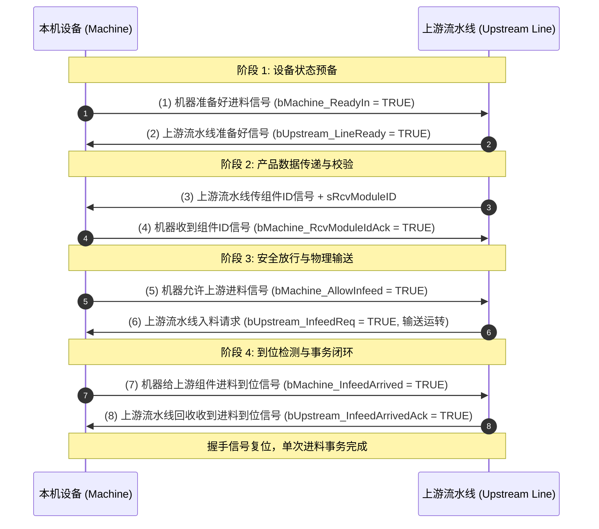
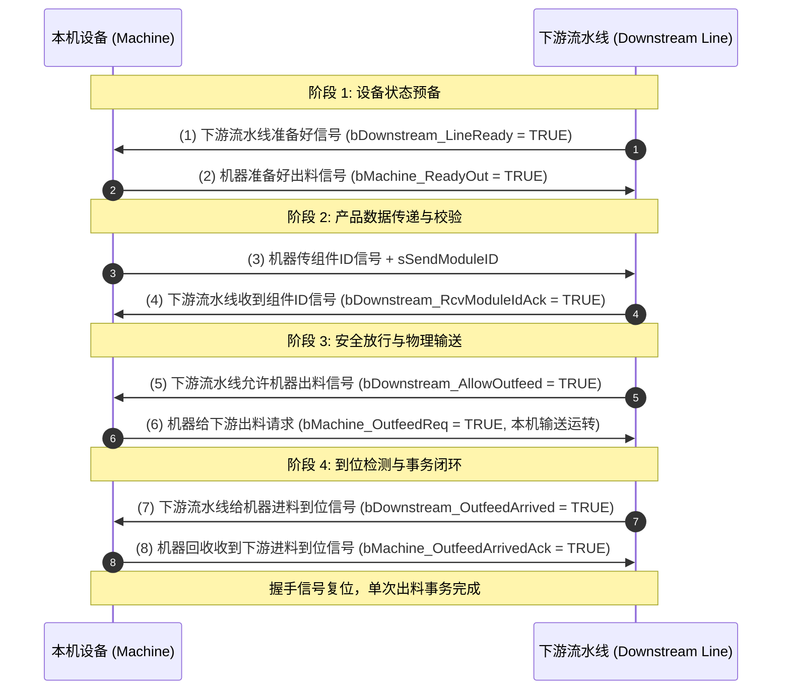

# 设备间信号交握与外部对接规范 (STD-820)

## 1. 规范基础信息

| 属性 | 内容 |
|:---|:---|
| **规范编号** | `STD-820` |
| **规范名称** | 设备间信号交握与外部对接规范 |
| **版本号** | `V1.0.0` |
| **编制日期** | 2026-08-22 |
| **适用领域** | PLC 自动化域、M2M 产线设备交握、上位流水线对接 |
| **遵循标准** | IEC 61131-3, LSP-905 SCL编程规范, INT-815 接口规范 |

---

## 2. 核心对接协议与时序体系

自动化流水线中，单机设备与上下游流水线/机器人/AGV 之间采用 **8 步闭环双向握手时序 (8-Step Handshake Protocol)**，并配合 **4s ON / 4s OFF 双向心跳监视**。

### 2.1 上游进料 8 步握手协议 (Infeed Handshake)



### 2.2 下游出料 8 步握手协议 (Outfeed Handshake)



---

## 3. 心跳监视标准 (Heartbeat Specification)

- **心跳翻转周期**：**4.0 秒 ON，4.0 秒 OFF**（整周期 8.0 秒，方波占空比 50%）；
- **超时报警阈值**：**12.0 秒**（即连续 1.5 个周期未检测到心跳电平翻转，触发 `ComFault` 通讯中断报警）；
- **安全联动**：通讯中断时，自动撤销 `Ready`、`AllowInfeed` 与 `AllowOutfeed`，阻断跨机输送动作。

---

## 4. 标准数据类型定义 (SCL UDT)

```scl
TYPE ST_UpstreamDocking :
STRUCT
    // 本机 -> 上游 (Machine Output)
    bMachine_ReadyIn            : BOOL;     (* (1) 机器准备好进料信号 *)
    bMachine_RcvModuleIdAck     : BOOL;     (* (4) 机器收到组件ID信号 *)
    bMachine_AllowInfeed        : BOOL;     (* (5) 机器允许上游进料信号 *)
    bMachine_InfeedArrived      : BOOL;     (* (7) 机器给上游组件进料到位信号 *)
    bMachine_HeartbeatToUp      : BOOL;     (* [心跳] 本机向上游心跳 (4s ON / 4s OFF) *)

    // 上游 -> 本机 (Upstream Output)
    bUpstream_LineReady         : BOOL;     (* (2) 上游流水线准备好信号 *)
    bUpstream_SendModuleId      : BOOL;     (* (3) 上游流水线传组件ID信号 *)
    bUpstream_InfeedReq         : BOOL;     (* (6) 上游流水线入料请求信号 *)
    bUpstream_InfeedArrivedAck  : BOOL;     (* (8) 上游回收收到进料到位信号 *)
    bUpstream_HeartbeatFromUp   : BOOL;     (* [心跳] 上游输入心跳 *)

    // 数据与状态
    sRcvModuleID                : STRING[32]; (* 接收的组件 ID *)
    bUpstreamComFault           : BOOL;     (* 上游通讯中断报警 (12s 超时) *)
    iInfeedStep                 : INT;      (* 当前步序 0~8 *)
END_STRUCT
END_TYPE

TYPE ST_DownstreamDocking :
STRUCT
    // 本机 -> 下游 (Machine Output)
    bMachine_ReadyOut           : BOOL;     (* (2) 机器准备好出料信号 *)
    bMachine_SendModuleId       : BOOL;     (* (3) 机器传组件ID信号 *)
    bMachine_OutfeedReq         : BOOL;     (* (6) 机器给下游出料请求信号 *)
    bMachine_OutfeedArrivedAck  : BOOL;     (* (8) 机器回收收到进料到位信号 *)
    bMachine_HeartbeatToDown    : BOOL;     (* [心跳] 本机向下游心跳 (4s ON / 4s OFF) *)

    // 下游 -> 本机 (Downstream Output)
    bDownstream_LineReady       : BOOL;     (* (1) 下游流水线准备好信号 *)
    bDownstream_RcvModuleIdAck  : BOOL;     (* (4) 下游流水线收到组件ID信号 *)
    bDownstream_AllowOutfeed    : BOOL;     (* (5) 下游流水线允许机器出料信号 *)
    bDownstream_OutfeedArrived  : BOOL;     (* (7) 下游流水线给机器进料到位信号 *)
    bDownstream_HeartbeatFromDown: BOOL;    (* [心跳] 下游输入心跳 *)

    // 数据与状态
    sSendModuleID               : STRING[32]; (* 发送给下游的组件 ID *)
    bDownstreamComFault         : BOOL;     (* 下游通讯中断报警 (12s 超时) *)
    iOutfeedStep                : INT;      (* 当前步序 0~8 *)
END_STRUCT
END_TYPE

TYPE ST_ExternalDevice :
STRUCT
    stUpstream      : ST_UpstreamDocking;
    stDownstream    : ST_DownstreamDocking;
    bEmergencyStop  : BOOL;                 (* 外部急停联动 *)
    bSafetyDoorOK   : BOOL;                 (* 外部安全门状态 *)
    bAnyComFault    : BOOL;                 (* 外部通讯综合故障 *)
END_STRUCT
END_TYPE
```
