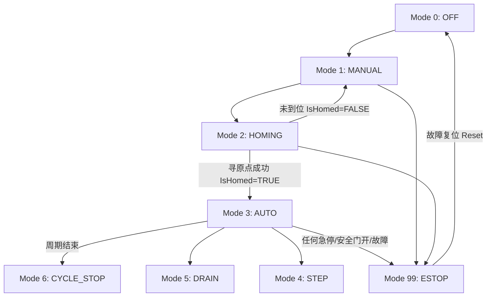

# STD-830: 工位运行模式与 OMAC 状态机控制规范

> **规范定位**：参考汽车制造行业标准（西门子 SICAR / OMAC PackML），统一所有自动化工位、单机设备与产线单元的运行模式与状态转移控制架构。
> **核心铁律**：严禁在未完成寻原点（`IsHomed = FALSE`）状态下直接切入自动运行（`AUTO`）。

---

## 1. OMAC 八大标准运行模式定义

所有工位状态机必须具备以下 8 大标准模式状态，并由 `FB_Station_Mode` 进行集中调度：

| 模式编号 | 模式枚举名称 | 中文定义 | 核心行为与允许动作 |
| :---: | :--- | :--- | :--- |
| **0** | `MODE_OFF` | 脱机/停机 | 工位不参与生产，切断所有自动动作输出，允许断电检修。 |
| **1** | `MODE_MANUAL` | 手动单动 | 允许在 HMI 画面点动单个气缸、电机、伺服，受软限位与互锁保护。 |
| **2** | `MODE_HOMING` | 自动寻原点 | 触发工位按预设工艺时序自动回退至安全原点（Base Position）。 |
| **3** | `MODE_AUTO` | 全自动运行 | 连续循环自动生产，严格受上游进料与下游出料安全联锁控制。 |
| **4** | `MODE_STEP` | 自动单步调试 | 每按一次“单步触发”按钮推进一个工艺步序，用于现场试车与排障。 |
| **5** | `MODE_DRAIN` | 排空/清线 | 不再接收新来料，自动将工位内部已有工件加工并输送出站。 |
| **6** | `MODE_CYCLE_STOP`| 周期暂停 | 当前正在加工的工序完成后自动在周期末停下，不破坏在制品。 |
| **99** | `MODE_ESTOP` | 急停/安全切断 | 毫秒级封锁所有动力输出，强制切入故障安全态。 |

---

## 2. 状态转移矩阵与安全防呆门禁



### 2.1 强力防呆阻断铁律
1. **未寻原点禁止切入自动**：当接收到 `ReqAuto := TRUE` 时，若 `q_stSts.IsHomed = FALSE`，状态机**必须强制降级并留在 `MODE_MANUAL`**，向 HMI 输出“请先执行回原点”提示。
2. **急停最高优先级**：急停信号或安全门断开时，无条件在当拍 PLC 周期内将状态强制覆盖为 `MODE_ESTOP (99)`，并清零所有运行标志。

---

## 3. 标准接口契约 (SCL 数据结构)

```pascal
TYPE ST_StationModeCmd :
STRUCT
    ReqOff          : BOOL;  // 请求脱机模式
    ReqManual       : BOOL;  // 请求手动模式
    ReqHoming       : BOOL;  // 请求自动寻原点
    ReqAuto         : BOOL;  // 请求全自动运行
    ReqStep         : BOOL;  // 请求单步调试
    ReqDrain        : BOOL;  // 请求排空模式
    ReqCycleStop    : BOOL;  // 请求周期暂停
    ReqEStop        : BOOL;  // 急停/安全切断
    Reset           : BOOL;  // 故障复位
    Start           : BOOL;  // 启动按钮
    Stop            : BOOL;  // 停止按钮
END_STRUCT
END_TYPE
```

---

## 4. 版本记录

| 版本 | 日期 | 变更内容 | 责任人 |
| :--- | :--- | :--- | :--- |
| **V1.0.0** | 2026-08-23 | 首次发布，经 DJ-2026-008 实战工程验证生效 | Antigravity & auto-pm team |
