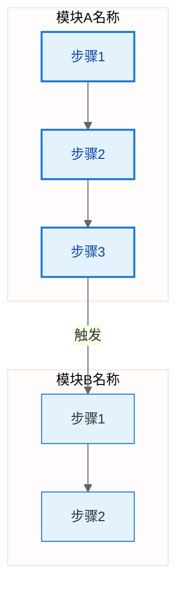

# Mermaid图表工作流规范

## 1. 文档基础信息

**文档编号**：TOOL-906
**文档标题**：Mermaid图表工作流规范
**文档版本**：V2.0.0
**编制日期**：2026-05-27
**适用范围**：工作空间内所有项目的流程图、架构图、时序图等图表的创建、管理与导出

## 2. 版本变更记录

| 版本号 | 变更内容 | 变更人 | 变更日期 |
|--------|----------|--------|----------|
| V2.0.0 | 从"工具使用指南"升级为"图表工作流规范"，新增用户故事、工作流、图表与文档集成规范 | AI助手 | 2026-05-27 |
| V1.0.0 | 初始版本（仅工具使用） | AI助手 | 2026-05-27 |

## 3. 用户故事

### US-1：需求文档需要配流程图

> **作为** 项目经理/系统工程师
> **我想要** 在编写PRD或需求规格说明书时，同时产出工艺流程图
> **以便** 让评审人员直观理解业务流程，减少文字歧义

**触发场景**：编写 PRD-001 产品需求文档、REQ-020 需求分析文档、REQ-028 迭代需求规格说明书

### US-2：详细设计需要配流程图

> **作为** PLC/软件开发工程师
> **我想要** 在详细设计说明书中为每个模块绘制流程图
> **以便** 编码前确认逻辑正确性，减少返工

**触发场景**：编写 DES-021 详细设计说明书、PLC 功能块设计文档

### US-3：流程图需要导出为高清图片

> **作为** 项目成员
> **我想要** 将 Mermaid 流程图导出为高清 PNG/SVG 图片
> **以便** 嵌入 Word/PPT 文档、打印张贴、邮件分享

**触发场景**：文档评审、客户汇报、打印交付

### US-4：流程图需要随需求变更同步更新

> **作为** 项目成员
> **我想要** 流程图与需求文档保持版本同步
> **以便** 避免文档与图表不一致导致的开发错误

**触发场景**：需求变更（CHG-040）、迭代推进

### US-5：批量导出项目所有图表

> **作为** 项目经理
> **我想要** 一键导出项目中所有 .mmd 图表为图片
> **以便** 交付时统一打包，无需逐个手动操作

**触发场景**：项目交付（PM-050 验收核验报告）、版本发布

## 4. 图表工作流

### 4.1 总体工作流

```
需求/设计文档编写 → 识别需要图表的章节 → 创建/更新 .mmd 文件 → 预览验证 → 导出图片 → 嵌入文档
       ↑                                                           ↓
       └────────────── 需求变更时同步更新图表 ←──────────────────────┘
```

### 4.2 详细步骤

#### Step 1：识别图表需求

在编写以下文档时，**必须**评估是否需要配流程图：

| 文档类型 | 规范编号 | 应配图的章节 |
|---------|---------|-------------|
| 产品需求文档 | PRD-001 | §4 核心流程（用户流程、业务流程） |
| 需求分析文档 | REQ-020 | §4 功能需求（复杂交互流程） |
| 迭代需求规格说明书 | REQ-028 | 功能用例流程 |
| 详细设计说明书 | DES-021 | §5.x.5 流程图（每个模块） |
| PLC程序设计文档 | - | 自动工艺流程图、状态转换图 |
| 技术方案文档 | TECH-014 | 系统架构图、数据流图 |

#### Step 2：选择图表模式

| 模式 | 适用场景 | 文件组织 | 示例 |
|------|---------|---------|------|
| **内嵌模式** | 图表简单（<15个节点）、仅服务当前文档 | Mermaid代码块写在 .md 文档内 | `018_DJ-2026-005_自动工艺流程图_FLOW-V2.0.0.md` 中的状态图 |
| **独立模式** | 图表复杂（>=15个节点）、多文档引用、需单独导出 | 独立 .mmd 文件，与文档同目录 | `边框缓存机工艺流程图_V2.mmd` |

**判断规则**：
- 节点数 < 15 且仅被1个文档引用 → 内嵌模式
- 节点数 >= 15 或被多个文档引用 → 独立模式
- PLC 工艺流程图 → **强制独立模式**（需导出张贴）

#### Step 3：创建 .mmd 文件（独立模式）

文件命名：`<图表名称>_V<主版本号>.mmd`

放置位置：与引用它的文档**同目录**

```
01_需求与设计/13_软件方案/
├── 012_DJ-2026-005_需求规格说明书_REQ-V2.0.0.md   ← 引用图表的文档
├── 边框缓存机工艺流程图_V2.mmd                     ← 独立图表文件
└── 边框缓存机工艺流程图_V2.png                     ← 导出的图片（可选）
```

#### Step 4：编写 Mermaid 代码

**模板**（flowchart TD，从上到下）：



**编写规范**：
- 子图标题使用纯文本，**禁止使用 Emoji**（部分渲染引擎不支持）
- 节点内换行使用 `\n`，**禁止使用 `<br/>`**（HTML标签兼容性不稳定）
- 每个模块用 `subgraph` 分组，并用 `classDef` 统一配色
- 配色方案参考 §7 标准色板

#### Step 5：预览验证

在 Trae 中打开 .mmd 文件，使用 `vscode-mermaid-editor` 插件实时预览。

> ⚠️ 插件的 Copy Image（Ctrl+Alt+;）功能因 Trae WebView 沙箱限制不可用，需使用 §6 的导出工具。

#### Step 6：导出图片

使用 mmdc 命令行工具导出（详见 §6）：

```powershell
mmdc -i "边框缓存机工艺流程图_V2.mmd" -o "边框缓存机工艺流程图_V2.png" -w 2400 -b white -s 2
```

#### Step 7：嵌入文档

**内嵌模式**：Mermaid 代码块直接写在 .md 中，无需导出。

**独立模式**：在 .md 文档中通过相对路径引用导出的图片：

```markdown
### 4.1 工艺流程


> 源文件：[边框缓存机工艺流程图_V2.mmd](边框缓存机工艺流程图_V2.mmd)
```

#### Step 8：变更同步

需求变更时，按以下顺序更新：

1. 更新 .mmd 源文件
2. 重新导出 PNG/SVG
3. 更新引用该图表的 .md 文档中的说明文字
4. 在 PM_SESSION 的 change_log 中记录变更

## 5. 图表与文档集成规范

### 5.1 目录组织

```
<项目根目录>/
├── 01_需求与设计/
│   └── 13_软件方案/
│       ├── 012_DJ-2026-005_需求规格说明书_REQ-V2.0.0.md
│       ├── 边框缓存机工艺流程图_V2.mmd          ← 图表源文件
│       └── 边框缓存机工艺流程图_V2.png          ← 导出图片
├── 02_PLC程序/
│   └── 程序文档/
│       └── 018_DJ-2026-005_自动工艺流程图_FLOW-V2.0.0.md  ← 内嵌Mermaid代码块
```

### 5.2 文档中引用图表的标准写法

```markdown
### X.X 图表标题


> 源文件：[图表名称_Vx.mmd](相对路径/图表名称_Vx.mmd) | 最后导出：YYYY-MM-DD
```

### 5.3 版本同步规则

| 场景 | 操作 |
|------|------|
| .mmd 内容修改 | 必须重新导出对应的 PNG/SVG |
| 需求变更影响流程 | 先更新 .mmd，再导出，再更新 .md 文字描述 |
| .mmd 版本升级（V2→V3） | 旧版 PNG 保留或移入 `_archive/`，导出新版 PNG |
| 批量导出 | 使用 §6.4 的批量导出命令，确保所有图片与源文件同步 |

## 6. 导出工具链

### 6.1 工具分工

| 工具 | 用途 | 操作方式 | 状态 |
|------|------|---------|------|
| `vscode-mermaid-editor` | 编辑+预览 .mmd 文件 | IDE 内实时预览 | ✅ 可用 |
| `mmdc` (mermaid-cli) | 导出高清图片 | 终端命令行 | ✅ 已安装 |
| `export-mermaid.ps1` | 一键导出封装 | PowerShell | ✅ 已创建 |
| `mermaid-editor` Copy Image | 复制图片到剪贴板 | Ctrl+Alt+; | ❌ 不可用（沙箱限制） |

### 6.2 安装

```powershell
npm install -g @mermaid-js/mermaid-cli
mmdc --version
```

当前环境路径：

| 项目 | 路径 |
|------|------|
| Node.js | `C:\Users\fubai\.trae-cn\binaries\node\versions\24.13.0\node.exe` |
| mmdc | `C:\Users\fubai\.trae-cn\binaries\node\global\mmdc.cmd` |
| 一键脚本 | `.trae\bin\export-mermaid.ps1` |

### 6.3 单文件导出

```powershell
mmdc -i "流程图.mmd" -o "流程图.png" -w 2400 -b white -s 2
```

| 参数 | 含义 | 推荐值 |
|------|------|--------|
| `-i` | 输入文件路径 | - |
| `-o` | 输出文件路径（按扩展名选格式） | - |
| `-w` | 输出宽度（px） | `2400` |
| `-s` | 缩放倍数 | `2`（高清） |
| `-b` | 背景颜色 | `white` |
| `-t` | 主题 | `default` |
| `-c` | Mermaid配置文件 | 按需 |

输出格式：PNG（位图/文档嵌入）、SVG（矢量/网页）、PDF（打印），按 `-o` 扩展名自动选择。

### 6.4 批量导出

```powershell
$mmdc = "C:\Users\fubai\.trae-cn\binaries\node\global\mmdc.cmd"
Get-ChildItem -Recurse -Filter "*.mmd" | ForEach-Object {
    $out = $_.FullName -replace '\.mmd$','.png'
    & $mmdc -i $_.FullName -o $out -w 2400 -s 2 -b white
    Write-Host "OK: $out" -ForegroundColor Green
}
```

### 6.5 一键脚本

```powershell
.\export-mermaid.ps1 -InputFile "流程图.mmd"
.\export-mermaid.ps1 -InputFile "流程图.mmd" -Format svg -Width 3000 -Scale 3
```

### 6.6 CLI 接口定义

```
mmdc -i <input> -o <output> [-w <width>] [-s <scale>] [-b <bgColor>] [-t <theme>] [-c <config>]
```

### 6.7 PowerShell 脚本接口

```
export-mermaid.ps1 -InputFile <string> [-OutputFile <string>] [-Format png|svg|pdf] [-Width <int>] [-Scale <double>]
```

| 参数 | 类型 | 必填 | 默认值 | 说明 |
|------|------|------|--------|------|
| InputFile | string | 是 | - | .mmd 源文件路径 |
| OutputFile | string | 否 | 同名同目录换扩展名 | 输出文件路径 |
| Format | enum | 否 | png | 输出格式：png/svg/pdf |
| Width | int | 否 | 2400 | 输出宽度（px） |
| Scale | double | 否 | 2.0 | 缩放倍数 |

### 6.8 Mermaid 配置文件接口（可选）

通过 `-c` 参数指定 JSON 配置文件：

```json
{
  "theme": "base",
  "themeVariables": {
    "primaryColor": "#E3F2FD",
    "primaryBorderColor": "#1976D2",
    "lineColor": "#666",
    "fontSize": "14px"
  },
  "flowchart": {
    "useMaxWidth": true,
    "htmlLabels": true,
    "curve": "basis"
  }
}
```

## 7. 标准色板

| 用途 | 填充色 | 边框色 | 文字色 | classDef 名称 |
|------|--------|--------|--------|--------------|
| 初始化/系统 | #E3F2FD | #1976D2 | #0D47A1 | initStyle |
| 输送/物流 | #E1F5FE | #0288D1 | #01579B | conveyorStyle |
| 取放/操作 | #E8F5E8 | #2E7D32 | #1B5E20 | pickPlaceStyle |
| 送料/外部交互 | #F3E5F5 | #7B1FA2 | #4A148C | feederStyle |
| 安全/急停 | #FFEBEE | #C62828 | #B71C1C | safetyStyle |
| 报警/警告 | #FFF3E0 | #E65100 | #BF360C | alarmStyle |
| 通用/默认 | #F5F5F5 | #616161 | #212121 | defaultStyle |

## 8. 文件命名约定

| 文件类型 | 命名格式 | 示例 |
|---------|---------|------|
| Mermaid源文件 | `<图表名称>_V<版本号>.mmd` | `边框缓存机工艺流程图_V2.mmd` |
| 导出PNG | `<图表名称>_V<版本号>.png` | `边框缓存机工艺流程图_V2.png` |
| 导出SVG | `<图表名称>_V<版本号>.svg` | `边框缓存机工艺流程图_V2.svg` |
| Mermaid配置 | `<项目编号>_mermaid-config.json` | `DJ-2026-005_mermaid-config.json` |

## 9. Draw.io 旧文件处理

工作空间中存在 `.drawio` 格式的旧图表文件，处理策略：

| 场景 | 处理方式 |
|------|---------|
| 旧 .drawio 文件无需修改 | 保留原格式，用 Draw.io 桌面版编辑/导出 |
| 旧 .drawio 文件需要更新 | 转换为 .mmd 格式后按本规范管理 |
| 新建图表 | **统一使用 .mmd 格式** |

转换方法：手动将 drawio 内容改写为 Mermaid 语法，或使用 AI 辅助转换。

## 10. 常见问题

### Q1: mmdc 执行报错 "Could not find chrome/chromium"

mmdc 依赖 Puppeteer 捆绑的 Chromium。首次运行时自动下载到 `~/.cache/puppeteer/`。下载失败时：

```powershell
$env:PUPPETEER_SKIP_CHROMIUM_DOWNLOAD = "false"
npm install -g @mermaid-js/mermaid-cli
```

### Q2: 导出 PNG 中文乱码

mmdc 使用 Chromium 渲染，需确保系统安装了中文字体。Windows 默认已包含，Linux 需安装 `fonts-noto-cjk`。

### Q3: 子图标题中能否使用 Emoji？

不建议。部分渲染引擎（含 mmdc 的 Chromium headless）对 Emoji 支持不稳定，可能导致导出失败。

### Q4: Copy Image 为什么不可用？

Trae IDE 的 WebView 沙箱禁用了 `navigator.clipboard.write([ClipboardItem])` API，这是 IDE 环境限制，与插件版本无关。使用 mmdc 命令行导出替代。

### Q5: 内嵌模式和独立模式如何选择？

节点数 < 15 且仅被1个文档引用 → 内嵌模式（Mermaid代码块写在.md内）
节点数 >= 15 或被多个文档引用 → 独立模式（.mmd文件 + 导出图片引用）
PLC 工艺流程图 → 强制独立模式

## 11. 完整工作流示例

以 DJ-2026-005 边框缓存机项目为例：

```
1. 编写需求规格说明书 (REQ-V2.0.0)
   → 识别 §4 核心流程需要工艺流程图
   → 节点数 > 15，选择独立模式

2. 创建 .mmd 文件
   → 边框缓存机工艺流程图_V2.mmd
   → 放在 01_需求与设计/13_软件方案/ 目录下

3. 编写 Mermaid 代码
   → 6个subgraph: 系统初始化/4层输送机/取放料机构/给打胶机送料/安全管理/报警管理
   → 使用标准色板配色

4. 预览验证
   → Trae 中打开 .mmd 文件，确认渲染正确

5. 导出图片
   → mmdc -i "边框缓存机工艺流程图_V2.mmd" -o "边框缓存机工艺流程图_V2.png" -w 2400 -s 2

6. 嵌入文档
   → 在需求规格说明书中引用：
     
     > 源文件：[边框缓存机工艺流程图_V2.mmd](边框缓存机工艺流程图_V2.mmd)

7. 需求变更时
   → 更新 .mmd → 重新导出 PNG → 更新 .md 文字描述 → 记录 change_log
```
