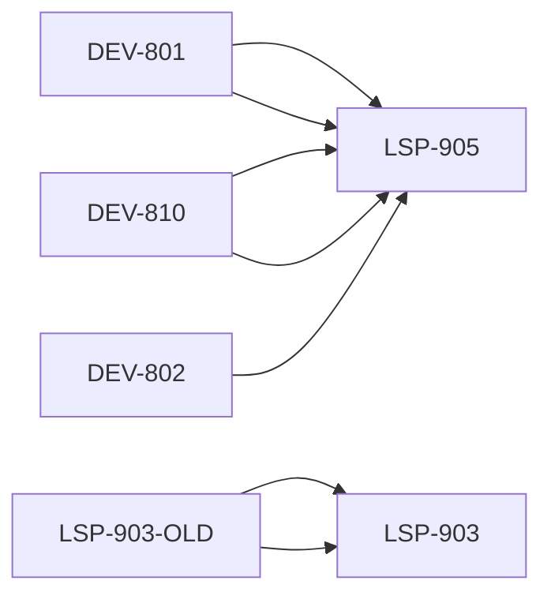

# 规范元数据汇总报告

> 生成日期: 2026-05-26
> 数据来源: spec_registry.json v1.0.0
> 工作空间: My_Workspace

---

## 总览

| 指标 | 数值 |
|------|------|
| 规范总数 | **56** |
| 🟢 活跃(stable) | **52** |
| 🟡 已废弃(deprecated) | **3** |
| ⚪ 已归档(archived) | **1** |

### 按域分布

| 域 | 说明 | 数量 |
|----|------|------|
| `pm` | 项目管理域 - 与技术栈无关的通用PM流程规范 | 39 |
| `plc` | PLC自动化域 - Siemens LSP/SCL/PLC编程相关规范 | 12 |
| `python` | Python开发域 - Python/Qt/FastAPI相关规范 | 4 |
| `cross-domain` | 跨域通用 - 所有技术栈共用的工具/流程 | 1 |

---

### 按类型前缀分布

| 类型前缀 | 数量 |
|----------|------|
| `PM` | 17 |
| `DEV` | 14 |
| `LSP` | 5 |
| `REQ` | 3 |
| `CHG` | 2 |
| `TOOL` | 2 |
| `INT` | 2 |
| `PRD` | 1 |
| `TECH` | 1 |
| `PROJ` | 1 |
| `TASK` | 1 |
| `DES` | 1 |
| `SUM` | 1 |
| `TEST` | 1 |
| `BUG` | 1 |
| `OPS` | 1 |
| `CHK` | 1 |
| `PLC` | 1 |

---

## 替代关系图



| 废弃规范 | 替代规范 |
|----------|----------|
| DEV-801 (PLC变量命名与功能块命名规范) | **LSP-905** (SCL编程规范) |
| DEV-802 (PLC工作流命名规范) | **LSP-905** (SCL编程规范) |
| DEV-810 (PLC编程规范) | **LSP-905** (SCL编程规范) |
| LSP-903-OLD (Siemens-LSP Go-Gen 插件定时器使用规范(旧版)) | **LSP-903** (定时器使用规范) |

---

## 项目管理域 (PM)

### 00_元规则与治理 (4个)

| spec_id | 编号 | 标题 | 版本 | 生命周期 | 类型 | 文件名 |
|---------|------|------|------|----------|------|--------|
| `RULE-001` | 001 | 通用项目名称命名规范 | V1.0.2 | 🟢stable | DEV | `001_通用项目名称命名规范_DEV-V1.0.2.md` |
| `RULE-002` | 002 | 通用项目工作流命名规范 | V1.0.1 | 🟢stable | DEV | `002_通用项目工作流命名规范_DEV-V1.0.1.md` |
| `RULE-003` | 003 | 跨资源库命名统一规范 | V1.1.0 | 🟢stable | DEV | `003_通用跨资源库命名统一规范_DEV-V1.1.0.md` |
| `RULE-004` | 004 | PM_WORKFLOW总控Skill使用说明 | V1.0.0 | 🟢stable | PM | `004_PM_WORKFLOW总控Skill使用说明_PM-V1.0.0.md` |

### 01_启动阶段 (4个)

| spec_id | 编号 | 标题 | 版本 | 生命周期 | 类型 | 文件名 |
|---------|------|------|------|----------|------|--------|
| `PM-000` | 000 | 通用项目立项表模板 | V1.1.0 | 🟢stable | PM | `000_通用项目立项表模板_PM-V1.1.0.md` |
| `PRD-001` | 001 | 产品需求文档模板 | V1.0.0 | 🟢stable | PRD | `001_产品需求文档模板_PRD-V1.0.0.md` |
| `PM-006` | 006 | 产品化项目章程模板 | V1.0.0 | 🟢stable | PM | `006_产品化项目章程模板_PM-V1.0.0.md` |
| `PM-007` | 007 | 产品路线图模板 | V1.0.0 | 🟢stable | PM | `007_产品路线图模板_PM-V1.0.0.md` |

### 02_规划阶段 (14个)

| spec_id | 编号 | 标题 | 版本 | 生命周期 | 类型 | 文件名 |
|---------|------|------|------|----------|------|--------|
| `PM-010` | 010 | 通用项目管理规范 | V1.0.2 | 🟢stable | PM | `010_通用项目管理规范_PM-V1.0.2.md` |
| `PM-011` | 011 | 通用项目成本管理规范 | V1.0.0 | 🟢stable | PM | `011_通用项目成本管理规范_PM-V1.0.0.md` |
| `PM-012` | 012 | 通用项目进度管理规范 | V1.0.0 | 🟢stable | PM | `012_通用项目进度管理规范_PM-V1.0.0.md` |
| `PM-013` | 013 | 通用项目风险管理规范 | V1.0.0 | 🟢stable | PM | `013_通用项目风险管理规范_PM-V1.0.0.md` |
| `TECH-014` | 014 | 技术方案文档模板 | V1.0.0 | 🟢stable | TECH | `014_技术方案文档模板_TECH-V1.0.0.md` |
| `PROJ-016` | 016 | 通用项目结构模板 | V1.0.0 | 🟢stable | PROJ | `016_通用项目结构模板_PROJ-V1.0.0.md` |
| `TASK-017` | 017 | AI任务分配模板 | V1.0.0 | 🟢stable | TASK | `017_AI任务分配模板_TASK-V1.0.0.md` |
| `REQ-020` | 020 | 通用需求分析文档模板 | V1.1.0 | 🟢stable | REQ | `020_通用需求分析文档模板_REQ-V1.1.0.md` |
| `DES-021` | 021 | 通用详细设计说明书模板 | V1.0.0 | 🟢stable | DES | `021_通用详细设计说明书模板_DES-V1.0.0.md` |
| `PM-027` | 027 | 迭代项目计划模板 | V1.0.0 | 🟢stable | PM | `027_迭代项目计划模板_PM-V1.0.0.md` |
| `REQ-028` | 028 | 迭代需求规格说明书模板 | V1.0.0 | 🟢stable | REQ | `028_迭代需求规格说明书模板_REQ-V1.0.0.md` |
| `REQ-029` | 029 | 需求变更记录模板 | V1.0.0 | 🟢stable | REQ | `029_需求变更记录模板_REQ-V1.0.0.md` |
| `PM-030` | 030 | 迭代里程碑清单模板 | V1.0.0 | 🟢stable | PM | `030_迭代里程碑清单模板_PM-V1.0.0.md` |
| `PM-033` | 033 | 功能模块迭代流程标准 | V1.0.0 | 🟢stable | PM | `033_功能模块迭代流程标准_PM-V1.0.0.md` |

### 03_执行管控 (5个)

| spec_id | 编号 | 标题 | 版本 | 生命周期 | 类型 | 文件名 |
|---------|------|------|------|----------|------|--------|
| `TEST-018` | 018 | 测试报告模板 | V1.0.0 | 🟢stable | TEST | `018_测试报告模板_TEST-V1.0.0.md` |
| `BUG-019` | 019 | 缺陷跟踪表模板 | V1.0.0 | 🟢stable | BUG | `019_缺陷跟踪表模板_BUG-V1.0.0.md` |
| `DEV-030` | 030 | 通用项目交付规范 | V1.2.0 | 🟢stable | DEV | `030_通用项目交付规范_DEV-V1.2.0.md` |
| `DEV-031` | 031 | 通用测试规范 | V1.0.0 | 🟢stable | DEV | `031_通用测试规范_DEV-V1.0.0.md` |
| `DEV-032` | 032 | GUI测试方案标准 | V1.0.0 | 🟢stable | DEV | `032_GUI测试方案标准_DEV-V1.0.0.md` |

### 04_变更管理 (8个)

| spec_id | 编号 | 标题 | 版本 | 生命周期 | 类型 | 文件名 |
|---------|------|------|------|----------|------|--------|
| `DEV-004` | 004 | 通用项目文档版本管理与变更核心规范 | V1.1.1 | 🟢stable | DEV | `004_通用项目文档版本管理与变更核心规范_DEV-V1.1.1.md` |
| `CHG-040` | 040 | 通用变更单模板 | V2.0.0 | 🟢stable | CHG | `040_通用变更单模板_CHG-V2.0.0.md` |
| `CHG-041` | 041 | 通用版本变更台帐模板 | V2.1.0 | 🟢stable | CHG | `041_通用版本变更台帐模板_CHG-V2.1.0.md` |
| `PM-042` | 042 | 通用变更管理流程规范 | V2.1.0 | 🟢stable | PM | `042_通用变更管理流程规范_PM-V2.1.0.md` |
| `PM-043` | 043 | 变更管理目录结构说明 | V2.1.0 | 🟢stable | PM | `043_通用变更管理目录结构说明_PM-V2.1.0.md` |
| `PM-044` | 044 | 变更管理文档版本控制规范 | V1.0.0 | 🟢stable | PM | `044_变更管理文档版本控制规范_PM-V1.0.0.md` |
| `PM-045` | 045 | 变更管理流程执行指南 | V1.1.0 | 🟢stable | PM | `045_变更管理流程执行指南_PM-V1.0.0.md` |
| `OPS-SOP` | SOP | 规范版本管理操作SOP | V1.0.0 | 🟢stable | OPS | `规范版本管理操作SOP_OPS-V1.0.0.md` |

### 05_收尾验收 (4个)

| spec_id | 编号 | 标题 | 版本 | 生命周期 | 类型 | 文件名 |
|---------|------|------|------|----------|------|--------|
| `SUM-025` | 025 | 项目总结报告模板 | V1.0.0 | 🟢stable | SUM | `025_项目总结报告模板_SUM-V1.0.0.md` |
| `PM-050` | 050 | 通用验收核验报告模板 | V1.0.0 | 🟢stable | PM | `050_通用验收核验报告模板_PM-V1.0.0.md` |
| `PM-051` | 051 | 产品化项目总结模板 | V1.0.0 | 🟢stable | PM | `051_产品化项目总结模板_PM-V1.0.0.md` |
| `CHK-SOP` | CHK | 规范发布检查清单 | V1.0.0 | 🟢stable | CHK | `规范发布检查清单_CHK-V1.0.0.md` |

---

## PLC自动化域 (PLC)

### PLC编程 (8个)

| spec_id | 编号 | 标题 | 版本 | 生命周期 | 类型 | 文件名 |
|---------|------|------|------|----------|------|--------|
| `PLC-023` | 023 | PLC程序设计文档模板 | V2.0.0 | 🟢stable | PLC | `023_PLC程序设计文档模板_PLC-V2.0.0.md` |
| `INT-815` | 815 | PLC接口文档模板 | V1.1.0 | 🟢stable | INT | `815_PLC接口文档模板_INT-V1.1.0.md` |
| `LSP-903` | 903 | 定时器使用规范 | V1.0.0 | 🟢stable | LSP | `903_定时器使用规范.md` |
| `LSP-904` | 904 | SCL注释规范 | V1.1.0 | 🟢stable | LSP | `904_SCL注释规范.md` |
| `LSP-905` | 905 | SCL编程规范 | V1.0.1 | 🟢stable | LSP | `905_SCL编程规范.md` |
| `LSP-906` | 906 | PLC编程错误预防规则 | V1.0.0 | 🟢stable | LSP | `906_错误预防规则.md` |
| `LSP-907` | 907 | PLC项目配置规范 | V1.0.0 | 🟢stable | LSP | `907_项目配置规范.md` |
| `TOOL-908` | 908 | Siemens Language Support插件使用指南 | V1.0.0 | 🟢stable | TOOL | `908_Siemens_Language_Support_使用指南.md` |

### _archive/deprecated (3个)

| spec_id | 编号 | 标题 | 版本 | 生命周期 | 类型 | 文件名 |
|---------|------|------|------|----------|------|--------|
| `DEV-801` | 801 | PLC变量命名与功能块命名规范 | V1.0.5 | 🟡deprecated | DEV | `801_PLC变量命名与功能块命名规范_DEV-V1.0.5.md` |
| `DEV-802` | 802 | PLC工作流命名规范 | V1.0.3 | 🟡deprecated | DEV | `802_PLC工作流命名规范_DEV-V1.0.3.md` |
| `DEV-810` | 810 | PLC编程规范 | V1.0.4 | 🟡deprecated | DEV | `810_PLC编程规范_DEV-V1.0.4.md` |

### _archive/history (1个)

| spec_id | 编号 | 标题 | 版本 | 生命周期 | 类型 | 文件名 |
|---------|------|------|------|----------|------|--------|
| `LSP-903-OLD` | 903 | Siemens-LSP Go-Gen 插件定时器使用规范(旧版) | V1.0.0 | ⚪archived | DEV | `903_Siemens-LSP_Go-Gen_定时器使用规范_DEV-V1.0.0.md` |

---

## Python开发域 (Python)

### Python开发 (4个)

| spec_id | 编号 | 标题 | 版本 | 生命周期 | 类型 | 文件名 |
|---------|------|------|------|----------|------|--------|
| `CODE-210` | 210 | Python编程规范 | V1.1.0 | 🟢stable | DEV | `210_Python编程规范_DEV-V1.1.0.md` |
| `CODE-211` | 211 | Python代码审查规范 | V1.0.0 | 🟢stable | DEV | `211_Python代码审查规范_DEV-V1.0.0.md` |
| `INT-215` | 215 | Python接口文档模板 | V1.0.0 | 🟢stable | INT | `215_Python接口文档模板_INT-V1.0.0.md` |
| `CODE-220` | 220 | Python项目打包规范 | V2.2.0 | 🟢stable | DEV | `220_Python项目打包规范_DEV-V2.1.0.md` |

---

## 跨域通用 (Cross-Domain)

### 项目管理 (1个)

| spec_id | 编号 | 标题 | 版本 | 生命周期 | 类型 | 文件名 |
|---------|------|------|------|----------|------|--------|
| `TOOL-902` | 902 | Git使用指南 | V1.0.0 | 🟢stable | TOOL | `902_Git使用指南.md` |

---

## 完整YAML元数据清单

以下为每个活跃规范的frontmatter原始数据：

### `TOOL-902` — Git使用指南

```yaml
spec_id: TOOL-902
title: "Git使用指南"
version: "V1.0.0"
domain: cross-domain
lifecycle: stable
canonical_path: "0100_PLC自动化/00_通用规范/项目管理/902_Git使用指南.md"
type_prefix: TOOL
number: "902"
sub_domain: 项目管理
tags: ["Git", "版本控制", "工具"]
```

### `PLC-023` — PLC程序设计文档模板

```yaml
spec_id: PLC-023
title: "PLC程序设计文档模板"
version: "V2.0.0"
domain: plc
lifecycle: stable
canonical_path: "0100_PLC自动化/00_通用规范/PLC编程/023_PLC程序设计文档模板_PLC-V2.0.0.md"
type_prefix: PLC
number: "023"
sub_domain: PLC编程
tags: ["程序设计", "文档模板", "PLC"]
```

### `INT-815` — PLC接口文档模板

```yaml
spec_id: INT-815
title: "PLC接口文档模板"
version: "V1.1.0"
domain: plc
lifecycle: stable
canonical_path: "0100_PLC自动化/00_通用规范/PLC编程/815_PLC接口文档模板_INT-V1.1.0.md"
type_prefix: INT
number: "815"
sub_domain: PLC编程
tags: ["接口", "文档模板", "PLC"]
```

### `LSP-903` — 定时器使用规范

```yaml
spec_id: LSP-903
title: "定时器使用规范"
version: "V1.0.0"
domain: plc
lifecycle: stable
canonical_path: "0100_PLC自动化/00_通用规范/PLC编程/903_定时器使用规范.md"
type_prefix: LSP
number: "903"
sub_domain: PLC编程
replaces: [LSP-903-OLD]
tags: ["定时器", "FB_TON", "LSP"]
```

### `LSP-904` — SCL注释规范

```yaml
spec_id: LSP-904
title: "SCL注释规范"
version: "V1.1.0"
domain: plc
lifecycle: stable
canonical_path: "0100_PLC自动化/00_通用规范/PLC编程/904_SCL注释规范.md"
type_prefix: LSP
number: "904"
sub_domain: PLC编程
tags: ["SCL", "注释", "LSP"]
```

### `LSP-905` — SCL编程规范

```yaml
spec_id: LSP-905
title: "SCL编程规范"
version: "V1.0.1"
domain: plc
lifecycle: stable
canonical_path: "0100_PLC自动化/00_通用规范/PLC编程/905_SCL编程规范.md"
type_prefix: LSP
number: "905"
sub_domain: PLC编程
replaces: [DEV-801, DEV-810]
tags: ["SCL", "编程", "核心规范", "LSP"]
```

### `LSP-906` — PLC编程错误预防规则

```yaml
spec_id: LSP-906
title: "PLC编程错误预防规则"
version: "V1.0.0"
domain: plc
lifecycle: stable
canonical_path: "0100_PLC自动化/00_通用规范/PLC编程/906_错误预防规则.md"
type_prefix: LSP
number: "906"
sub_domain: PLC编程
tags: ["错误预防", "实战", "LSP"]
```

### `LSP-907` — PLC项目配置规范

```yaml
spec_id: LSP-907
title: "PLC项目配置规范"
version: "V1.0.0"
domain: plc
lifecycle: stable
canonical_path: "0100_PLC自动化/00_通用规范/PLC编程/907_项目配置规范.md"
type_prefix: LSP
number: "907"
sub_domain: PLC编程
tags: ["配置", "plc.json", "LSP"]
```

### `TOOL-908` — Siemens Language Support插件使用指南

```yaml
spec_id: TOOL-908
title: "Siemens Language Support插件使用指南"
version: "V1.0.0"
domain: plc
lifecycle: stable
canonical_path: "0100_PLC自动化/00_通用规范/PLC编程/908_Siemens_Language_Support_使用指南.md"
type_prefix: TOOL
number: "908"
sub_domain: PLC编程
tags: ["Siemens", "LSP", "工具", "使用指南"]
```

### `PM-000` — 通用项目立项表模板

```yaml
spec_id: PM-000
title: "通用项目立项表模板"
version: "V1.1.0"
domain: pm
lifecycle: stable
canonical_path: "00_Obsidian_Base全局规范文件仓库/01_项目管理域/01_启动阶段/000_通用项目立项表模板_PM-V1.1.0.md"
type_prefix: PM
number: "000"
sub_domain: 01_启动阶段
tags: ["立项", "模板"]
```

### `RULE-001` — 通用项目名称命名规范

```yaml
spec_id: RULE-001
title: "通用项目名称命名规范"
version: "V1.0.2"
domain: pm
lifecycle: stable
canonical_path: "00_Obsidian_Base全局规范文件仓库/01_项目管理域/00_元规则与治理/001_通用项目名称命名规范_DEV-V1.0.2.md"
type_prefix: DEV
number: "001"
sub_domain: 00_元规则与治理
tags: ["命名", "元规则", "项目编号"]
```

### `PRD-001` — 产品需求文档模板

```yaml
spec_id: PRD-001
title: "产品需求文档模板"
version: "V1.0.0"
domain: pm
lifecycle: stable
canonical_path: "00_Obsidian_Base全局规范文件仓库/01_项目管理域/01_启动阶段/001_产品需求文档模板_PRD-V1.0.0.md"
type_prefix: PRD
number: "001"
sub_domain: 01_启动阶段
tags: ["PRD", "需求", "模板"]
```

### `RULE-002` — 通用项目工作流命名规范

```yaml
spec_id: RULE-002
title: "通用项目工作流命名规范"
version: "V1.0.1"
domain: pm
lifecycle: stable
canonical_path: "00_Obsidian_Base全局规范文件仓库/01_项目管理域/00_元规则与治理/002_通用项目工作流命名规范_DEV-V1.0.1.md"
type_prefix: DEV
number: "002"
sub_domain: 00_元规则与治理
tags: ["命名", "工作流"]
```

### `RULE-003` — 跨资源库命名统一规范

```yaml
spec_id: RULE-003
title: "跨资源库命名统一规范"
version: "V1.1.0"
domain: pm
lifecycle: stable
canonical_path: "00_Obsidian_Base全局规范文件仓库/01_项目管理域/00_元规则与治理/003_通用跨资源库命名统一规范_DEV-V1.1.0.md"
type_prefix: DEV
number: "003"
sub_domain: 00_元规则与治理
tags: ["命名", "跨库", "统一"]
```

### `RULE-004` — PM_WORKFLOW总控Skill使用说明

```yaml
spec_id: RULE-004
title: "PM_WORKFLOW总控Skill使用说明"
version: "V1.0.0"
domain: pm
lifecycle: stable
canonical_path: "00_Obsidian_Base全局规范文件仓库/01_项目管理域/00_元规则与治理/004_PM_WORKFLOW总控Skill使用说明_PM-V1.0.0.md"
type_prefix: PM
number: "004"
sub_domain: 00_元规则与治理
tags: ["PM_WORKFLOW", "Skill", "总控"]
```

### `DEV-004` — 通用项目文档版本管理与变更核心规范

```yaml
spec_id: DEV-004
title: "通用项目文档版本管理与变更核心规范"
version: "V1.1.1"
domain: pm
lifecycle: stable
canonical_path: "00_Obsidian_Base全局规范文件仓库/01_项目管理域/04_变更管理/004_通用项目文档版本管理与变更核心规范_DEV-V1.1.1.md"
type_prefix: DEV
number: "004"
sub_domain: 04_变更管理
tags: ["版本管理", "变更", "核心规范"]
```

### `PM-006` — 产品化项目章程模板

```yaml
spec_id: PM-006
title: "产品化项目章程模板"
version: "V1.0.0"
domain: pm
lifecycle: stable
canonical_path: "00_Obsidian_Base全局规范文件仓库/01_项目管理域/01_启动阶段/006_产品化项目章程模板_PM-V1.0.0.md"
type_prefix: PM
number: "006"
sub_domain: 01_启动阶段
tags: ["章程", "模板"]
```

### `PM-007` — 产品路线图模板

```yaml
spec_id: PM-007
title: "产品路线图模板"
version: "V1.0.0"
domain: pm
lifecycle: stable
canonical_path: "00_Obsidian_Base全局规范文件仓库/01_项目管理域/01_启动阶段/007_产品路线图模板_PM-V1.0.0.md"
type_prefix: PM
number: "007"
sub_domain: 01_启动阶段
tags: ["路线图", "模板"]
```

### `PM-010` — 通用项目管理规范

```yaml
spec_id: PM-010
title: "通用项目管理规范"
version: "V1.0.2"
domain: pm
lifecycle: stable
canonical_path: "00_Obsidian_Base全局规范文件仓库/01_项目管理域/02_规划阶段/010_通用项目管理规范_PM-V1.0.2.md"
type_prefix: PM
number: "010"
sub_domain: 02_规划阶段
tags: ["管理", "总纲"]
```

### `PM-011` — 通用项目成本管理规范

```yaml
spec_id: PM-011
title: "通用项目成本管理规范"
version: "V1.0.0"
domain: pm
lifecycle: stable
canonical_path: "00_Obsidian_Base全局规范文件仓库/01_项目管理域/02_规划阶段/011_通用项目成本管理规范_PM-V1.0.0.md"
type_prefix: PM
number: "011"
sub_domain: 02_规划阶段
tags: ["成本", "管理"]
```

### `PM-012` — 通用项目进度管理规范

```yaml
spec_id: PM-012
title: "通用项目进度管理规范"
version: "V1.0.0"
domain: pm
lifecycle: stable
canonical_path: "00_Obsidian_Base全局规范文件仓库/01_项目管理域/02_规划阶段/012_通用项目进度管理规范_PM-V1.0.0.md"
type_prefix: PM
number: "012"
sub_domain: 02_规划阶段
tags: ["进度", "管理"]
```

### `PM-013` — 通用项目风险管理规范

```yaml
spec_id: PM-013
title: "通用项目风险管理规范"
version: "V1.0.0"
domain: pm
lifecycle: stable
canonical_path: "00_Obsidian_Base全局规范文件仓库/01_项目管理域/02_规划阶段/013_通用项目风险管理规范_PM-V1.0.0.md"
type_prefix: PM
number: "013"
sub_domain: 02_规划阶段
tags: ["风险", "管理"]
```

### `TECH-014` — 技术方案文档模板

```yaml
spec_id: TECH-014
title: "技术方案文档模板"
version: "V1.0.0"
domain: pm
lifecycle: stable
canonical_path: "00_Obsidian_Base全局规范文件仓库/01_项目管理域/02_规划阶段/014_技术方案文档模板_TECH-V1.0.0.md"
type_prefix: TECH
number: "014"
sub_domain: 02_规划阶段
tags: ["技术方案", "模板"]
```

### `PROJ-016` — 通用项目结构模板

```yaml
spec_id: PROJ-016
title: "通用项目结构模板"
version: "V1.0.0"
domain: pm
lifecycle: stable
canonical_path: "00_Obsidian_Base全局规范文件仓库/01_项目管理域/02_规划阶段/016_通用项目结构模板_PROJ-V1.0.0.md"
type_prefix: PROJ
number: "016"
sub_domain: 02_规划阶段
tags: ["项目结构", "模板"]
```

### `TASK-017` — AI任务分配模板

```yaml
spec_id: TASK-017
title: "AI任务分配模板"
version: "V1.0.0"
domain: pm
lifecycle: stable
canonical_path: "00_Obsidian_Base全局规范文件仓库/01_项目管理域/02_规划阶段/017_AI任务分配模板_TASK-V1.0.0.md"
type_prefix: TASK
number: "017"
sub_domain: 02_规划阶段
tags: ["AI", "任务", "模板"]
```

### `TEST-018` — 测试报告模板

```yaml
spec_id: TEST-018
title: "测试报告模板"
version: "V1.0.0"
domain: pm
lifecycle: stable
canonical_path: "00_Obsidian_Base全局规范文件仓库/01_项目管理域/03_执行管控/018_测试报告模板_TEST-V1.0.0.md"
type_prefix: TEST
number: "018"
sub_domain: 03_执行管控
tags: ["测试", "报告", "模板"]
```

### `BUG-019` — 缺陷跟踪表模板

```yaml
spec_id: BUG-019
title: "缺陷跟踪表模板"
version: "V1.0.0"
domain: pm
lifecycle: stable
canonical_path: "00_Obsidian_Base全局规范文件仓库/01_项目管理域/03_执行管控/019_缺陷跟踪表模板_BUG-V1.0.0.md"
type_prefix: BUG
number: "019"
sub_domain: 03_执行管控
tags: ["缺陷", "跟踪", "模板"]
```

### `REQ-020` — 通用需求分析文档模板

```yaml
spec_id: REQ-020
title: "通用需求分析文档模板"
version: "V1.1.0"
domain: pm
lifecycle: stable
canonical_path: "00_Obsidian_Base全局规范文件仓库/01_项目管理域/02_规划阶段/020_通用需求分析文档模板_REQ-V1.1.0.md"
type_prefix: REQ
number: "020"
sub_domain: 02_规划阶段
tags: ["需求分析", "模板"]
```

### `DES-021` — 通用详细设计说明书模板

```yaml
spec_id: DES-021
title: "通用详细设计说明书模板"
version: "V1.0.0"
domain: pm
lifecycle: stable
canonical_path: "00_Obsidian_Base全局规范文件仓库/01_项目管理域/02_规划阶段/021_通用详细设计说明书模板_DES-V1.0.0.md"
type_prefix: DES
number: "021"
sub_domain: 02_规划阶段
tags: ["详细设计", "模板"]
```

### `SUM-025` — 项目总结报告模板

```yaml
spec_id: SUM-025
title: "项目总结报告模板"
version: "V1.0.0"
domain: pm
lifecycle: stable
canonical_path: "00_Obsidian_Base全局规范文件仓库/01_项目管理域/05_收尾验收/025_项目总结报告模板_SUM-V1.0.0.md"
type_prefix: SUM
number: "025"
sub_domain: 05_收尾验收
tags: ["总结", "模板"]
```

### `PM-027` — 迭代项目计划模板

```yaml
spec_id: PM-027
title: "迭代项目计划模板"
version: "V1.0.0"
domain: pm
lifecycle: stable
canonical_path: "00_Obsidian_Base全局规范文件仓库/01_项目管理域/02_规划阶段/027_迭代项目计划模板_PM-V1.0.0.md"
type_prefix: PM
number: "027"
sub_domain: 02_规划阶段
tags: ["迭代", "计划", "模板"]
```

### `REQ-028` — 迭代需求规格说明书模板

```yaml
spec_id: REQ-028
title: "迭代需求规格说明书模板"
version: "V1.0.0"
domain: pm
lifecycle: stable
canonical_path: "00_Obsidian_Base全局规范文件仓库/01_项目管理域/02_规划阶段/028_迭代需求规格说明书模板_REQ-V1.0.0.md"
type_prefix: REQ
number: "028"
sub_domain: 02_规划阶段
tags: ["迭代", "需求", "模板"]
```

### `REQ-029` — 需求变更记录模板

```yaml
spec_id: REQ-029
title: "需求变更记录模板"
version: "V1.0.0"
domain: pm
lifecycle: stable
canonical_path: "00_Obsidian_Base全局规范文件仓库/01_项目管理域/02_规划阶段/029_需求变更记录模板_REQ-V1.0.0.md"
type_prefix: REQ
number: "029"
sub_domain: 02_规划阶段
tags: ["需求变更", "模板"]
```

### `PM-030` — 迭代里程碑清单模板

```yaml
spec_id: PM-030
title: "迭代里程碑清单模板"
version: "V1.0.0"
domain: pm
lifecycle: stable
canonical_path: "00_Obsidian_Base全局规范文件仓库/01_项目管理域/02_规划阶段/030_迭代里程碑清单模板_PM-V1.0.0.md"
type_prefix: PM
number: "030"
sub_domain: 02_规划阶段
tags: ["里程碑", "模板"]
```

### `DEV-030` — 通用项目交付规范

```yaml
spec_id: DEV-030
title: "通用项目交付规范"
version: "V1.2.0"
domain: pm
lifecycle: stable
canonical_path: "00_Obsidian_Base全局规范文件仓库/01_项目管理域/03_执行管控/030_通用项目交付规范_DEV-V1.2.0.md"
type_prefix: DEV
number: "030"
sub_domain: 03_执行管控
tags: ["交付", "规范"]
```

### `DEV-031` — 通用测试规范

```yaml
spec_id: DEV-031
title: "通用测试规范"
version: "V1.0.0"
domain: pm
lifecycle: stable
canonical_path: "00_Obsidian_Base全局规范文件仓库/01_项目管理域/03_执行管控/031_通用测试规范_DEV-V1.0.0.md"
type_prefix: DEV
number: "031"
sub_domain: 03_执行管控
tags: ["测试", "规范"]
```

### `DEV-032` — GUI测试方案标准

```yaml
spec_id: DEV-032
title: "GUI测试方案标准"
version: "V1.0.0"
domain: pm
lifecycle: stable
canonical_path: "00_Obsidian_Base全局规范文件仓库/01_项目管理域/03_执行管控/032_GUI测试方案标准_DEV-V1.0.0.md"
type_prefix: DEV
number: "032"
sub_domain: 03_执行管控
tags: ["GUI", "测试"]
```

### `PM-033` — 功能模块迭代流程标准

```yaml
spec_id: PM-033
title: "功能模块迭代流程标准"
version: "V1.0.0"
domain: pm
lifecycle: stable
canonical_path: "00_Obsidian_Base全局规范文件仓库/01_项目管理域/02_规划阶段/033_功能模块迭代流程标准_PM-V1.0.0.md"
type_prefix: PM
number: "033"
sub_domain: 02_规划阶段
tags: ["迭代", "流程", "标准"]
```

### `CHG-040` — 通用变更单模板

```yaml
spec_id: CHG-040
title: "通用变更单模板"
version: "V2.0.0"
domain: pm
lifecycle: stable
canonical_path: "00_Obsidian_Base全局规范文件仓库/01_项目管理域/04_变更管理/040_通用变更单模板_CHG-V2.0.0.md"
type_prefix: CHG
number: "040"
sub_domain: 04_变更管理
tags: ["变更单", "模板"]
```

### `CHG-041` — 通用版本变更台帐模板

```yaml
spec_id: CHG-041
title: "通用版本变更台帐模板"
version: "V2.1.0"
domain: pm
lifecycle: stable
canonical_path: "00_Obsidian_Base全局规范文件仓库/01_项目管理域/04_变更管理/041_通用版本变更台帐模板_CHG-V2.1.0.md"
type_prefix: CHG
number: "041"
sub_domain: 04_变更管理
tags: ["台帐", "版本变更", "模板"]
```

### `PM-042` — 通用变更管理流程规范

```yaml
spec_id: PM-042
title: "通用变更管理流程规范"
version: "V2.1.0"
domain: pm
lifecycle: stable
canonical_path: "00_Obsidian_Base全局规范文件仓库/01_项目管理域/04_变更管理/042_通用变更管理流程规范_PM-V2.1.0.md"
type_prefix: PM
number: "042"
sub_domain: 04_变更管理
tags: ["变更管理", "流程"]
```

### `PM-043` — 变更管理目录结构说明

```yaml
spec_id: PM-043
title: "变更管理目录结构说明"
version: "V2.1.0"
domain: pm
lifecycle: stable
canonical_path: "00_Obsidian_Base全局规范文件仓库/01_项目管理域/04_变更管理/043_通用变更管理目录结构说明_PM-V2.1.0.md"
type_prefix: PM
number: "043"
sub_domain: 04_变更管理
tags: ["变更管理", "目录结构"]
```

### `PM-044` — 变更管理文档版本控制规范

```yaml
spec_id: PM-044
title: "变更管理文档版本控制规范"
version: "V1.0.0"
domain: pm
lifecycle: stable
canonical_path: "00_Obsidian_Base全局规范文件仓库/01_项目管理域/04_变更管理/044_变更管理文档版本控制规范_PM-V1.0.0.md"
type_prefix: PM
number: "044"
sub_domain: 04_变更管理
tags: ["变更管理", "版本控制"]
```

### `PM-045` — 变更管理流程执行指南

```yaml
spec_id: PM-045
title: "变更管理流程执行指南"
version: "V1.1.0"
domain: pm
lifecycle: stable
canonical_path: "00_Obsidian_Base全局规范文件仓库/01_项目管理域/04_变更管理/045_变更管理流程执行指南_PM-V1.0.0.md"
type_prefix: PM
number: "045"
sub_domain: 04_变更管理
tags: ["变更管理", "执行指南"]
```

### `PM-050` — 通用验收核验报告模板

```yaml
spec_id: PM-050
title: "通用验收核验报告模板"
version: "V1.0.0"
domain: pm
lifecycle: stable
canonical_path: "00_Obsidian_Base全局规范文件仓库/01_项目管理域/05_收尾验收/050_通用验收核验报告模板_PM-V1.0.0.md"
type_prefix: PM
number: "050"
sub_domain: 05_收尾验收
tags: ["验收", "模板"]
```

### `PM-051` — 产品化项目总结模板

```yaml
spec_id: PM-051
title: "产品化项目总结模板"
version: "V1.0.0"
domain: pm
lifecycle: stable
canonical_path: "00_Obsidian_Base全局规范文件仓库/01_项目管理域/05_收尾验收/051_产品化项目总结模板_PM-V1.0.0.md"
type_prefix: PM
number: "051"
sub_domain: 05_收尾验收
tags: ["产品化", "总结", "模板"]
```

### `CHK-SOP` — 规范发布检查清单

```yaml
spec_id: CHK-SOP
title: "规范发布检查清单"
version: "V1.0.0"
domain: pm
lifecycle: stable
canonical_path: "00_Obsidian_Base全局规范文件仓库/01_项目管理域/05_收尾验收/规范发布检查清单_CHK-V1.0.0.md"
type_prefix: CHK
number: "CHK"
sub_domain: 05_收尾验收
tags: ["检查清单", "发布"]
```

### `OPS-SOP` — 规范版本管理操作SOP

```yaml
spec_id: OPS-SOP
title: "规范版本管理操作SOP"
version: "V1.0.0"
domain: pm
lifecycle: stable
canonical_path: "00_Obsidian_Base全局规范文件仓库/01_项目管理域/04_变更管理/规范版本管理操作SOP_OPS-V1.0.0.md"
type_prefix: OPS
number: "SOP"
sub_domain: 04_变更管理
tags: ["SOP", "版本管理", "操作"]
```

### `CODE-210` — Python编程规范

```yaml
spec_id: CODE-210
title: "Python编程规范"
version: "V1.1.0"
domain: python
lifecycle: stable
canonical_path: "01_Project自动化项目管理/00_通用规范/Python开发/210_Python编程规范_DEV-V1.1.0.md"
type_prefix: DEV
number: "210"
sub_domain: Python开发
tags: ["Python", "编程", "核心规范"]
```

### `CODE-211` — Python代码审查规范

```yaml
spec_id: CODE-211
title: "Python代码审查规范"
version: "V1.0.0"
domain: python
lifecycle: stable
canonical_path: "01_Project自动化项目管理/00_通用规范/Python开发/211_Python代码审查规范_DEV-V1.0.0.md"
type_prefix: DEV
number: "211"
sub_domain: Python开发
tags: ["Python", "代码审查"]
```

### `INT-215` — Python接口文档模板

```yaml
spec_id: INT-215
title: "Python接口文档模板"
version: "V1.0.0"
domain: python
lifecycle: stable
canonical_path: "01_Project自动化项目管理/00_通用规范/Python开发/215_Python接口文档模板_INT-V1.0.0.md"
type_prefix: INT
number: "215"
sub_domain: Python开发
tags: ["Python", "接口", "文档模板"]
```

### `CODE-220` — Python项目打包规范

```yaml
spec_id: CODE-220
title: "Python项目打包规范"
version: "V2.2.0"
domain: python
lifecycle: stable
canonical_path: "01_Project自动化项目管理/00_通用规范/Python开发/220_Python项目打包规范_DEV-V2.1.0.md"
type_prefix: DEV
number: "220"
sub_domain: Python开发
tags: ["Python", "打包", "发布"]
```

---

*报告自动生成于 2026-05-26 | 注册表版本: v1.0.0*