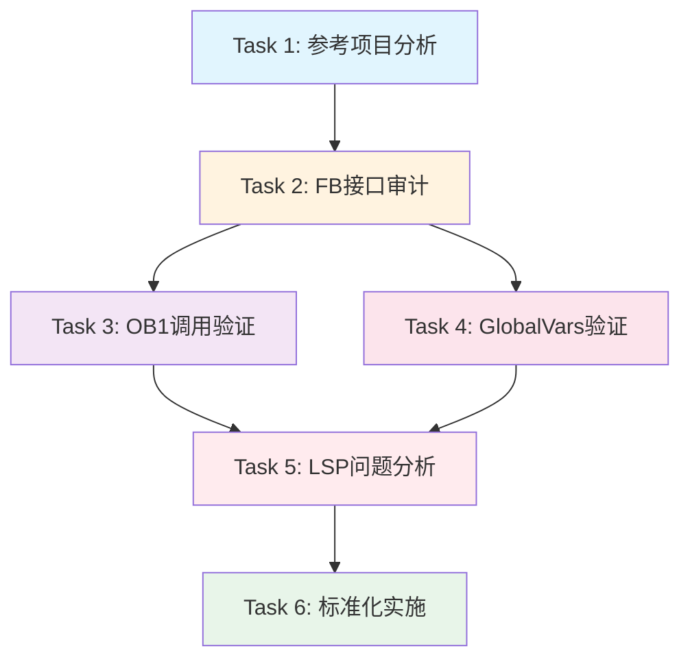

# DJ-2026-005 项目程序结构标准化修订 - 任务列表

## 任务概览
基于DJ-2026-000参考项目，全面审计和修订DJ-2026-005的程序结构，解决LSP兼容性问题，建立标准化基准。

---

## Task 1: 参考项目结构分析（DJ-2026-000） ✅ 已完成
**目标**: 建立正常项目的结构和质量基准

### SubTask 1.1: 分析DJ-2026-000的程序架构
- [x] 1.1.1 读取并分析OB1.scl的代码结构和设计模式
- [x] 1.1.2 审计GlobalVars.db的数据组织方式和命名规范
- [x] 1.1.3 检查FB_ValveControl.scl的接口定义清晰度
- [x] 1.1.4 验证LSP诊断结果（确认0错误状态）
- [x] 1.1.5 总结参考项目的最佳实践清单

**交付物**: 《DJ-2026-000架构分析报告》✅ 已生成
- 程序组织方式：OB1-FB-GlobalVars三层架构，简洁清晰
- 复杂度对比：DJ-2026-005参数规模是参考项目的22倍
- 关键差异：TIME类型输出、接口规模、中文变量名长度

**验证标准**: ✅ 所有检查项完成且文档通过审核

---

## Task 2: DJ-2026-005功能块接口全面审计
**目标**: 确保所有6个FB的接口定义完整且符合规范

### SubTask 2.1: FB_ExternalDeviceInteraction审计
- [ ] 2.1.1 验证FUNCTION_BLOCK声明和三个VAR区域完整性
- [ ] 2.1.2 统计VAR_INPUT变量数量和类型分布
- [ ] 2.1.3 统计VAR_OUTPUT变量数量和类型分布
- [ ] 2.1.4 检查变量命名是否符合801_PLC规范
- [ ] 2.1.5 验证注释覆盖率（目标>90%）
- [ ] 2.1.6 记录发现的任何异常或问题

**预期结果**:
- 输入: 27个BOOL (系统控制6 + 组框机7 + 打胶机6 + 机器人5 + 本机3)
- 输出: 20个 (组框机5 + 打胶机4 + 机器人3 + 状态报警4)

### SubTask 2.2: FB_1001_Conveyor4Layer审计（容器块）
- [ ] 2.2.1 验证容器块的复合接口定义（含ARRAY[1..4]类型）
- [ ] 2.2.2 统计输入/输出参数总数（考虑数组展开后的实际数量）
- [ ] 2.2.3 检查与FB_1002_SingleLayerConveyor的调用关系
- [ ] 2.2.4 验证手动操作信号和传感器信号的数组维度一致性

**预期结果**:
- 输入: 34个逻辑参数（9公共 + 3工艺 + 24手动 + 28传感器 - 重复计算）
- 输出: 30个逻辑参数（20执行器 + 4下游 + 4状态 + 1报警 + 步序数组）

### SubTask 2.3: FB_1003_PickPlace审计（重点对象）
- [ ] 2.3.1 **重点验证V4.2.0版本的58个输入变量**
  - [ ] 系统控制8个 (i_b使能/自动模式/手动模式/启动/停止/复位)
  - [ ] 手动操作14个 (Z轴点动2 + X1轴点动2 + 气缸10)
  - [ ] 工艺参数6个 (REAL速度4 + INT时间2)
  - [ ] 传感器26个 (气缸10 + 产品4 + 伺服12)
  - [ ] 上游信号4个 (输送机L1-L4放料完成)
- [ ] 2.3.2 **关键审计30个输出变量**
  - [ ] 执行器输出10个 (升降2 + 前夹紧2 + 后夹紧2 + 前夹紧2 + 后夹紧2)
  - [ ] 伺服输出3个 (Z轴脉冲/方向/使能)
  - [ ] 下游信号1个 (放料完成给送料机构)
  - [ ] 状态输出7个 (运行中/故障/当前状态/Z位置/X1位置/X2位置/取料层数)
  - [ ] 报警输出1个 (本站报警代码INT)
  - [ ] **⚠️ 定时器调试输出4个 (TIME类型) - LSP问题焦点**
    - q_e放料完成保持_Elapsed : TIME
    - q_e动作_Elapsed : TIME
    - q_e产品检测稳定_Elapsed : TIME
    - q_e初始化_Elapsed : TIME
- [ ] 2.3.3 **诊断TIME输出变量的LSP兼容性**
  - [ ] 对比FB_1004_GlueMachineFeeder的相同模式（也有4个TIME输出）
  - [ ] 检查VAR_OUTPUT第250节的语法是否完全正确
  - [ ] 验证END_VAR闭合位置是否正确
  - [ ] 测试修改注释后是否触发LSP重新索引
- [ ] 2.3.4 检查内部VAR区域的ALM常量定义（第375-382行）
  - [ ] 确认这些是内部常量而非输出引脚
  - [ ] 分析为何LSP可能误将这些作为可用引脚显示

**交付物**: 《FB_1003接口详细审计报告》包含完整的输入/输出变量清单和LSP问题诊断结果

### SubTask 2.4: FB_1004_GlueMachineFeeder审计
- [ ] 2.4.1 验证17个输入变量（系统控制6 + 手动2 + 工艺3 + 传感器4 + 打胶机2 + 上游1）
- [ ] 2.4.2 验证14个输出变量（执行器3 + 安全区1 + 状态4 + 报警1 + 定时器4）
- [ ] 2.4.3 **对比其4个TIME输出是否也有LSP问题**
  - q_e通讯超时_Elapsed : TIME
  - q_e动作_Elapsed : TIME
  - q_e初始化_Elapsed : TIME
  - q_e抓料保持_Elapsed : TIME
- [ ] 2.4.4 如果FB_1004无LSP问题，记录差异点用于根因分析

### SubTask 2.5: FB_2001_CommonAlarm审计
- [ ] 2.5.1 验证4个输入（三站报警3 + 复位1）
- [ ] 2.5.2 验证16个输出（HMI显示2 + 全局互锁1 + MES数据3 + 新报警1 + 多报警状态9）
- [ ] 2.5.3 检查ARRAY类型的MES报警队列定义（ARRAY[0..9] OF INT）
- [ ] 2.5.4 验证工站报警状态数组（ARRAY[1..3] OF INT）

**验证标准**: ✅ 所有6个FB的接口统计完成，形成对比表格

---

## Task 3: OB1.scl调用一致性深度验证
**目标**: 确保OB1中每个FB调用的参数100%匹配FB定义

### SubTask 3.1: fbExternalDevice调用验证
- [ ] 3.1.1 逐行核对27个输入参数的变量名和顺序
- [ ] 3.1.2 逐行核对20个输出参数的变量名和顺序
- [ ] 3.1.3 验证赋值方向正确性（输入用:=, 输出用=>）
- [ ] 3.1.4 检查GlobalVars.stExternal映射路径是否正确

### SubTask 3.2: fbConveyor4Layer调用验证
- [ ] 3.2.1 核对所有ARRAY[1..4]类型参数的正确传递
- [ ] 3.2.2 验证工艺参数（REAL/INT）的类型匹配
- [ ] 3.2.3 检查下游反馈信号（取放料完成→放料完成）的数据流

### SubTask 3.3: fbPickPlace调用验证（重点）
- [ ] 3.3.1 **逐一核对58个输入参数**（按类别分组验证）
  - [ ] 系统控制8个
  - [ ] 手动操作14个（特别关注V4.2.0新增的前夹紧2/后夹紧2）
  - [ ] 工艺参数6个（REAL类型速度参数）
  - [ ] 传感器26个（特别是伺服状态和限位开关）
  - [ ] 上游信号4个（输送机L1-L4）
- [ ] 3.3.2 **逐一核对26个输出参数**
  - [ ] 执行器10个
  - [ ] 伺服3个
  - [ ] 下游1个
  - [ ] 状态7个
  - [ ] 报警1个
  - [ ] **⚠️ 定时器调试4个（TIME输出，第349行附近）**
- [ ] 3.3.3 **定位LSP报错的确切行号和引脚名**
  - [ ] 截图或记录错误信息详情
  - [ ] 对比实际FB定义确认是否存在该引脚
  - [ ] 分析可能的根本原因

### SubTask 3.4: fbGlueFeeder调用验证
- [ ] 3.4.1 核对17个输入参数
- [ ] 3.4.2 核对14个输出参数
- [ ] 3.4.3 **特别检查其4个TIME输出是否有相同的LSP错误**

### SubTask 3.5: fbCommonAlarm调用验证
- [ ] 3.5.1 核对4个输入（三站报警来自上游FB的输出）
- [ ] 3.5.2 核对16个输出（写入GlobalVars.stGlobal）
- [ ] 3.5.3 验证数据流闭环：各站报警→CommonAlarm→全局状态→外部设备联锁

**交付物**: 《OB1调用差异报告》列出所有不匹配项（如有）

**验证标准**: ✅ 参数匹配率=100%，0个Unknown pin错误

---

## Task 4: GlobalVars.db数据结构完整性验证
**目标**: 确保GlobalVars完全覆盖所有FB接口需求

### SubTask 4.1: 结构体定义验证
- [ ] 4.1.1 验证5个STRUCT的存在性和命名：stGlobal/stExternal/stConveyor/stPickPlace/stFeeder
- [ ] 4.1.2 每个STRUCT内部的变量排序（先输入i_xxx，后输出o_xxx，最后q_xxx）
- [ ] 4.1.3 数据类型一致性检查（与FB定义逐字段对比）

### SubTask 4.2: stPickPlace结构体深度检查（重点）
- [ ] 4.2.1 **验证58个输入字段的完整性和类型**
  - [ ] 特别关注V4.2.0新增的手动操作和传感器字段
  - [ ] 检查REAL类型字段（取料速度/放料速度/Z轴速度/X1轴速度）
- [ ] 4.2.2 **验证30个输出字段的完整性和类型**
  - [ ] **⚠️ 重点检查4个TIME类型字段是否存在且类型正确**
    - q_e放料完成保持_Elapsed : TIME
    - q_e动作_Elapsed : TIME
    - q_e产品检测稳定_Elapsed : TIME
    - q_e初始化_Elapsed : TIME
- [ ] 4.2.3 检查初始值设置是否符合安全默认值（FALSE/0）

### SubTask 4.3: 跨FB数据流验证
- [ ] 4.3.1 Conveyor输出 → PickPlace输入（放料完成信号链路）
- [ ] 4.3.2 PickPlace输出 → Feeder输入（放料完成给送料机构）
- [ ] 4.3.3 三站报警 → CommonAlarm输入 → stGlobal输出 → ExternalDevice输入（报警联锁链路）

**交付物**: 《GlobalVars完整性检查报告》包含覆盖矩阵

**验证标准**: ✅ 覆盖率=100%，所有FB接口都有对应的GlobalVars字段

---

## Task 5: LSP兼容性问题根因分析与修复方案制定
**目标**: 彻底解决"Unknown pin"错误

### SubTask 5.1: 问题现象收集与分析
- [ ] 5.1.1 记录LSP错误的完整信息：
  - [ ] 错误发生的确切文件路径和行号
  - [ ] 报告的"Unknown pin"名称（如`q_e放料完成保持_Elapsed`）
  - [ ] LSP建议的可用引脚列表（截图中的ALM_xxx系列）
  - [ ] 错误级别（Error/Warning/Info）
- [ ] 5.1.2 **对比LSP期望的接口 vs 实际FB定义**
  - [ ] LSP显示的ALM_X1轴伺服故障等变量位于何处？（应在VAR内部常量区）
  - [ ] 为何LSP将内部常量误识别为输出引脚？
  - [ ] 是否存在多个版本的同名FB被混淆？

### SubTask 5.2: 可能原因假设验证
- [ ] 5.2.1 **假设A: LSP缓存未更新**
  - [ ] 验证方法：修改FB文件注释，观察LSP是否重新解析
  - [ ] 已执行的操作：在250节添加[OUTPUT]标记和说明
  - [ ] 待观察结果：用户IDE中的错误是否消失

- [ ] 5.2.2 **假设B: LSP不支持TIME类型输出**
  - [ ] 验证方法：对比FB_1004的4个TIME输出是否有同样问题
  - [ ] 如果FB_1004无问题，则排除此假设
  - [ ] 如果FB_1004也有问题，确认是LSP限制

- [ ] 5.2.3 **假设C: VAR_OUTPUT语法边界问题**
  - [ ] 验证方法：检查END_VAR位置是否精确在第285行
  - [ ] 检查后续VAR区域是否干扰了OUTPUT的解析
  - [ ] 尝试调整注释格式或区域划分

- [ ] 5.2.4 **假设D: 文件编码或特殊字符问题**
  - [ ] 验证方法：检查文件是否为UTF-8编码
  - [ ] 检查中文注释是否导致解析异常
  - [ ] 尝试临时移除中文注释测试

### SubTask 5.3: 修复方案设计与评估
根据SubTask 5.2的验证结果，选择最优方案：

#### 方案A: 强制刷新LSP缓存（低风险）
- [ ] 5.3.1 操作步骤：
  1. 在VSCode中执行 `Developer: Reload Window`
  2. 或删除`.plc-out`缓存目录后重启VSCode
  3. 或关闭/重新打开OB1.scl文件
- [ ] 5.3.2 适用条件：假设A成立（缓存问题）
- [ ] 5.3.3 预期效果：LSP重新索引后识别正确的接口
- [ ] 5.3.4 风险评估：无代码变更，仅影响开发环境

#### 方案B: 移除TIME输出至内部变量（中等风险）
- [ ] 5.3.5 操作步骤：
  1. 在FB_1003的VAR段新增`s_e_xxx_Internal : TIME`变量
  2. 将VAR_OUTPUT中的4个TIME变量注释掉
  3. 修改ET赋值目标为新的内部变量
  4. 在OB1中注释掉4行输出映射
  5. 添加TODO标注恢复条件
  6. 版本号升级为V4.2.1（临时兼容版）
- [ ] 5.3.6 适用条件：假设B或C成立（LSP限制或语法问题）
- [ ] 5.3.7 预期效果：LSP错误消失，但牺牲调试功能
- [ ] 5.3.8 风险评估：需更新文档，HMI暂时无法获取定时器数据

#### 方案C: 重构FB接口设计（高风险）
- [ ] 5.3.9 操作步骤：
  1. 将4个TIME输出改为INT类型（存储毫秒值）
  2. 或拆分为独立的调试功能块（FB_DebugTimer）
  3. 全面更新OB1和GlobalVars
  4. 更新所有相关文档和测试用例
- [ ] 5.3.10 适用条件：前两个方案均无效
- [ ] 5.3.11 预期效果：彻底解决问题但工作量大
- [ ] 5.3.12 风险评估：可能引入回归问题，需要充分测试

**交付物**: 《LSP问题根因分析与修复决策报告》

**验证标准**: ✅ 选择最优方案并实施，LSP错误数降为0

---

## Task 6: 标准化改进措施实施
**目标**: 基于审计结果进行必要的结构调整

### SubTask 6.1: 代码质量提升（如果发现缺陷）
- [ ] 6.1.1 补充缺失的变量注释（目标覆盖率>90%）
- [ ] 6.1.2 统一注释风格（采用DJ-2026-000的简洁风格）
- [ ] 6.1.3 优化变量分组和排序逻辑
- [ ] 6.1.4 消除冗余或重复的变量定义

### SubTask 6.2: 版本号同步机制建立
- [ ] 6.2.1 制定版本联动规则表
- [ ] 6.2.2 更新所有文件的版本号为一致基线
- [ ] 6.2.3 在每个文件的变更记录中引用关联文件版本

### SubTask 6.3: 文档同步更新
- [ ] 6.3.1 更新接口文档_IFC-FB1003-PickPlace.md（反映V4.2.0/V4.2.1变化）
- [ ] 6.3.2 更新程序架构文档_ARC-DJ-2026-005-V4.2.0.md
- [ ] 6.3.3 更新PLC变量定义文档_VAR-DJ-2026-005-V4.2.0.md
- [ ] 6.3.4 编写《修订总结报告》记录所有变更

**验证标准**: ✅ 代码质量和文档同步性达到参考项目水平

---

# Task Dependencies

**依赖关系说明**:
- Task 1 必须首先完成（建立基准）
- Task 2 可并行执行（独立审计各FB）
- Task 3 和 Task 4 可并行执行（都依赖Task 2的结果）
- Task 5 是关键路径（必须等Task 3和4完成后才能确定根因）
- Task 6 最后执行（基于前面所有任务的结果）

**预估工作量**:
- Task 1: 30分钟
- Task 2: 2小时（6个FB × 20分钟）
- Task 3: 1.5小时
- Task 4: 1小时
- Task 5: 1-2小时（取决于问题复杂度）
- Task 6: 1-2小时（取决于需要的改动范围）
- **总计**: 7-8.5小时
