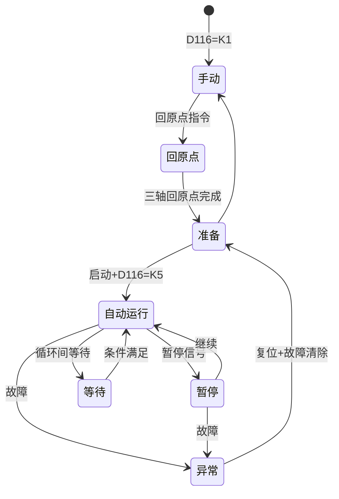
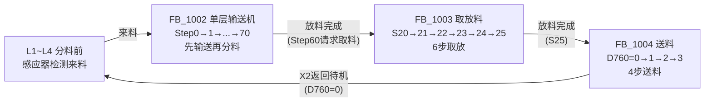
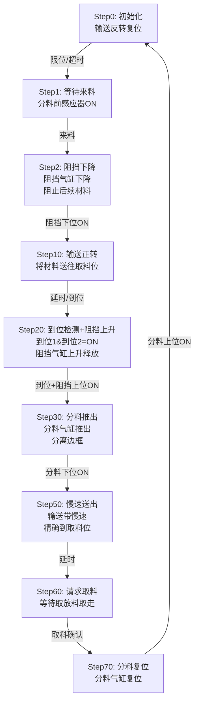
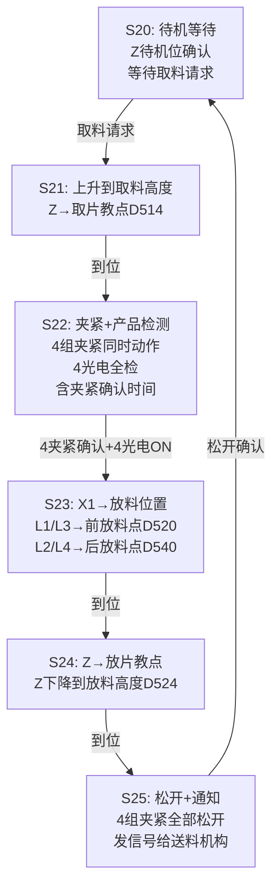
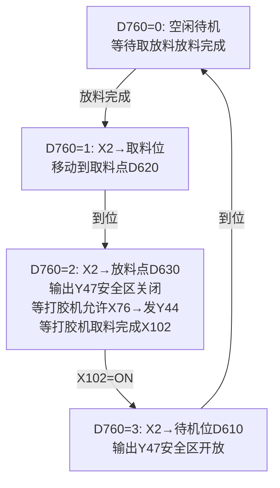

# 边框缓存机自动工艺流程图

## 1. 文档基础信息
- **文档标题**：边框缓存机自动工艺流程图
- **文档版本**：FLOW-V2.0.0
- **编制日期**：2026-04-22
- **更新日期**：2026-05-17
- **适用范围**：边框缓存机项目 (DJ-2026-005)

## 2. 编译器导出源程序（PNG）索引

> 说明：本流程图与“编译器导出PDF(改编重构ST参考使用)”的导出结果一致性对齐；导出内容用于理解原始逻辑与梳理模块边界，不作为地址等价迁移依据。

| 导出类型 | 数据名 | 页码范围 | 说明 |
|---|---|---:|---|
| 梯形图 | 系统运行 | 1~39 | 系统运行/互锁/状态位等基础逻辑 |
| 梯形图 | X1轴 | 40~43 | X1轴相关控制与状态 |
| 梯形图 | X2轴 | 44~48 | X2轴相关控制与状态 |
| 梯形图 | Z轴 | 49~58 | Z轴相关控制与状态 |
| 梯形图 | 报警 | 59~88 | 报警与故障相关逻辑 |
| 梯形图 | 配置CC_Link | 89~90 | 通讯/配置相关逻辑（V2.0.0口径：仅保留历史参考） |
| FBD/LD | 分料 | 1~10 | 4层分料功能块调用与程序本体 |
| ST | 分料送料IO映射 | 1~2 | 4层输送/分料的Y点输出映射与上料按钮 |
| FB/FUN | 送料分料测试 | 1~13 | 分料/送料测试用Step状态机（历史参考） |

## 2. 自动工艺流程图

### 2.1 系统模式转换

### 2.2 三工站流水线主流程

### 2.3 四层输送机分料流程（每层独立，Step_S状态机）

### 2.4 取放料流程（STL S20~S25，6步）

### 2.5 送料与打胶机交互（D760步序，4步）

## 3. 流程图说明

此流程图基于源程序功能基线重建，包括以下主要部分：

1. **系统模式转换**：D116驱动8种模式状态机（K1手动→K2回原点→K3准备→K5自动运行→K6等待/K8异常/K10暂停）
2. **三工站流水线主流程**：L1~L4来料→FB_1002输送机分料(Step0~70)→FB_1003取放料(S20~S25)→FB_1004送料(D760=0~3)→循环
3. **四层输送机分料流程**：每层独立9步Step_S状态机，先输送再分料(Step0→1→2→10→20→30→50→60→70)
4. **取放料流程**：STL S20~S25 六步，4夹紧+4光电在S22步内完成，按层选择前/后放料点
5. **送料与打胶机交互**：D760四步直接取料→送料→交互→返回，Y47安全区管理

## 4. 版本更新记录

| 版本 | 日期 | 更新内容 | 编制人 |
|------|------|----------|--------|
| V2.1.0 | 2026-05-17 | 基于源程序功能基线重绘全部Mermaid图：系统模式状态图+三工站主流程+3个真实状态机(Step_S分料/S20~S25取放/D760送料) | Trae |
| V1.0.0 | 2026-04-22 | 初始版本创建，包含完整的自动工艺流程图 | System |
| V2.0.0 | 2026-05-17 | 补充编译器导出程序索引；交付口径统一到V2.0.0（语义对齐优先，取消CC-Link强绑定表述） | Trae |
