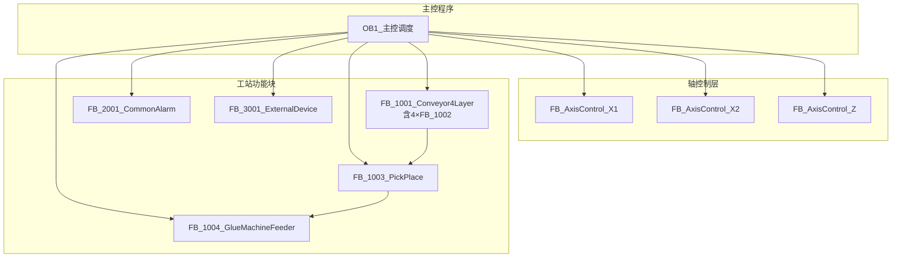

# 边框缓存机 PLC程序架构文档

## 文档基础信息

| 属性 | 值 |
|------|-----|
| **文档标题** | 边框缓存机 PLC程序架构文档 |
| **文档版本** | V2.0.0 |
| **编制日期** | 2026-05-17 |
| **编制人** | Trae |
| **审核人** | [待审核] |
| **遵循规范** | 050_模板结构规范_TPL-V1.0.0, 810_PLC编程规范_DEV-V1.0.3, 801_PLC变量命名与功能块命名规范_DEV-V1.0.5 |

## 编译器导出源程序（PNG）索引

> 说明：本索引用于快速定位“编译器导出PDF(改编重构ST参考使用)”中的原始逻辑页面；交付口径为语义对齐优先，不要求地址等价迁移。

| 导出类型 | 数据名 | 页码范围 | 说明 |
|---|---|---:|---|
| 梯形图 | 系统运行 | 1~39 | 系统运行/互锁/状态位等基础逻辑 |
| 梯形图 | X1轴 | 40~43 | X1轴相关控制与状态 |
| 梯形图 | X2轴 | 44~48 | X2轴相关控制与状态 |
| 梯形图 | Z轴 | 49~58 | Z轴相关控制与状态 |
| 梯形图 | 报警 | 59~88 | 报警与故障相关逻辑 |
| 梯形图 | 配置CC_Link | 89~90 | 通讯/配置相关逻辑（历史参考） |
| FBD/LD | 分料 | 1~10 | 4层分料功能块调用与程序本体 |
| ST | 分料送料IO映射 | 1~2 | 4层输送/分料的Y点输出映射与上料按钮 |
| FB/FUN | 送料分料测试 | 1~13 | 分料/送料测试用Step状态机（历史参考） |

## 版本变更记录

| 版本号 | 变更内容 | 变更人 | 变更日期 | 详细说明 |
|--------|----------|--------|----------|----------|
| V2.0.0 | 交付口径统一到V2.0.0；补充编译器导出程序索引；同步文档索引与引用 | Trae | 2026-05-17 | 文档与文件名统一到V2.0.0；取消CC-Link强绑定表述（保留历史参考）；补充LD/FBD/ST/FB导出索引便于溯源 |
| V4.3.0 | 标准化主程序修复: 新增OB1主程序块, GlobalVars数据块, 修复测试文件语法, 完善调试环境 | AI Assistant | 2026-05-02 | 创建OB1/OB1.scl标准化主程序(实例化6个功能块); 创建DB1/GlobalVars.db全局变量数据块(5个结构化分组); 修复FB_1004测试文件语法错误(添加5个END_TESTCASE); 创建SysLib/.plc.json共享库配置; 支持VS Code PLC调试器完整运行 |
| V4.2.0 | 全面规范化整理: 文件命名优化(参照DJ-2026-005), 文档策略调整, 编码标准化 | Trae | 2026-04-29 | 源代码文件去除版本号后缀(6个), 功能块文档去版本号(~21个), 删除中文命名旧文件(1个), external目录英文名标准化, 全局文档升级至V4.2.0, UTF-8无BOM全项目覆盖 |
| V4.1.0 | 全局规范修订: 程序文件V4.1.0同步, 规范版本升级(801→V1.0.5, 810→V1.0.3), FB命名英文化, 定时器命名优化(tIn/tQ/tR/tPt/tEt) | Trae | 2026-04-25 | 6个ST程序文件升级至V4.1.0; 文档规范引用全面更新; FB名称统一为英文标准命名; 程序架构图和代码示例同步修订; 所有交叉引用链接更新为V4.1.0版本 |
| V4.0.0 | V4.0.0架构重构: 扁平化组件架构,801命名规范全面适配,文档同步更新 | Trae | 2026-04-23 | 初始V4版本,含FB重命名(5个→801规范)、变量前缀统一(30处)、文档全面同步(7个文档~200处) |

## 1. 系统架构概览

### 1.1 整体架构



## 2. 组件结构

### 2.1 扁平化组件架构

| 组件名称 | 类型 | 核心职责 | 文件位置 |
|---------|------|---------|----------|
| **OB1** (主循环) | ORGANIZATION_BLOCK | PLC主循环, 功能块实例化与调用调度中心 | [OB1/OB1.scl](OB1/OB1.scl) |
| **GlobalVars** (全局变量) | DATA_BLOCK | 全局数据交换中心, I/O映射集中管理 | [DB1/GlobalVars.db](DB1/GlobalVars.db) |
| FB_AxisControl (轴控制) | FUNCTION_BLOCK | 独立轴控制FB：回原点/绝对定位/点动/限位保护，3轴各1实例 | **待新建** |
| FB_ExternalDeviceInteraction | FUNCTION_BLOCK | 外部设备交互(组框机/打胶机/机器人/8安全门/急停) | [external/FB_ExternalDeviceInteraction.scl](external/FB_ExternalDeviceInteraction.scl) |
| FB_1001_Conveyor4Layer_BufferFraming | FUNCTION_BLOCK | 4层输送机容器(内部4×FB_1002) | [conveyor/FB_1001_Conveyor4Layer_BufferFraming.scl](conveyor/FB_1001_Conveyor4Layer_BufferFraming.scl) |
| FB_1002_SingleLayerConveyor_BufferFraming | FUNCTION_BLOCK | 单层输送机控制: 9步(Step0~70)，先输送再分料 | [conveyor/FB_1002_SingleLayerConveyor_BufferFraming.scl](conveyor/FB_1002_SingleLayerConveyor_BufferFraming.scl) |
| FB_1003_PickPlace_BufferFraming | FUNCTION_BLOCK | Z轴+X1轴+夹爪: 6步(S20~S25) | [pickplace/FB_1003_PickPlace_BufferFraming.scl](pickplace/FB_1003_PickPlace_BufferFraming.scl) |
| FB_1004_GlueMachineFeeder_BufferFraming | FUNCTION_BLOCK | X2轴+打胶机交互: 4步(D760) | [feeder/FB_1004_GlueMachineFeeder_BufferFraming.scl](feeder/FB_1004_GlueMachineFeeder_BufferFraming.scl) |
| FB_2001_CommonAlarm_AllStation | FUNCTION_BLOCK | ~50类报警汇总+全局报警字+MES队列+指示灯 | [common/FB_2001_CommonAlarm_AllStation.scl](common/FB_2001_CommonAlarm_AllStation.scl) |

### 2.2 架构对比

| 对比项 | V3.0.0 (旧架构) | V4.0.0 (新架构) | V4.1.0 (规范修订) | V4.2.0 (规范化整理) | **V4.3.0 (标准化修复)** |
|--------|------------------|------------------|-------------------|-------------------|----------------------|
| **架构模式** | 三层碎片化架构(Device+Logic+Main=21个FB) | 扁平化组件架构(主控+3工站+公共报警=5个组件) | 保持扁平化架构不变 | 保持扁平化架构不变 | **✅ 标准化OB1+GlobalVars模式** |
| **功能块数量** | 21个功能块 | 5个组件(1个PROGRAM + 4个FUNCTION_BLOCK) | 保持5个组件不变 | 扩展至7个(含FB_1002容器+FB_ExternalDevice) | **9个组件(OB1+DB1+7个FB)** |
| **IO映射方式** | 分散在各Device层FB中 | 集中在主控程序(主控程序承担所有X/Y映射) | 主控程序重命名为PRG_MainControl_DJ2026005 | 保持不变 | **✅ GlobalVars集中管理(结构化分组)** |
| **物理地址依赖** | Device层FB直接引用X/Y/M/D地址 | 所有工站FB为纯逻辑块，无任何物理地址引用 | 保持纯逻辑块设计不变 | 保持不变 | **保持纯逻辑块设计不变** |
| **数据耦合度** | 高(多层传递，接口复杂) | 低(主控统一协调，工站接口清晰) | 保持低耦合设计不变 | 保持不变 | **✅ 更低耦合(GlobalVars统一数据交换)** |
| **调试支持** | TIA Portal专用 | TIA Portal专用 | TIA Portal专用 | TIA Portal专用 | **✅ 支持VS Code PLC调试器** |
| **D区规划** | 无统一规划 | 新增D400~D425固定分配(报警系统专用) | 保持D区规划不变 | 保持不变 | 保持不变 |
| **M区规划** | 无统一规划 | M200全局互锁，M100~M149 HMI控制/状态 | 保持M区规划不变 | 保持不变 | 保持不变 |
| **FB命名** | 中文/混合命名 | 英文标准化命名(801规范V1.0.2) | 升级至801规范V1.0.5 | 保持801规范V1.0.5 | **保持801规范V1.0.5** |
| **注释风格** | 不统一 | 统一使用(* *)格式 | 完全统一IEC 61131-3标准注释格式 | // 和 (* *) 均可(V2.0灵活规范) | **✅ 完整中文注释(功能/参数/调用说明)** |
| **文件命名** | 中文/混合 | 英文标准化+带版本号_V4.1.0 | 保持带版本号 | 简洁英文命名(无版本号,参照DJ-2026-005) | **保持简洁英文命名** |
| **编码格式** | 多种编码混用 | UTF-8 | UTF-8 | UTF-8无BOM全项目统一 | **UTF-8无BOM全项目统一** |

## 3. 系统功能模块

### 3.1 主控程序

- **功能**：系统核心，负责IO映射、HMI交互、工站实例化与调用、报警D区回写
- **输入**：所有物理IO信号、HMI控制信号
- **输出**：所有执行器控制信号、HMI状态信号、D区报警数据
- **文件**：[PRG_MainControl_DJ2026005.st](主控/PRG_MainControl_DJ2026005.st)

### 3.2 FB_1001_Conveyor4Layer_BufferFraming (四层输送机容器)

- **功能**：4层独立分料/输送控制容器，内部实例化4个FB_1002
- **输入**：各层传感器信号、手动操作信号、工艺参数
- **输出**：各层执行器控制信号、放料完成信号、报警代码
- **文件**：[FB_1001_Conveyor4Layer_BufferFraming.scl](conveyor/FB_1001_Conveyor4Layer_BufferFraming.scl)
- **内部组件**：FB_1002_SingleLayerConveyor_BufferFraming × 4个实例

### 3.3 FB_1002_SingleLayerConveyor_BufferFraming (单层输送机)

- **功能**：单层输送机完整控制逻辑（9步自动状态机）
- **输入**：该层传感器信号、手动操作信号
- **输出**：该层执行器控制信号、状态反馈
- **文件**：[FB_1002_SingleLayerConveyor_BufferFraming.scl](conveyor/FB_1002_SingleLayerConveyor_BufferFraming.scl)

### 3.4 FB_1003_PickPlace_BufferFraming (取放料机构)

- **功能**：Z轴升降+X1轴横移+夹爪控制，6步状态机(S20~S25)，一次取两根边框
- **输入**：升降/夹紧气缸传感器、伺服轴传感器、产品检测传感器、上游输送机信号
- **输出**：气缸控制信号、伺服控制信号、放料完成信号、报警代码
- **文件**：[FB_1003_PickPlace_BufferFraming.scl](pickplace/FB_1003_PickPlace_BufferFraming.scl)

### 3.5 FB_1004_GlueMachineFeeder_BufferFraming (打胶机送料机构)

- **功能**：X2轴横移+打胶机交互，4步状态机(D760)，含安全区管理
- **输入**：X2轴传感器、打胶机交互信号、上游取放料信号
- **输出**：X2轴控制信号、打胶机交互信号、报警代码
- **文件**：[FB_1004_GlueMachineFeeder_BufferFraming.scl](feeder/FB_1004_GlueMachineFeeder_BufferFraming.scl)

### 3.6 FB_2001_CommonAlarm_AllStation (公共报警管理)

- **功能**：三站报警汇总、全局报警字计算、MES报警队列管理、多报警状态输出
- **输入**：各工站报警代码
- **输出**：全局报警字、最高优先级报警码、MES报警队列、报警状态数组、报警触发BOOL量
- **文件**：[FB_2001_CommonAlarm_AllStation.scl](common/FB_2001_CommonAlarm_AllStation.scl)

### 3.7 FB_ExternalDeviceInteraction (外部设备交互)

- **功能**：外部设备（如打胶机）的交互协议和信号管理
- **输入**：外部设备状态信号、安全区域信号
- **输出**：外部设备控制信号、交互完成标志
- **文件**：[FB_ExternalDeviceInteraction.scl](external/FB_ExternalDeviceInteraction.scl)

## 4. 信号流程

### 4.1 输入信号流程

1. 物理IO信号 → 主控程序IO映射 → 逻辑变量
2. 逻辑变量 → 各工站功能块输入
3. 工站功能块处理 → 工站功能块输出
4. 工站功能块输出 → 主控程序 → 执行器控制/状态反馈

### 4.2 控制流程

1. 系统启动 → 主控程序初始化 → 各工站初始化
2. 手动/自动模式选择
3. 启动按钮 → 系统运行
4. 四层输送机 → 分料送料
5. 取放料机构 → 产品搬运
6. 打胶机送料机构 → 与打胶机协作
7. 外部设备交互 → 打胶机通信
8. 公共报警 → 报警监控

## 5. 关键技术特点

### 5.1 扁平化组件架构

- **主控程序**：集中IO映射，统一协调各工站
- **工站功能块**：纯逻辑块，无物理地址依赖，高内聚低耦合
- **接口标准化**：各工站接口清晰，易于维护和扩展

### 5.2 容器模式设计

- **FB_1001作为容器**：内部实例化4个FB_1002单层实例
- **输入分发**：将ARRAY输入拆分为单个信号传给各层
- **输出收集**：将4个实例输出汇聚为ARRAY供主控读取
- **职责单一**：容器仅做路由，业务逻辑在FB_1002中

### 5.3 状态机控制

- 四层输送机：9步自动状态机(Step0→1→2→10→20→30→50→60→70)，先输送再分料
- 取放料机构：6步取放料循环(S20~S25)，夹紧与检测合并在S22步
- 打胶机送料机构：4步送料循环(D760=0→1→2→3)，直接取料→送料→交互→返回
- 提高系统稳定性和可维护性

### 5.4 模块化设计

- 功能块独立封装，便于维护和扩展
- 标准化接口，降低模块间耦合
- 工站解耦，可独立调试和测试

### 5.5 安全保护

- 完善的安全信号处理
- 急停、安全门等安全功能
- 符合ISO 13849-1安全标准

### 5.6 报警系统

- 分级报警机制
- 详细的报警代码和指示
- MES报警队列管理（最近10条去重记录）
- 多报警同时显示功能
- 报警触发BOOL量输出，支持HMI显示

## 6. 系统配置

### 6.1 硬件配置

- **CPU**：支持ST语言的PLC
- **DI模块**：扩展输入模块
- **DO模块**：扩展输出模块
- **远程IO**：用于取放料机构
- **伺服驱动器**：控制伺服轴
- **变频器**：控制输送带

### 6.2 软件配置

- **编程软件**：支持IEC 61131-3标准
- **程序结构**：扁平化组件设计 + 容器模式
- **变量管理**：统一命名规范，集中IO映射
- **定时器/计数器命名**：采用简化规则 tIn/tQ/tR/tPt/tEt (遵循810_PLC编程规范_DEV-V1.0.3)

## 7. 目录结构与文件组织

### 7.1 标准目录布局

```
通用ST程序及变量表/
├── common/                    # 公共服务
│   ├── FB_2001_CommonAlarm_AllStation.scl
│   ├── 使用说明_UM-FB2001-CommonAlarm.md
│   ├── 接口文档_IFC-FB2001-CommonAlarm.md
│   ├── 详细设计说明书_DSN-FB2001-CommonAlarm.md
│   ├── 变更记录_CHG-FB2001-CommonAlarm.md
│   └── 报警码定义_ALM-DJ-2026-005.md
├── conveyor/                  # 四层输送机
│   ├── FB_1001_Conveyor4Layer_BufferFraming.scl      # 容器FB
│   ├── FB_1002_SingleLayerConveyor_BufferFraming.scl # 单层FB
│   └── [配套文档 x4]
├── pickplace/                 # 取放料机构
│   ├── FB_1003_PickPlace_BufferFraming.scl
│   └── [配套文档 x4]
├── feeder/                    # 打胶机送料机构
│   ├── FB_1004_GlueMachineFeeder_BufferFraming.scl
│   ├── FB_1004_GlueMachineFeeder_BufferFraming.scltest
│   └── [配套文档 x4]
├── external/                  # 外部设备交互
│   ├── FB_ExternalDeviceInteraction.scl
│   └── [配套文档 x4]
├── [全局规范文档]              # 根目录,带版本号
│   ├── 程序架构文档_ARC-DJ-2026-005-V2.0.0.md        ← 本文档
│   ├── PLC变量定义文档_VAR-DJ-2026-005-V2.0.0.md
│   └── 详细设计说明书_DSN-DJ-2026-005-V2.0.0.md
└── Siemens_Language_Support_使用指南.md             # V2.0
```

### 7.2 文件命名规范

| 类型 | 格式 | 示例 |
|------|------|------|
| 源代码 | `{FB编号}_{英文描述}.scl` | `FB_1001_Conveyor4Layer_BufferFraming.scl` |
| 测试文件 | `{FB编号}_{描述}.scltest` | `FB_1004_GlueMachineFeeder_BufferFraming.scltest` |
| 功能块文档 | `{类型}_{ID}-{FBRef}.md` | `使用说明_UM-FB1001-Conveyor4Layer.md` |
| 全局规范文档 | `{类型}_{ID}-V{版本}.md` | `程序架构文档_ARC-DJ-2026-005-V2.0.0.md` |

## 8. 维护与扩展

### 8.1 维护要点

- 定期检查IO信号状态
- 定期测试安全功能
- 检查报警记录
- 备份程序和参数
- 验证西门子插件兼容性

### 8.2 扩展建议

- 可扩展更多层的缓存
- 可增加更多类型的传感器
- 可集成更多外部设备
- 可添加远程监控功能
- 可增加单元测试覆盖率

## 9. 文档索引

| 文档类型    | 描述      | 文件位置                                                                                                 |
| ------- | ------- | ---------------------------------------------------------------------------------------------------- |
| 接口文档    | 功能块接口定义 | 各功能块文件夹下                                                                                             |
| 使用说明    | 功能块使用指南 | 各功能块文件夹下                                                                                             |
| 报警码定义  | 报警代码定义 | [common/报警码定义_ALM-DJ-2026-005.md](common/报警码定义_ALM-DJ-2026-005.md) |
| 程序设计总文档 | 整体程序设计  | [../程序文档/016\_DJ-2026-005\_PLC程序设计总文档\_PLC-V2.0.0.md](../程序文档/016_DJ-2026-005_PLC程序设计总文档_PLC-V2.0.0.md) |
| IO分配表   | IO点位定义  | [../程序文档/015\_DJ-2026-005\_IO分配表\_IO-V2.0.0.md](../程序文档/015_DJ-2026-005_IO分配表_IO-V2.0.0.md)             |
| 变量定义文档 | 变量定义和说明 | [PLC变量定义文档_VAR-DJ-2026-005-V2.0.0.md](PLC变量定义文档_VAR-DJ-2026-005-V2.0.0.md) |
| 详细设计说明书 | 项目级设计说明 | [详细设计说明书_DSN-DJ-2026-005-V2.0.0.md](详细设计说明书_DSN-DJ-2026-005-V2.0.0.md) |
| 西门子插件指南 | VS Code插件使用 | [Siemens_Language_Support_使用指南.md](Siemens_Language_Support_使用指南.md) |

## 10. 版本信息

- **程序版本**：V2.0.0
- **编制日期**：2026-05-17
- **遵循规范**：IEC 61131-3, 810_PLC编程规范_DEV-V1.0.3, 801_PLC变量命名与功能块命名规范_DEV-V1.0.5
- **项目编号**：DJ-2026-005
- **参考基准**：DJ-2026-005 (已验证测试项目)
