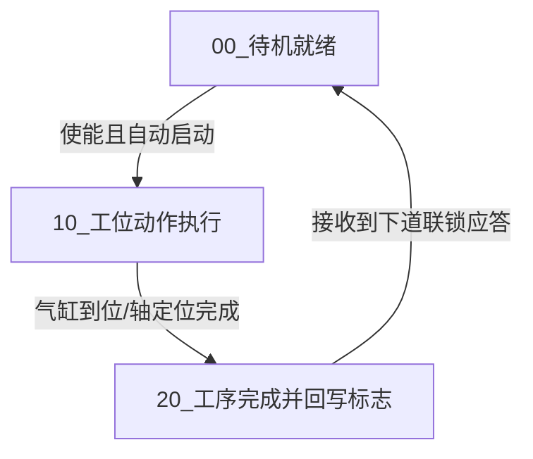

# 详细设计说明书 - FB_1003_PaperHolder_Z

## 1. 机构控制原理与工况
隔纸放料架 Z 轴升降、换料点、拉隔纸与裁切铺设。

## 2. 状态机与工步流转

```mermaid
graph TD
    S0[00_待机就绪] -->|使能且自动启动| S10[10_工位动作执行]
    S10 -->|气缸到位/轴定位完成| S20[20_工序完成并回写标志]
    S20 -->|接收到下道联锁应答| S0
```

## 3. 安全联锁与异常保护
- 安全门打开或光幕被遮挡时，立即切断伺服动力并锁定气阀；
- 动作超时计时器保护（设定阈值 5000ms）。
