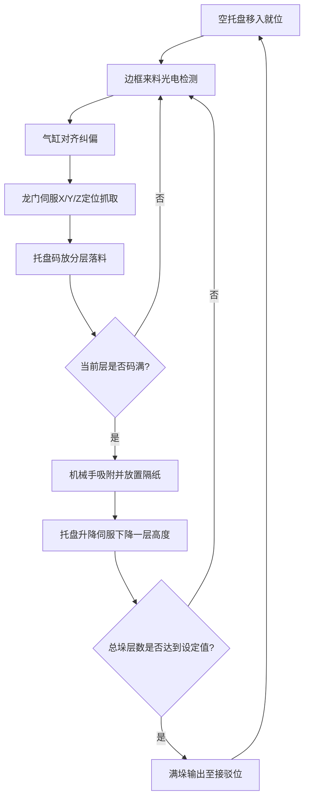

# 018_DJ-2026-009_自动工艺流程图_FLOW

```mermaid
graph TD
    A[空托盘移入就位] --> B[边框来料光电检测]
    B --> C[气缸对齐纠偏]
    C --> D[龙门伺服X/Y/Z定位抓取]
    D --> E[托盘码放分层落料]
    E --> F{当前层是否码满?}
    F -- 否 --> B
    F -- 是 --> G[机械手吸附并放置隔纸]
    G --> H[托盘升降伺服下降一层高度]
    H --> I{总垛层数是否达到设定值?}
    I -- 否 --> B
    I -- 是 --> J[满垛输出至接驳位]
    J --> A
```
