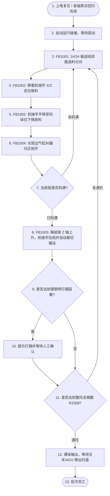

# 自动工艺流程图 - DJ-2026-009 长边框堆垛机

## 1. 全机自动运行主工艺流程

---

## 2. 各工位 SFC 步序与状态机转换表

### 2.1 FB1001 双路入料输送工位状态机
- **Step 0**: 待机模式
- **Step 1**: 启动 1#/2# 变频皮带，等待来料光电遮挡；
- **Step 2**: 边框进入减速区，分料阻挡气缸升起；
- **Step 3**: 进料计数 +1，当达到单套对数 (`R1520`) 时输出取料就绪信号；
- **Step 4**: 等待移载机械手取料完成信号，复位就绪标志并进入下一循环。

### 2.2 FB1002 叠垛移载机械手状态机
- **Step 10**: X/Z 轴位于待机安全点；
- **Step 11**: 收到进料就绪，X 轴移动至 `取料点 (R1002)`，Z 轴下降至取料位；
- **Step 12**: 夹爪气缸闭合 / 真空吸盘开启，压力达标后 Z 轴提升至安全高度；
- **Step 13**: X 轴快速移动至 `放料点 (R1004)`；
- **Step 14**: Z 轴依据当前层数计算目标高度并下降放料；
- **Step 15**: 释放工件，Z 轴快速回升，触发工位 4 归正拍齐。

### 2.3 FB1003 隔纸架与自动裁切状态机
- **Step 20**: 隔纸架 Z 轴升降至 `拉隔纸点 (R1202)`；
- **Step 21**: 机械手夹具移动至 `拉隔纸起点 (R1006)` 并夹住纸头；
- **Step 22**: 机械手平移至 `拉隔纸铺设点 (R1008)`；
- **Step 23**: 切刀气缸动作执行自动裁切；
- **Step 24**: 隔纸平铺于已码边框表面，隔纸架 Z 轴退回安全高度。

### 2.4 FB1004 边框长短边归正状态机
- **Step 30**: 放料完成后，短边纠偏气缸伸出拍齐边框端头；
- **Step 31**: 长边纠偏气缸伸出压实边框侧边；
- **Step 32**: 延时 0.5s 保压后双向气缸同步缩回原位。
