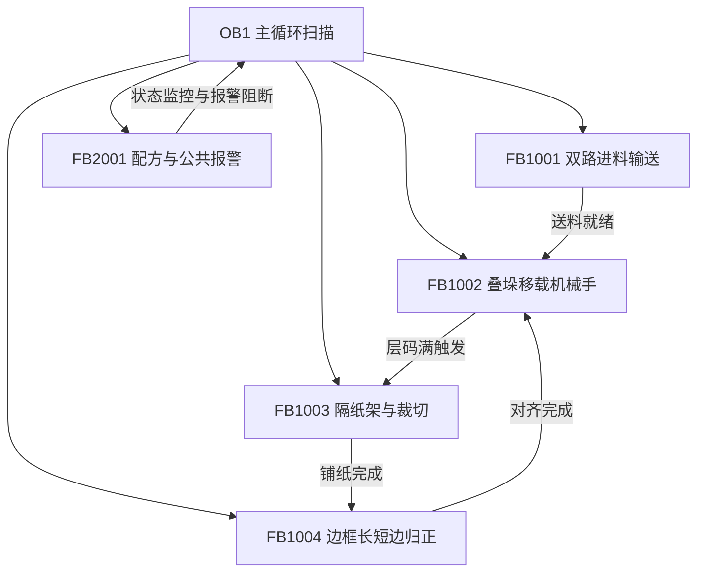

# 详细设计说明书 (DSN) - DJ-2026-009 长边框堆垛机

## 1. 伺服轴教点与寄存器映射表 (源自真实校点分配)

| 机构名称 | 轴名称 | 站号 | 教点1 (待机点) | 教点2 (取料点) | 教点3 (放料点) | 教点4 (拉纸起点) | 教点5 (铺设点) |
| :--- | :--- | :---: | :---: | :---: | :---: | :---: | :---: |
| **叠垛移载机械手** | 移载 X 轴 | 1 | `R1000` | `R1002` | `R1004` | `R1006` | `R1008` |
| **叠垛移载机械手** | 移载 Z 轴 | 2 | `R1100` | `R1102` | `R1104` | `R1106` | `R1108` |
| **隔纸放料架** | 隔纸架 Z 轴 | 3 | `R1200 (换料)` | `R1202 (拉纸)` | `R1204 (安全)` | `R1206 (阻挡)` | - |

---

## 2. 真实工艺参数与补偿寄存器清单

| 参数名称 | 寄存器编号 | 数据类型 | 物理单位 | 设定范围 | 工程意义与运算逻辑 |
| :--- | :---: | :---: | :---: | :---: | :--- |
| **边框宽度设定** | `R1500` | INT | mm | 20 ~ 100 | 铝边框横截面宽度 |
| **边框层高设定** | `R1502` | INT | mm | 20 ~ 150 | 单层堆叠增量 (Z轴每次放料下压基准) |
| **边框槽壁厚度** | `R1504` | INT | mm | 1 ~ 10 | 扣合卡槽壁厚 |
| **隔纸厚度补偿** | `R1506` | INT | mm | 0 ~ 20 | 隔纸压缩后实际厚度补偿 |
| **整托边框根数** | `R1508` | INT | 根 | 100 ~ 5000 | 满垛计数目标值 |
| **单套对数设定** | `R1520` | INT | 对 | 1 ~ 4 | 机械手单次抓取对数 |
| **层摆放对数设定** | `R1522` | INT | 对 | 2 ~ 20 | 单层边框对数 |
| **隔纸裁切长度补偿**| `R1530` | INT | mm | -100 ~ +100 | 气动切刀拉纸长度微调 |
| **长边归正 X 轴补偿**| `R1532` | INT | mm | -50 ~ +50 | 长边推齐气缸 X 轴偏移补偿 |
| **长边归正 Z 轴补偿**| `R1534` | INT | mm | -50 ~ +50 | 长边推齐气缸 Z 轴下压补偿 |
| **短边归正 Z 轴补偿**| `R1536` | INT | mm | -50 ~ +50 | 短边纠偏推齐 Z 轴补偿 |
| **放塑钢带层数 1** | `R1540` | INT | 层 | 1 ~ 50 | 首次打捆塑钢带层数 |
| **放塑钢带层数 2** | `R1542` | INT | 层 | 1 ~ 50 | 二次打捆塑钢带层数 |
| **放塑钢带层数 3** | `R1544` | INT | 层 | 1 ~ 50 | 三次打捆塑钢带层数 |

---

## 3. 功能块 (FB) 软件架构与执行逻辑

