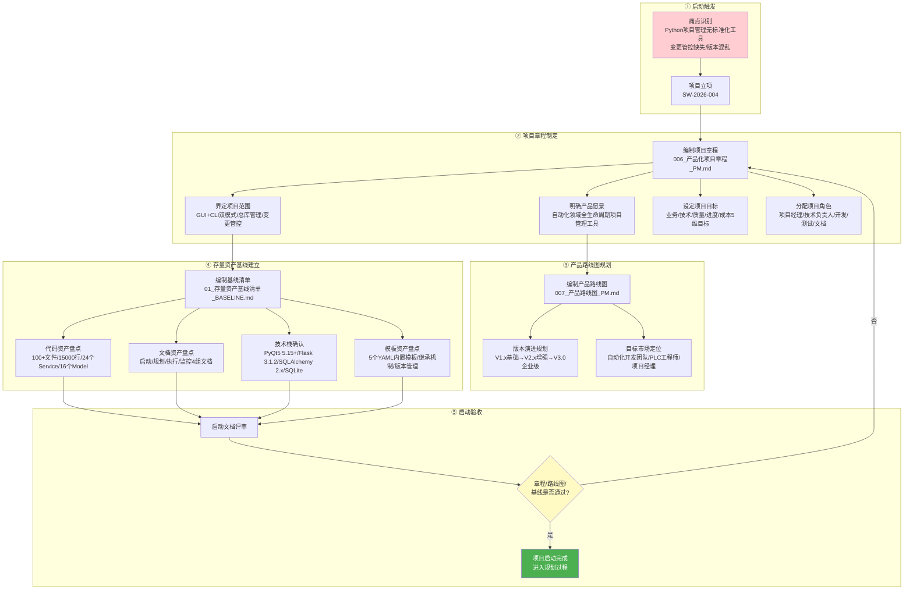
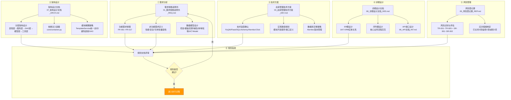
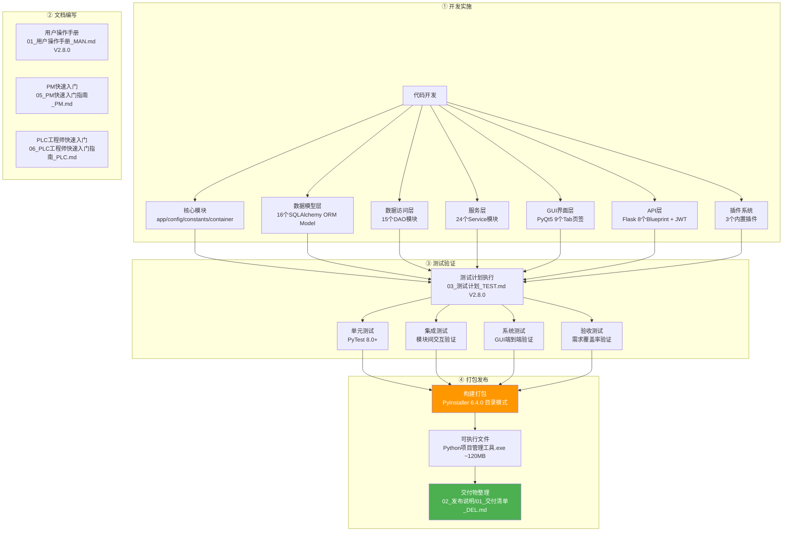
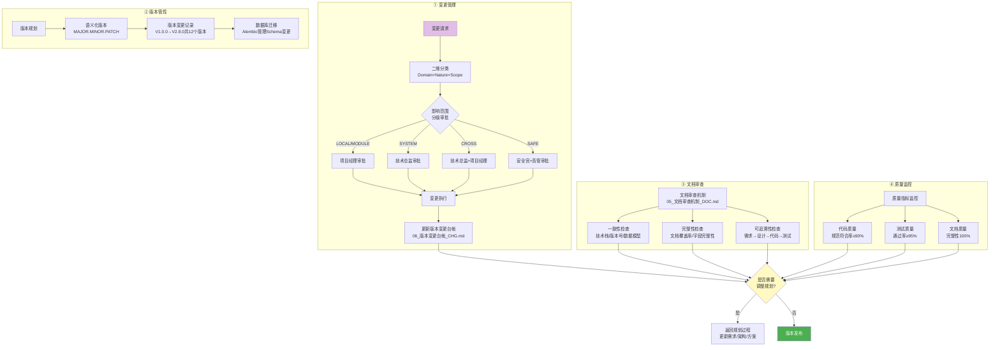
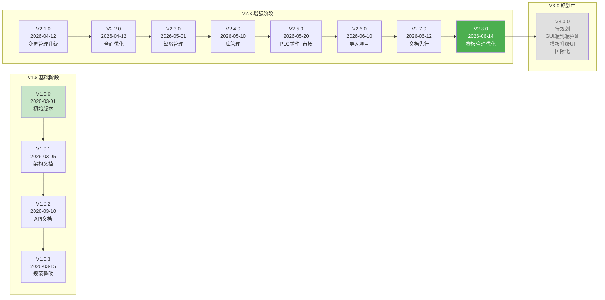
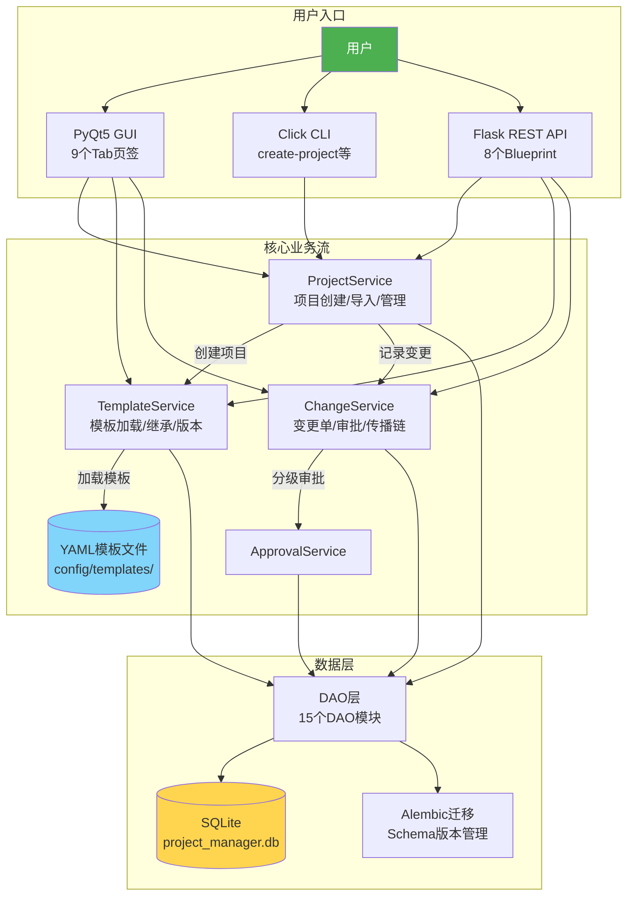

# SW-2026-004 项目启动完整流程图

**项目名称**：Python项目管理工具
**当前版本**：V2.8.0
**编制日期**：2026-06-14

---

## 1. 项目全生命周期总览

---

## 2. 启动过程详细流程

---

## 3. 规划过程详细流程

---

## 4. 执行过程详细流程

---

## 5. 监控和控制详细流程

---

## 6. 版本演进时间线

---

## 7. 系统架构与启动流程映射

---

## 8. 关键文档与流程节点对应关系

| 流程节点 | 关键文档 | 当前版本 | 状态 |
|----------|---------|---------|------|
| 项目立项 | 006_产品化项目章程_PM.md | PM-V1.0.0 | 历史文档（已标注） |
| 路线图 | 007_产品路线图_PM.md | PM-V1.0.0 | 历史文档（已标注） |
| 基线盘点 | 01_存量资产基线清单_BASELINE.md | V2.8.0 | ✅ 已更新 |
| 需求分析 | 01_需求规格说明书_REQ.md | V2.8.0 | ✅ 已更新 |
| 架构设计 | 07_架构设计文档_ARCH.md | V2.8.0 | ✅ 已更新 |
| 技术方案 | 03_总库管理技术方案_DEV.md | V2.8.0 | ✅ 已更新 |
| 详细设计 | 08_详细设计文档_DES.md | V2.8.0 | ✅ 已更新 |
| API设计 | 06_API文档_INT.md | V2.8.0 | ✅ 已更新 |
| 风险管理 | 05_风险登记册_REP.md | V2.8.0 | ✅ 已更新 |
| 用户手册 | 01_用户操作手册_MAN.md | V2.8.0 | ✅ 已更新 |
| 测试计划 | 03_测试计划_TEST.md | V2.8.0 | ✅ 已更新 |
| 变更管理 | 01_变更管理技术方案_DEV.md | V2.1.0 | ✅ 已更新 |
| 版本台帐 | 06_版本变更台帐_CHG.md | V2.8.0 | ✅ 已更新 |
| 文档审查 | 05_文档审查机制_DOC.md | V2.8.0 | ✅ 已更新 |
| 模板优化 | 07_模板管理优化技术方案_DEV.md | V2.8.0 | ✅ 新增 |
| 项目会话 | PM_SESSION_SW-2026-004.md | V2.8.0 | ✅ 活跃 |

---

*文档生成时间：2026-06-14*
