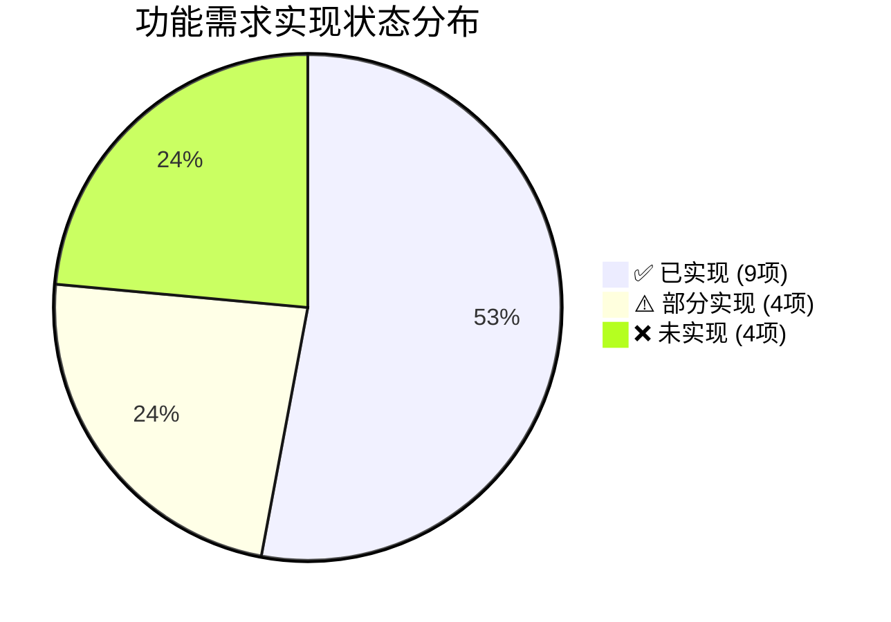

# Python项目管理工具总库管理需求规格说明书

## 1. 文档基础信息

**文档标题**：Python项目管理工具总库管理需求规格说明书
**文档版本**：REQ V2.8.0
**编制日期**：2026-06-14
**编制人**：文档专家
**审核人**：[待审核]

## 2. 版本变更记录

| 版本号 | 变更内容 | 变更人 | 变更日期 |
|--------|----------|--------|----------|
| REQ V2.7.0 | 更新功能达成度（FR-008代码风格检查已实现，FR-009变更管理V2.1.0补齐domain/nature/scope字段）；新增5个P0 Bug修复验收项；更新变更数据模型为V2.1.0三维分类；更新统计概览 | 技术负责人 | 2026-06-14 |
| V1.0.3 | 更新需求规格说明书，确保与实际功能一致 | 文档专家 | 2026-03-10 |
| V1.0.2 | 初始创建需求规格说明书 | 系统 | 2026-02-26 |

## 3. 功能达成度总览

### 3.1 统计概览

| 状态 | 数量 | 占比 |
|------|------|------|
| ✅ 已实现 | 9 | 53% |
| ⚠️ 部分实现 | 4 | 23.5% |
| ❌ 未实现 | 4 | 23.5% |
| **合计** | **17** | **100%** |

### 3.2 按状态分布

### 3.3 状态明细

| FR编号 | 功能名称 | 实现状态 | 实现说明 |
|--------|----------|----------|----------|
| FR-001 | 总库创建与配置 | ✅ | LibraryService完整实现 |
| FR-002 | 项目导入与管理 | ✅ | ProjectService完整实现（含批量导入/模板变更） |
| FR-003 | 项目分类管理 | ✅ | LibraryService.create_category / list_categories |
| FR-004 | 项目搜索与过滤 | ✅ | list_projects支持keyword/status/business_line过滤 |
| FR-005 | 项目状态监控 | ⚠️ | 统计信息有，无实时运行状态监控/告警通知 |
| FR-006 | 总库统计分析 | ⚠️ | get_library_statistics存在，无图表可视化 |
| FR-007 | 依赖关系分析 | ⚠️ | library_dependency_service存在，无图谱可视化 |
| FR-008 | 健康状态评估 | ✅ | check_service已实现目录检查+命名检查+文档检查+代码风格检查（SCL命名/结构+Python命名） |
| FR-009 | 项目变更跟踪 | ✅ | ChangeService V2.1.0完整实现（Domain×Nature×Scope三维分类+传播链+分级审批+台账） |
| FR-010 | 版本管理 | ✅ | 变更系统内置版本管理 |
| FR-011 | 变更审批流程 | ✅ | 完整审批链：草稿→提交→审批→实施→完成，含驳回/取消 |
| FR-012 | 统一配置管理 | ❌ | 仅有基础Config类，无独立模块（后续版本规划） |
| FR-013 | 统一构建与部署 | ⚠️ | build_deploy_service存在，GUI无对应界面 |
| FR-014 | 统一测试管理 | ❌ | 无test_service，无测试管理界面（后续版本规划） |
| FR-015 | 文档管理 | ❌ | 无独立document_service（后续版本规划） |
| FR-016 | 模板管理 | ✅ | 5套内置模板+自定义模板CRUD+导入导出（PRD 2.2） |
| -- | 用户管理系统 | ❌ | 无user_service，GUI无登录界面（后续版本规划） |

## 4. 简介

### 4.1 文档目的
本文档旨在详细描述SW-2026-004_Python项目管理工具的总库管理功能需求，包括功能需求、非功能需求、数据需求、接口需求和验收标准，为开发团队提供明确的开发指南和验收依据。V2.6.0起增加功能实现状态标注，反映各需求与当前代码实际的对应关系。

### 4.2 术语定义

| 术语 | 解释 |
|------|------|
| 总库 | Python自动化项目的集合，包含多个相关的Python项目 |
| 项目 | 单个Python自动化项目，包含代码、配置、文档等 |
| 变更 | 项目的修改和更新，包括代码变更、配置变更等 |
| 版本 | 项目的特定状态，通过版本号标识 |
| 依赖 | 项目间的依赖关系，一个项目依赖另一个项目的功能 |
| 构建 | 将项目代码编译、打包为可执行文件的过程 |
| 部署 | 将构建后的项目部署到目标环境的过程 |
| 健康状态 | 项目的代码质量、测试覆盖率、运行状态等综合指标 |

## 5. 功能需求（Functional Requirements）

### 5.1 总库管理功能

| 功能编号 | 功能名称 | 功能描述 | 详细说明 | 优先级 | 实现状态 |
|----------|----------|----------|----------|--------|----------|
| FR-001 | 总库创建与配置 | 创建和配置Python项目总库，设置总库基本信息和参数 | 1. 支持指定总库名称、存储路径、描述信息 2. 支持设置总库级别的配置参数，如默认构建工具、测试框架等 3. 自动生成总库唯一标识 4. 验证总库路径的有效性和可访问性 | 高 | ✅ 已实现 |
| FR-002 | 项目导入与管理 | 将现有Python项目导入总库，支持项目的添加、删除、更新操作 | 1. 支持从本地文件系统导入现有Python项目 2. 支持批量导入项目 3. 支持手动创建新项目并添加到总库 4. 支持项目的删除、重命名、移动操作 5. 支持项目信息的编辑和更新 6. 验证项目结构的完整性和规范性 | 高 | ✅ 已实现 |
| FR-003 | 项目分类管理 | 对总库中的项目进行分类管理，支持自定义分类 | 1. 支持创建多级分类结构 2. 支持分类的重命名、删除操作 3. 支持项目在分类间的移动 4. 支持按分类筛选和查看项目 | 中 | ✅ 已实现 |
| FR-004 | 项目搜索与过滤 | 支持根据项目名称、类型、状态等条件搜索和过滤项目 | 1. 支持按项目名称、描述、标签等进行模糊搜索 2. 支持按项目状态、分类、业务线等进行过滤 3. 支持多条件组合搜索 4. 支持搜索结果的排序和分页 | 高 | ✅ 已实现 |
| FR-016 | 模板管理 | 提供项目模板管理功能，支持内置模板和自定义模板 | 1. 内置5套标准项目模板 2. 支持自定义模板的创建、编辑、删除（CRUD） 3. 支持模板的导入导出 4. 基于模板快速创建项目 | 中 | ✅ 已实现 |

### 5.2 监控与统计功能

| 功能编号 | 功能名称 | 功能描述 | 详细说明 | 优先级 | 实现状态 |
|----------|----------|----------|----------|--------|----------|
| FR-005 | 项目状态监控 | 监控项目的运行状态、构建状态、测试状态等 | 1. 支持基础统计信息查询 2. 缺失：实时运行状态监控 3. 缺失：状态变更的通知和告警 | 高 | ⚠️ 部分实现 |
| FR-006 | 总库统计分析 | 统计总库中项目数量、类型分布、状态分布等信息 | 1. get_library_statistics接口存在 2. 缺失：图表可视化 3. 缺失：趋势分析和报告生成 | 中 | ⚠️ 部分实现 |
| FR-007 | 依赖关系分析 | 分析项目间的依赖关系，生成依赖图谱 | 1. library_dependency_service存在 2. 缺失：依赖关系图谱可视化 3. 缺失：依赖冲突和循环依赖检测 | 中 | ⚠️ 部分实现 |
| FR-008 | 健康状态评估 | 评估项目的健康状态，包括代码质量、测试覆盖率等 | 1. check_service已实现目录检查+命名检查+文档检查 2. 代码风格检查已实现（SCL命名/结构检查+Python命名检查） 3. 缺失：健康状态综合评分与报告 | 中 | ✅ 已实现 |

### 5.3 变更管理功能

| 功能编号 | 功能名称 | 功能描述 | 详细说明 | 优先级 | 实现状态 |
|----------|----------|----------|----------|--------|----------|
| FR-009 | 项目变更跟踪 | 跟踪项目的变更历史，包括代码变更、配置变更等 | 1. ChangeService V2.1.0完整实现 2. Domain×Nature×Scope三维分类体系 3. 传播链追踪 4. 分级审批触发机制 5. 变更台账 | 高 | ✅ 已实现 |
| FR-010 | 版本管理 | 管理项目的版本信息，支持版本标签、版本比较等 | 1. 变更系统内置版本管理 2. 支持版本创建、标签、描述 3. 支持版本间差异比较 | 高 | ✅ 已实现 |
| FR-011 | 变更审批流程 | 建立变更审批流程，确保变更的合理性和安全性 | 1. 完整审批链：草稿→提交→审批→实施→完成 2. 支持驳回和取消操作 3. 支持审批状态跟踪 | 中 | ✅ 已实现 |

### 5.4 统一管理功能

| 功能编号 | 功能名称 | 功能描述 | 详细说明 | 优先级 | 实现状态 |
|----------|----------|----------|----------|--------|----------|
| FR-012 | 统一配置管理 | 管理总库和项目的配置信息，支持配置模板和批量配置 | 1. 仅有基础Config类 2. 缺失：独立配置管理模块 3. 缺失：配置模板和批量应用 | 高 | ❌ 未实现 |
| FR-013 | 统一构建与部署 | 支持项目的统一构建和部署，自动化构建流程 | 1. build_deploy_service模块存在 2. 缺失：GUI界面无对应入口 3. 后续版本需补齐可视化操作界面 | 高 | ⚠️ 部分实现 |
| FR-014 | 统一测试管理 | 管理项目的测试计划和执行，支持测试结果分析 | 1. 无test_service模块 2. 无测试管理界面 3. 规划为后续版本功能 | 中 | ❌ 未实现 |
| FR-015 | 文档管理 | 管理项目的文档，支持文档版本控制和协作编辑 | 1. 无独立document_service模块 2. 规划为后续版本功能 | 中 | ❌ 未实现 |

### 5.5 用户与权限管理

| 功能编号 | 功能名称 | 功能描述 | 详细说明 | 优先级 | 实现状态 |
|----------|----------|----------|----------|--------|----------|
| US-001 | 用户管理系统 | 用户认证、授权与角色管理 | 1. 无user_service模块 2. GUI无登录界面 3. 当前以单用户/本地模式运行 4. 规划为后续版本功能 | 中 | ❌ 未实现 |

## 6. 非功能需求（Non-Functional Requirements）

| 需求编号 | 需求名称 | 需求描述 | 详细说明 | 优先级 |
|----------|----------|----------|----------|--------|
| NFR-001 | 性能需求 | 总库管理操作响应时间小于2秒，支持管理至少1000个项目 | 1. 总库创建、项目导入等操作响应时间小于2秒 2. 项目搜索和过滤操作响应时间小于1秒 3. 统计分析操作响应时间小于3秒 4. 支持管理至少1000个项目而不影响性能 | 高 |
| NFR-002 | 可靠性需求 | 系统应能稳定运行，数据存储安全可靠，支持数据备份和恢复 | 1. 系统连续运行24小时无故障 2. 数据存储采用事务机制，确保数据一致性 3. 支持自动和手动数据备份 4. 支持数据恢复功能 | 高 |
| NFR-003 | 可扩展性需求 | 系统架构应支持未来功能扩展，模块间低耦合，易于集成新功能 | 1. 采用模块化设计，模块间低耦合 2. 支持插件机制，便于扩展功能 3. 支持第三方工具集成 4. 架构设计考虑未来功能扩展 | 高 |
| NFR-004 | 安全性需求 | 具备用户权限管理，数据传输加密，防止未授权访问 | 1. 支持用户认证和授权机制 2. 支持基于角色的权限控制 3. 数据传输采用加密机制 4. 防止SQL注入、XSS等安全漏洞 | 高 |
| NFR-005 | 可维护性需求 | 代码结构清晰，文档完整，便于维护和扩展 | 1. 代码遵循PEP8规范 2. 提供完整的开发文档 3. 提供详细的API文档 4. 代码模块化，便于维护和扩展 | 高 |
| NFR-006 | 兼容性需求 | 支持不同版本的Python项目，兼容主流的Python框架和库 | 1. 支持Python 3.8+版本的项目 2. 兼容主流的Python框架（如Django、Flask等） 3. 兼容主流的Python库和依赖管理工具 4. 支持不同操作系统环境 | 高 |
| NFR-007 | 易用性需求 | 提供直观的用户界面，操作流程简单明了，易于上手 | 1. 提供图形化用户界面 2. 操作流程符合用户习惯 3. 提供详细的操作指引和帮助文档 4. 支持快捷键和批量操作 | 中 |
| NFR-008 | 可移植性需求 | 支持在不同操作系统环境下运行，无需修改代码 | 1. 支持Windows、Linux、MacOS等主流操作系统 2. 依赖管理采用跨平台方案 3. 提供统一的安装和部署流程 4. 支持不同环境下的配置管理 | 中 |

## 7. 数据需求

### 7.1 总库数据模型

| 数据字段 | 数据类型 | 描述 | 约束 | 优先级 |
|----------|----------|------|------|--------|
| 总库ID | String | 总库唯一标识 | 主键，必填 | 高 |
| 总库名称 | String | 总库名称 | 必填，唯一 | 高 |
| 总库路径 | String | 总库存储路径 | 必填，唯一 | 高 |
| 总库描述 | Text | 总库描述信息 | 可选 | 高 |
| 创建时间 | Datetime | 总库创建时间 | 自动生成 | 高 |
| 最后修改时间 | Datetime | 总库最后修改时间 | 自动更新 | 高 |
| 配置信息 | JSON | 总库配置参数 | 可选 | 高 |
| 项目数量 | Integer | 总库中的项目数量 | 自动计算 | 中 |

### 7.2 项目数据模型

| 数据字段 | 数据类型 | 描述 | 约束 | 优先级 |
|----------|----------|------|------|--------|
| 项目ID | String | 项目唯一标识 | 主键，必填 | 高 |
| 项目名称 | String | 项目名称 | 必填 | 高 |
| 项目路径 | String | 项目存储路径 | 必填，唯一 | 高 |
| 项目描述 | Text | 项目描述信息 | 可选 | 高 |
| 分类ID | String | 所属分类ID | 外键，可选 | 高 |
| 总库ID | String | 所属总库ID | 外键，必填 | 高 |
| 业务线 | String | 所属业务线 | 可选 | 中 |
| 状态 | String | 项目状态（活跃/归档/废弃） | 必填 | 高 |
| 创建时间 | Datetime | 项目创建时间 | 自动生成 | 高 |
| 最后修改时间 | Datetime | 项目最后修改时间 | 自动更新 | 高 |
| 配置信息 | JSON | 项目配置参数 | 可选 | 高 |
| 依赖关系 | JSON | 项目依赖关系 | 可选 | 中 |
| 健康状态 | JSON | 项目健康状态指标 | 可选 | 中 |
| 应用模板版本 | String | 创建时应用的模板版本号 | V2.8.0新增，可选 | 中 |

### 7.3 分类数据模型

| 数据字段 | 数据类型 | 描述 | 约束 | 优先级 |
|----------|----------|------|------|--------|
| 分类ID | String | 分类唯一标识 | 主键，必填 | 高 |
| 分类名称 | String | 分类名称 | 必填 | 高 |
| 分类描述 | Text | 分类描述信息 | 可选 | 高 |
| 父分类ID | String | 父分类ID | 外键，可选 | 高 |
| 总库ID | String | 所属总库ID | 外键，必填 | 高 |
| 创建时间 | Datetime | 分类创建时间 | 自动生成 | 中 |
| 最后修改时间 | Datetime | 分类最后修改时间 | 自动更新 | 中 |

### 7.4 变更数据模型

| 数据字段 | 数据类型 | 描述 | 约束 | 优先级 |
|----------|----------|------|------|--------|
| 变更ID | String | 变更唯一标识 | 主键，必填 | 高 |
| 项目ID | String | 关联项目ID | 外键，必填 | 高 |
| 变更类型 | String | 变更类型（代码/配置/依赖等） | 必填 | 高 |
| 变更描述 | Text | 变更描述信息 | 必填 | 高 |
| 变更前内容 | Text | 变更前的内容 | 可选 | 高 |
| 变更后内容 | Text | 变更后的内容 | 可选 | 高 |
| 变更域 | String | 变更所属领域（Domain） | V2.1.0新增 | 中 |
| 变更性质 | String | 变更性质分类（Nature） | V2.1.0新增 | 中 |
| 影响范围 | String | 变更影响范围（Scope） | V2.1.0新增 | 中 |
| 传播链 | JSON | 变更传播路径 | V2.1.0新增 | 中 |
| 审批等级 | String | 所需审批级别 | V2.1.0新增 | 中 |
| 变更人 | String | 变更执行人员 | 可选 | 高 |
| 变更时间 | Datetime | 变更执行时间 | 自动生成 | 高 |
| 变更状态 | String | 变更状态（待审批/已批准/已执行/已回滚） | 可选 | 中 |

### 7.5 版本数据模型

| 数据字段 | 数据类型 | 描述 | 约束 | 优先级 |
|----------|----------|------|------|--------|
| 版本ID | String | 版本唯一标识 | 主键，必填 | 高 |
| 项目ID | String | 关联项目ID | 外键，必填 | 高 |
| 版本号 | String | 版本号（语义化版本） | 必填 | 高 |
| 版本标签 | String | 版本标签（如release、beta等） | 可选 | 高 |
| 版本描述 | Text | 版本描述信息 | 可选 | 高 |
| 创建时间 | Datetime | 版本创建时间 | 自动生成 | 高 |
| 创建人 | String | 版本创建人员 | 可选 | 中 |
| 变更内容 | Text | 版本变更内容 | 可选 | 中 |

### 7.6 配置数据模型

| 数据字段 | 数据类型 | 描述 | 约束 | 优先级 |
|----------|----------|------|------|--------|
| 配置ID | String | 配置唯一标识 | 主键，必填 | 高 |
| 配置名称 | String | 配置名称 | 必填 | 高 |
| 配置类型 | String | 配置类型（总库/项目/模板） | 必填 | 高 |
| 关联ID | String | 关联对象ID（总库ID/项目ID） | 外键，可选 | 高 |
| 配置内容 | JSON | 配置内容 | 必填 | 高 |
| 创建时间 | Datetime | 配置创建时间 | 自动生成 | 中 |
| 最后修改时间 | Datetime | 配置最后修改时间 | 自动更新 | 中 |

### 7.7 模板数据模型

| 数据字段 | 数据类型 | 描述 | 约束 | 优先级 |
|----------|----------|------|------|--------|
| 模板ID | String | 模板唯一标识 | 主键，必填 | 高 |
| 模板名称 | String | 模板名称 | 必填 | 高 |
| 模板类型 | String | 模板分类（内置/自定义） | 必填 | 高 |
| 模板描述 | Text | 模板描述信息 | 可选 | 中 |
| 模板内容 | JSON | 模板结构定义 | 必填 | 高 |
| 结构版本号 | String | 模板结构版本号 | V2.8.0新增，默认"1.0" | 中 |
| 父模板ID | String | 继承的父模板ID | V2.8.0新增，可选 | 中 |
| 创建时间 | Datetime | 模板创建时间 | 自动生成 | 中 |
| 最后修改时间 | Datetime | 模板最后修改时间 | 自动更新 | 中 |

## 8. 接口需求

### 8.1 内部接口

| 接口编号 | 接口名称 | 功能描述 | 输入输出概要 | 优先级 |
|----------|----------|----------|-------------|--------|
| II-001 | 总库管理接口 | 管理总库的创建、配置、删除等操作 | 输入：总库信息（名称、路径、描述、配置） → 输出：操作结果（状态、总库ID） | 高 |
| II-002 | 项目管理接口 | 管理项目的导入、更新、删除等操作 | 输入：项目信息（名称、路径、描述、分类） → 输出：操作结果（状态、项目ID） | 高 |
| II-003 | 分类管理接口 | 管理项目分类的创建、更新、删除等操作 | 输入：分类信息（名称、描述、父分类） → 输出：操作结果（状态、分类ID） | 中 |
| II-004 | 监控接口 | 提供项目状态监控和统计数据 | 输入：监控参数（项目ID、监控类型、时间范围） → 输出：监控结果 | 高 |
| II-005 | 变更管理接口 | 管理项目的变更历史和版本信息 | 输入：变更信息（项目ID、变更类型、变更内容） → 输出：操作结果（状态、变更ID） | 高 |
| II-006 | 配置管理接口 | 管理总库和项目的配置信息 | 输入：配置信息（配置类型、配置内容、关联ID） → 输出：操作结果（状态、配置ID） | 高 |
| II-007 | 构建与部署接口 | 管理项目的构建和部署操作 | 输入：构建参数 → 输出：操作结果（状态、构建日志、部署状态） | 高 |
| II-008 | 测试管理接口 | 管理项目的测试计划和执行 | 输入：测试参数 → 输出：操作结果（状态、测试结果、测试报告） | 中 |
| II-009 | 模板管理接口 | 管理项目模板的CRUD和导入导出 | 输入：模板信息 → 输出：操作结果（状态、模板ID） | 中 |

### 8.2 外部接口

| 接口编号 | 接口名称 | 功能描述 | 输入输出概要 | 优先级 |
|----------|----------|----------|-------------|--------|
| EI-001 | RESTful API接口 | 提供RESTful API，支持外部系统集成 | HTTP请求 → JSON响应（支持总库/项目/分类的CRUD、监控、变更管理） | 高 |
| EI-002 | 命令行接口 | 提供命令行工具，支持脚本化操作 | 命令参数 → 命令执行结果（支持总库管理、项目管理、构建部署等命令） | 高 |
| EI-003 | Web界面接口 | 提供Web/GUI界面，支持图形化操作 | 用户操作 → 界面响应（总库管理、项目管理、监控统计、变更管理等界面） | 高 |
| EI-004 | 第三方集成接口 | 支持与第三方工具和系统的集成 | 集成参数 → 集成结果（支持Git版本控制、CI/CD工具、测试工具集成） | 中 |

## 9. 验收标准

### 9.1 功能验收

| 验收编号 | 验收项 | 验收标准 | 实现状态 |
|----------|--------|----------|----------|
| AC-001 | 总库创建与配置 | 能够成功创建总库，设置基本信息和配置参数，响应时间小于2秒 | ✅ |
| AC-002 | 项目导入与管理 | 能够导入和管理项目，支持批量导入和模板创建，响应时间小于2秒 | ✅ |
| AC-003 | 项目分类管理 | 能够创建多级分类结构，支持分类CRUD和项目归类 | ✅ |
| AC-004 | 项目搜索与过滤 | 能够多条件组合搜索和过滤，响应时间小于1秒 | ✅ |
| AC-005 | 项目状态监控 | 基础统计可用，实时监控和告警待后续版本 | ⚠️ |
| AC-006 | 总库统计分析 | get_library_statistics可用，图表可视化待后续版本 | ⚠️ |
| AC-007 | 依赖关系分析 | 依赖分析服务可用，图谱可视化待后续版本 | ⚠️ |
| AC-008 | 健康状态评估 | 目录/命名/文档检查可用，代码风格检查待补齐 | ⚠️ |
| AC-009 | 项目变更跟踪 | ChangeService V2.1.0完整实现三维分类、传播链、台账 | ✅ |
| AC-010 | 版本管理 | 变更系统内置版本管理、差异比较 | ✅ |
| AC-011 | 变更审批流程 | 完整审批链（草稿→提交→审批→实施→完成）、驳回/取消 | ✅ |
| AC-012 | 统一配置管理 | 仅有基础Config类，独立模块规划中 | ❌ |
| AC-013 | 统一构建与部署 | build_deploy_service模块存在，GUI界面待补齐 | ⚠️ |
| AC-014 | 统一测试管理 | 规划为后续版本功能 | ❌ |
| AC-015 | 文档管理 | 规划为后续版本功能 | ❌ |
| AC-016 | 模板管理 | 5套内置模板+CRUD+导入导出完整实现 | ✅ |

### 9.2 非功能验收

| 验收编号 | 验收项 | 验收标准 | 测试方法 |
|----------|--------|----------|----------|
| AC-017 | 性能验收 | 核心操作响应时间满足指标，支持1000+项目管理 | 性能测试 |
| AC-018 | 可靠性验收 | 系统连续运行无故障，数据一致性和备份恢复 | 可靠性测试 |
| AC-019 | 安全性验收 | 认证授权、权限控制、传输加密、防注入 | 安全测试 |
| AC-020 | 兼容性验收 | Python 3.8+支持，主流框架兼容，跨平台运行 | 兼容性测试 |
| AC-021 | 易用性验收 | 图形化界面、操作指引、快捷键和批量操作 | 易用性测试 |

### 9.3 接口验收

| 验收编号 | 验收项 | 验收标准 | 测试方法 |
|----------|--------|----------|----------|
| AC-022 | RESTful API接口验收 | 完整RESTful API，响应<2秒，REST规范 | 接口测试 |
| AC-023 | 命令行接口验收 | 完整CLI工具，响应<2秒，帮助信息完善 | 接口测试 |
| AC-024 | Web界面接口验收 | 完整Web界面，加载<3秒，响应式设计 | 接口测试 |
| AC-025 | 第三方集成接口验收 | Git、CI/CD、测试工具成功集成 | 集成测试 |

## 10. 风险评估

| 风险编号 | 风险名称 | 风险描述 | 严重程度 | 发生概率 | 应对措施 |
|----------|----------|----------|----------|----------|----------|
| RA-001 | 数据安全风险 | 总库数据存储和传输可能存在安全隐患 | 高 | 中 | 实现数据加密和访问控制；定期安全审计；数据备份和恢复机制 |
| RA-002 | 性能风险 | 管理大量项目时可能出现性能瓶颈 | 中 | 中 | 优化数据库设计和查询；数据缓存机制；异步处理和并行计算 |
| RA-003 | 兼容性风险 | 不同版本的Python项目可能存在兼容性问题 | 中 | 高 | 版本检测和兼容处理；项目环境隔离；多版本Python环境管理 |
| RA-004 | 依赖管理风险 | 项目间依赖关系复杂可能导致管理困难 | 中 | 中 | 依赖关系分析和可视化；依赖冲突检测和解决；统一版本管理 |
| RA-005 | 扩展性风险 | 未来功能扩展可能受到现有架构限制 | 低 | 中 | 模块化设计；插件机制；架构评审和优化 |
| RA-006 | 集成风险 | 与第三方工具和系统的集成可能出现问题 | 中 | 中 | 标准化集成接口；集成测试验证机制；详细集成文档 |
| RA-007 | 维护风险 | 系统复杂度增加可能导致维护困难 | 低 | 中 | 代码结构清晰，文档完整；代码审查和质量保证；系统架构文档 |

## 11. 验收计划

### 11.1 验收阶段划分
1. **功能测试阶段**：验证所有功能需求的实现情况
2. **非功能测试阶段**：验证性能、可靠性、安全性等非功能需求
3. **接口测试阶段**：验证内部和外部接口的实现情况
4. **集成测试阶段**：验证系统与第三方工具和系统的集成情况
5. **验收评审阶段**：综合评估系统是否满足所有需求

### 11.2 验收测试方法
1. **功能测试**：采用黑盒测试方法，验证系统功能是否符合需求规格
2. **性能测试**：采用负载测试和压力测试方法，验证系统性能是否满足需求
3. **安全测试**：采用安全扫描和渗透测试方法，验证系统安全性是否满足需求
4. **兼容性测试**：在不同环境下测试系统的兼容性
5. **集成测试**：测试系统与第三方工具和系统的集成情况
6. **用户验收测试**：由最终用户进行测试，验证系统是否满足实际使用需求

### 11.3 验收标准达成条件
1. 所有已实现功能验收项通过测试
2. 所有非功能验收项通过测试
3. 所有接口验收项通过测试
4. 所有集成测试通过
5. 用户验收测试通过
6. 无严重风险未解决

## 12. 附录

### 12.1 参考资料

| 资料名称 | 版本 | 来源 |
|----------|------|------|
| Python项目管理最佳实践 | 1.0 | 行业标准 |
| RESTful API设计规范 | 1.0 | 行业标准 |
| 数据库设计规范 | 1.0 | 行业标准 |
| SW-2026-004 项目立项文档 | V1.0 | 项目内部 |
| ChangeService V2.1.0 变更系统设计 | V2.1.0 | 项目内部 |
