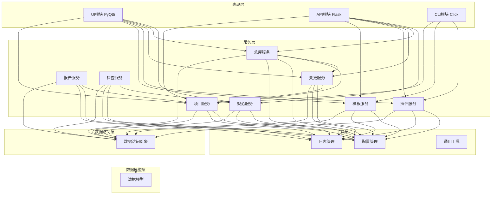
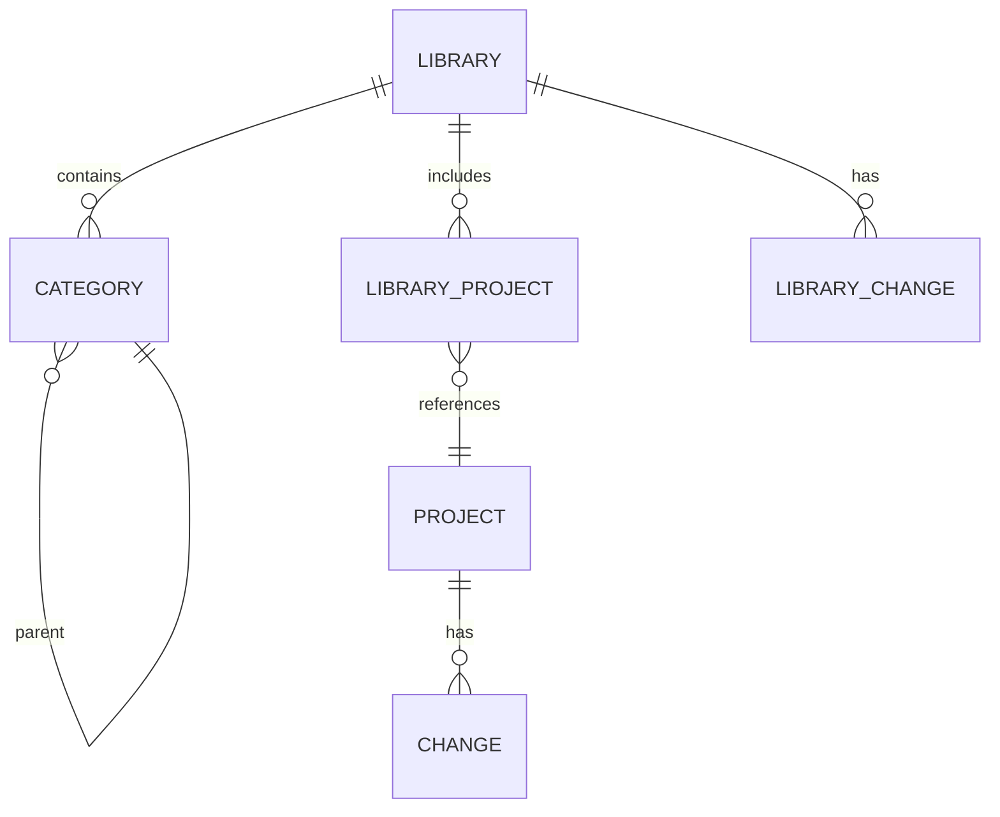
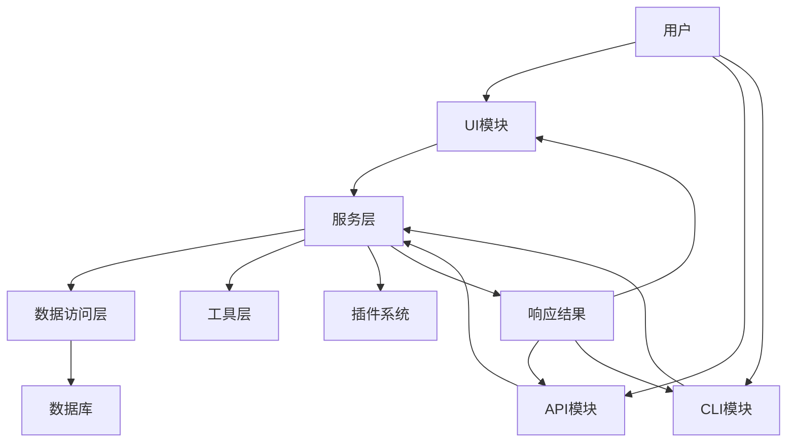

# SW-2026-004 Python项目管理工具 - 架构设计文档

## 1. 文档基础信息

**文档标题**：SW-2026-004 Python项目管理工具架构设计文档
**文档版本**：ARCH-V1.0.3
**编制日期**：2026-03-15
**编制人**：技术负责人
**审核人**：技术负责人
**项目编号**：SW-2026-004
**迭代版本**：V1.0.3

## 2. 版本变更记录

| 版本号 | 变更内容 | 变更人 | 变更日期 | 详细说明 |
|--------|----------|--------|----------|----------|
| V1.0.0 | 初始版本 | 技术负责人 | 2026-03-12 | 创建架构设计文档 |
| V1.0.3 | 更新版本号和审核人 | 技术负责人 | 2026-03-15 | 统一版本号为V1.0.3，更新审核人 |

## 3. 系统架构概述

### 1.1 架构风格

本系统采用分层架构设计，结合服务导向设计理念，确保系统的可扩展性、可维护性和可测试性。

### 1.2 核心层次

| 层次 | 职责 | 主要模块 |
|------|------|----------|
| 表现层（Presentation Layer） | 负责用户交互和数据展示 | UI（PyQt5）、API（Flask）、CLI（Click） |
| 服务层（Service Layer） | 实现业务逻辑 | 项目服务、模板服务、插件服务、变更服务等 |
| 数据访问层（Data Access Layer） | 负责数据持久化和访问 | DAO层、数据库操作 |
| 数据模型层（Model Layer） | 定义数据结构和关系 | 项目模型、模板模型、插件模型等 |
| 工具层（Utility Layer） | 提供通用功能和工具 | 日志、配置、文件操作等 |

## 2. 模块划分与依赖关系

### 2.1 模块划分

#### 2.1.1 核心模块

| 模块名称 | 主要职责 | 文件位置 | 依赖模块 |
|----------|----------|----------|----------|
| 项目管理模块 | 项目的创建、查询、更新和删除 | src/services/project_service.py | 数据模型层、数据访问层、工具层 |
| 模板管理模块 | 模板的创建、查询、更新和删除 | src/services/template_service.py | 数据模型层、数据访问层 |
| 插件管理模块 | 插件的安装、启用、禁用和配置 | src/services/plugin_service.py | 数据模型层、数据访问层 |
| 变更管理模块 | 变更的创建、审批、执行和跟踪 | src/services/change_service.py | 项目管理模块、数据模型层 |
| 总库管理模块 | 总库的管理、统计和分析 | src/services/library_service.py | 项目管理模块、变更管理模块 |
| 规范管理模块 | 规范的创建、查询和应用 | src/services/spec_service.py | 数据模型层、数据访问层 |

#### 2.1.2 支持模块

| 模块名称 | 主要职责 | 文件位置 | 依赖模块 |
|----------|----------|----------|----------|
| 配置管理模块 | 系统配置的加载和管理 | src/core/config.py | 工具层 |
| 数据库模块 | 数据库连接和管理 | src/dao/database.py | 工具层 |
| 日志模块 | 系统日志的记录和管理 | src/utils/logger.py | 工具层 |
| 认证模块 | 用户认证和权限管理 | src/api/auth.py | 数据模型层 |
| 报告模块 | 报告的生成和管理 | src/services/report_service.py | 项目管理模块 |
| 检查模块 | 规范检查和验证 | src/services/check_service.py | 规范管理模块 |

### 2.2 模块依赖关系图

## 3. 核心模块详细说明

### 3.1 项目管理模块

#### 3.1.1 功能职责
- 项目的创建、查询、更新和删除
- 项目编号的生成和管理
- 项目状态的管理
- 项目统计信息的获取

#### 3.1.2 核心类和方法
| 类/方法 | 描述 | 参数 | 返回值 |
|---------|------|------|--------|
| `ProjectService.create_project()` | 创建新项目 | business_line, name, template_id, manager, description, custom_path | (project, error) |
| `ProjectService.get_project()` | 获取项目详情 | project_id | project |
| `ProjectService.update_project()` | 更新项目信息 | project_id, data | (project, error) |
| `ProjectService.delete_project()` | 删除项目 | project_id | (success, error) |
| `ProjectService.list_projects()` | 获取项目列表 | status, business_line, keyword, page, size | (projects, total) |
| `ProjectService.generate_project_code()` | 生成项目编号 | business_line | (code, error) |
| `ProjectService.get_statistics()` | 获取项目统计信息 | - | stats |

#### 3.1.3 数据流程
1. 接收用户请求（UI/API/CLI）
2. 验证请求参数
3. 调用相应的服务方法
4. 与数据访问层交互
5. 返回处理结果

### 3.2 模板管理模块

#### 3.2.1 功能职责
- 模板的创建、查询、更新和删除
- 模板的导入和导出
- 模板结构的验证
- 内置模板的管理

#### 3.2.2 核心类和方法
| 类/方法 | 描述 | 参数 | 返回值 |
|---------|------|------|--------|
| `TemplateService.create_template()` | 创建自定义模板 | data | (template, error) |
| `TemplateService.get_template()` | 获取模板详情 | template_id | template |
| `TemplateService.update_template()` | 更新模板信息 | template_id, data | (template, error) |
| `TemplateService.delete_template()` | 删除模板 | template_id | (success, error) |
| `TemplateService.list_templates()` | 获取模板列表 | compiler, scene, is_builtin | templates |
| `TemplateService.export_template()` | 导出模板 | template_id | (json_data, error) |
| `TemplateService.import_template()` | 导入模板 | template_json | (template, error) |
| `TemplateService.validate_template_structure()` | 验证模板结构 | structure | (valid, message) |

#### 3.2.3 数据流程
1. 接收用户请求（UI/API/CLI）
2. 验证请求参数
3. 调用相应的服务方法
4. 与数据访问层交互
5. 返回处理结果

### 3.3 插件管理模块

#### 3.3.1 功能职责
- 插件的安装、启用、禁用和卸载
- 插件的配置管理
- 插件的执行和调用
- 插件市场的集成

#### 3.3.2 核心类和方法
| 类/方法 | 描述 | 参数 | 返回值 |
|---------|------|------|--------|
| `PluginService.install_plugin()` | 安装插件 | plugin_path | (plugin, error) |
| `PluginService.get_plugin()` | 获取插件信息 | plugin_id | plugin |
| `PluginService.enable_plugin()` | 启用插件 | plugin_id | (success, error) |
| `PluginService.disable_plugin()` | 禁用插件 | plugin_id | (success, error) |
| `PluginService.uninstall_plugin()` | 卸载插件 | plugin_id | (success, error) |
| `PluginService.list_plugins()` | 获取插件列表 | status | plugins |
| `PluginService.configure_plugin()` | 配置插件 | plugin_id, config | (success, error) |
| `PluginService.execute_plugin()` | 执行插件 | plugin_id, params | (result, error) |

#### 3.3.3 数据流程
1. 接收用户请求（UI/API/CLI）
2. 验证请求参数
3. 调用相应的服务方法
4. 与数据访问层交互
5. 执行插件逻辑
6. 返回处理结果

### 3.4 变更管理模块

#### 3.4.1 功能职责
- 变更的创建、查询、更新和删除
- 变更的审批流程管理
- 变更的执行和跟踪
- 变更的影响分析

#### 3.4.2 核心类和方法
| 类/方法 | 描述 | 参数 | 返回值 |
|---------|------|------|--------|
| `ChangeService.create_change()` | 创建变更 | project_id, title, description, change_type | (change, error) |
| `ChangeService.get_change()` | 获取变更详情 | change_id | change |
| `ChangeService.update_change()` | 更新变更信息 | change_id, data | (change, error) |
| `ChangeService.delete_change()` | 删除变更 | change_id | (success, error) |
| `ChangeService.list_changes()` | 获取变更列表 | project_id, status, change_type, page, size | (changes, total) |
| `ChangeService.approve_change()` | 审批变更 | change_id, approved_by, comment | (success, error) |
| `ChangeService.execute_change()` | 执行变更 | change_id, executed_by | (success, error) |
| `ChangeService.analyze_impact()` | 分析变更影响 | change_id | (impact, error) |

#### 3.4.3 数据流程
1. 接收用户请求（UI/API/CLI）
2. 验证请求参数
3. 调用相应的服务方法
4. 与数据访问层交互
5. 执行变更流程
6. 返回处理结果

### 3.5 总库管理模块

#### 3.5.1 功能职责
- 总库的管理和维护
- 项目的分类和组织
- 总库统计信息的获取
- 总库变更记录的管理

#### 3.5.2 核心类和方法
| 类/方法 | 描述 | 参数 | 返回值 |
|---------|------|------|--------|
| `LibraryService.get_library()` | 获取总库信息 | library_id | library |
| `LibraryService.update_library()` | 更新总库信息 | library_id, data | (library, error) |
| `LibraryService.add_project_to_library()` | 向总库添加项目 | library_id, project_id, category_id | (success, error) |
| `LibraryService.remove_project_from_library()` | 从总库移除项目 | library_id, project_id | (success, error) |
| `LibraryService.get_library_projects()` | 获取总库中的项目 | library_id, category_id, status, keyword, page, size | (projects, total) |
| `LibraryService.get_library_statistics()` | 获取总库统计信息 | library_id | stats |
| `LibraryChangeService.create_library_change()` | 创建总库变更 | library_id, change_type, title, description | (change, error) |
| `LibraryChangeService.list_library_changes()` | 获取总库变更记录 | library_id, change_type, status, page, size | (changes, total) |

#### 3.5.3 数据流程
1. 接收用户请求（UI/API/CLI）
2. 验证请求参数
3. 调用相应的服务方法
4. 与数据访问层交互
5. 执行总库管理操作
6. 返回处理结果

## 4. 数据模型设计

### 4.1 核心数据模型

#### 4.1.1 项目模型（Project）
| 字段名 | 数据类型 | 描述 |
|--------|----------|------|
| id | String | 项目唯一标识 |
| code | String | 项目编号 |
| name | String | 项目名称 |
| business_line | String | 业务线代码 |
| manager | String | 项目负责人 |
| description | String | 项目描述 |
| status | String | 项目状态 |
| created_at | DateTime | 创建时间 |
| updated_at | DateTime | 更新时间 |

#### 4.1.2 模板模型（Template）
| 字段名 | 数据类型 | 描述 |
|--------|----------|------|
| id | String | 模板唯一标识 |
| name | String | 模板名称 |
| compiler | String | 编译器类型 |
| scene | String | 应用场景 |
| is_builtin | Boolean | 是否内置模板 |
| structure | JSON | 模板结构 |
| created_at | DateTime | 创建时间 |
| updated_at | DateTime | 更新时间 |

#### 4.1.3 插件模型（Plugin）
| 字段名 | 数据类型 | 描述 |
|--------|----------|------|
| id | String | 插件唯一标识 |
| name | String | 插件名称 |
| version | String | 插件版本 |
| status | String | 插件状态 |
| description | String | 插件描述 |
| path | String | 插件路径 |
| config | JSON | 插件配置 |
| created_at | DateTime | 创建时间 |
| updated_at | DateTime | 更新时间 |

#### 4.1.4 变更模型（Change）
| 字段名 | 数据类型 | 描述 |
|--------|----------|------|
| id | String | 变更唯一标识 |
| project_id | String | 项目ID |
| title | String | 变更标题 |
| description | String | 变更描述 |
| change_type | String | 变更类型 |
| status | String | 变更状态 |
| requested_by | String | 申请人 |
| approved_by | String | 审批人 |
| executed_by | String | 执行人 |
| impact_assessment | JSON | 影响评估 |
| implementation_plan | JSON | 实施计划 |
| created_at | DateTime | 创建时间 |
| updated_at | DateTime | 更新时间 |

#### 4.1.5 总库模型（Library）
| 字段名 | 数据类型 | 描述 |
|--------|----------|------|
| id | String | 总库唯一标识 |
| name | String | 总库名称 |
| description | String | 总库描述 |
| root_path | String | 总库根路径 |
| status | String | 总库状态 |
| created_at | DateTime | 创建时间 |
| updated_at | DateTime | 更新时间 |

#### 4.1.6 分类模型（Category）
| 字段名 | 数据类型 | 描述 |
|--------|----------|------|
| id | String | 分类唯一标识 |
| library_id | String | 所属总库ID |
| name | String | 分类名称 |
| description | String | 分类描述 |
| parent_id | String | 父分类ID |

#### 4.1.7 总库项目关联模型（LibraryProject）
| 字段名 | 数据类型 | 描述 |
|--------|----------|------|
| library_id | String | 总库ID |
| project_id | String | 项目ID |
| added_at | DateTime | 添加时间 |
| category_id | String | 分类ID |

#### 4.1.8 总库变更模型（LibraryChange）
| 字段名 | 数据类型 | 描述 |
|--------|----------|------|
| id | String | 变更唯一标识 |
| library_id | String | 总库ID |
| change_type | String | 变更类型 |
| status | String | 变更状态 |
| title | String | 变更标题 |
| description | String | 变更描述 |
| requested_by | String | 申请人 |
| approved_by | String | 审批人 |
| impact_assessment | JSON | 影响评估 |
| implementation_plan | JSON | 实施计划 |
| created_at | DateTime | 创建时间 |
| updated_at | DateTime | 更新时间 |

### 4.2 数据关系图

## 5. 数据流设计

### 5.1 主要数据流程

#### 5.1.1 项目创建流程
1. 用户通过UI/API/CLI发起项目创建请求
2. 项目服务验证请求参数
3. 项目服务生成项目编号
4. 项目服务创建项目记录
5. 项目服务返回创建结果

#### 5.1.2 变更管理流程
1. 用户通过UI/API发起变更创建请求
2. 变更服务验证请求参数
3. 变更服务创建变更记录
4. 审批人审批变更
5. 执行人执行变更
6. 变更服务更新变更状态
7. 变更服务返回变更结果

#### 5.1.3 插件管理流程
1. 用户通过UI/API发起插件安装请求
2. 插件服务验证插件文件
3. 插件服务安装插件
4. 插件服务启用插件
5. 用户配置插件
6. 用户执行插件
7. 插件服务返回执行结果

### 5.2 数据流向图

## 6. 技术选型

### 6.1 核心技术栈

| 技术 | 版本 | 用途 | 依赖关系 |
|------|------|------|----------|
| Python | 3.14 | 核心编程语言 | - |
| Flask | 3.1.2 | Web API框架 | Python |
| PyQt5 | 5.15.10 | GUI框架 | Python |
| SQLite | 3.45.0 | 内置数据库 | - |
| SQLAlchemy | 2.0.23 | ORM框架 | Python |
| Click | 8.1.7 | CLI工具 | Python |
| PyGit2 | 1.14.1 | Git操作 | Python |
| NetworkX | 3.2.1 | 依赖关系图分析 | Python |
| Jinja2 | 3.1.2 | 模板引擎 | Python |
| Markdown | 3.5.1 | 文档生成 | Python |

### 6.2 第三方库依赖

| 库名称 | 版本 | 用途 | 所属模块 |
|--------|------|------|----------|
| Flask-CORS | 4.0.0 | 跨域支持 | API模块 |
| PyQt5-Qt5 | 5.15.10 | Qt5核心库 | UI模块 |
| PyQt5-sip | 12.13.0 | SIP绑定 | UI模块 |
| GitPython | 3.1.43 | Git操作 | 总库模块 |
| python-dotenv | 1.0.0 | 环境变量管理 | 配置模块 |
| colorlog | 6.8.2 | 彩色日志 | 日志模块 |
| requests | 2.31.0 | HTTP客户端 | 插件模块 |
| pyyaml | 6.0.1 | YAML解析 | 配置模块 |

## 7. 部署与集成

### 7.1 部署方式

#### 7.1.1 安装包部署
- 生成可执行文件
- 提供安装向导
- 自动配置环境

#### 7.1.2 源码部署
- 克隆代码仓库
- 安装依赖包
- 配置环境变量
- 运行主程序

### 7.2 集成方式

#### 7.2.1 API集成
- 提供RESTful API
- 支持API Key认证
- 提供Swagger文档

#### 7.2.2 插件集成
- 支持插件安装和卸载
- 提供插件API
- 支持插件配置

## 8. 性能与安全

### 8.1 性能优化

#### 8.1.1 数据库优化
- 使用索引
- 优化查询
- 批量操作

#### 8.1.2 缓存策略
- 内存缓存
- 文件缓存
- 数据库缓存

#### 8.1.3 并发处理
- 多线程
- 异步处理
- 并行计算

### 8.2 安全措施

#### 8.2.1 认证与授权
- API Key认证
- 角色权限控制
- 操作审计

#### 8.2.2 输入验证
- 参数验证
- 数据过滤
- 防注入攻击

#### 8.2.3 数据安全
- 敏感数据加密
- 备份与恢复
- 访问控制

## 9. 扩展性设计

### 9.1 模块扩展

- 插件系统：支持第三方插件
- 服务层：可扩展新服务
- 数据模型：可添加新模型

### 9.2 API扩展

- 版本控制：支持API版本管理
- 路由扩展：可添加新路由
- 中间件：可添加新中间件

### 9.3 功能扩展

- 总库管理：可扩展新功能
- 变更管理：可扩展新流程
- 规范管理：可扩展新规范

## 10. 结论

本架构设计文档详细描述了SW-2026-004 Python项目管理工具的系统架构、模块划分、依赖关系、数据模型和技术选型。系统采用分层架构设计，确保了系统的可扩展性、可维护性和可测试性。

通过清晰的模块划分和依赖关系管理，系统实现了功能的模块化和组件化，便于后续的功能扩展和维护。数据模型设计合理，满足了系统的业务需求。技术选型适当，使用了成熟的技术栈和第三方库，确保了系统的稳定性和性能。

该架构设计为系统的开发和维护提供了清晰的指导，为后续的功能扩展和性能优化奠定了基础。

---

**文档版本**：V1.0.0
**编写日期**：2026-03-10
**编写人员**：系统
