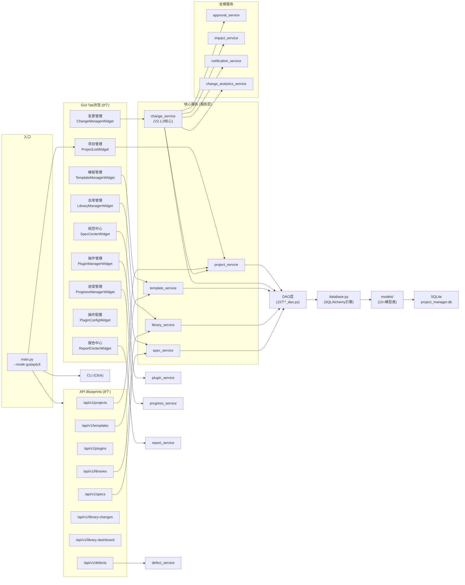
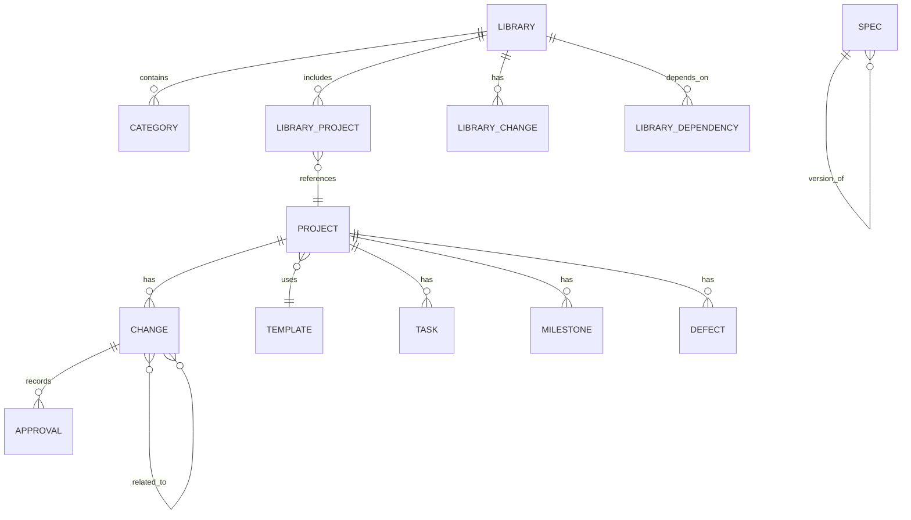
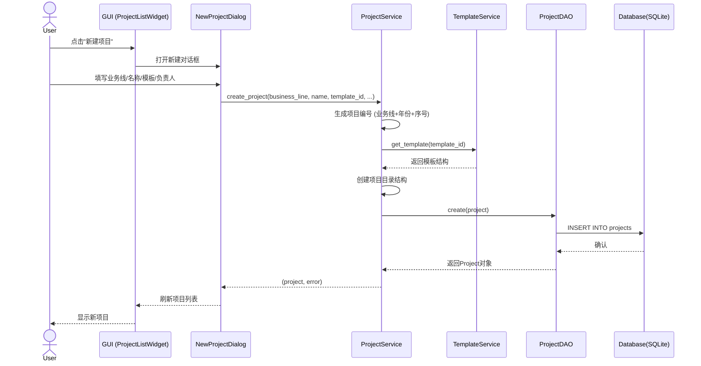
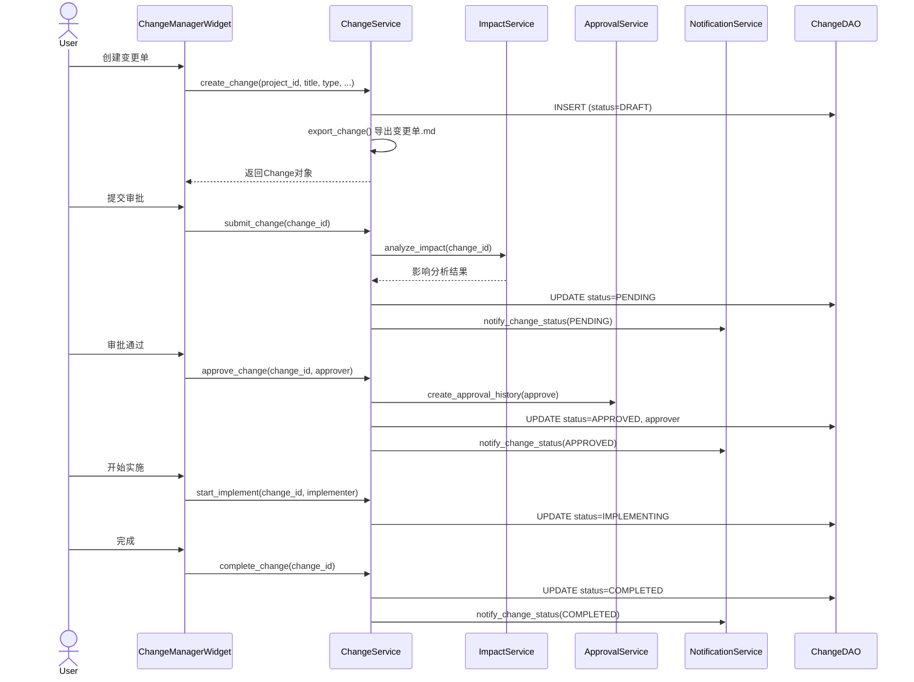

# SW-2026-004 Python项目管理工具 - 架构设计文档

## 1. 文档基础信息

| 属性 | 内容 |
|------|------|
| **文档标题** | SW-2026-004 Python项目管理工具 架构设计文档 |
| **文档版本** | ARCH V2.8.0 |
| **编制日期** | 2026-06-14 |
| **编制人** | 技术负责人 |
| **项目编号** | SW-2026-004 |
| **对应产品版本** | V2.8.0 |

## 2. 版本变更记录

| 版本号 | 变更内容 | 变更人 | 变更日期 |
|--------|----------|--------|----------|
| V1.0.0 | 初始版本 | 技术负责人 | 2026-03-12 |
| V1.0.3 | 统一版本号，更新审核人 | 技术负责人 | 2026-03-15 |
| V2.6.0 | 全面重写：基于实际代码结构（24个service、9Tab页签、8蓝图），新增变更管理V2.1.0架构、传播链追踪、分级审批；新增Mermaid架构分层图与模块依赖图；补充dependency-injector容器、pydantic配置、alembic迁移、security/rate_limiter/cache等实际组件 | 技术负责人 | 2026-06-12 |

## 3. 系统架构概述

### 3.1 架构风格

本系统采用**经典分层架构**（Layered Architecture），从上到下划分为5个逻辑层，层间通过接口/依赖注入解耦，遵循"上层依赖下层、下层不感知上层"的原则。表现层提供三种等价入口（GUI / API / CLI），共享同一服务层。

### 3.2 架构分层图

```mermaid
graph TD
    subgraph 表现层_Presentation["表现层 (Presentation)"]
        GUI["GUI<br/>PyQt5 5.15+<br/>9个Tab页签"]
        API["API<br/>Flask 3.0.2<br/>8个Blueprint + JWT"]
        CLI["CLI<br/>Click 8.1.7<br/>create-project/check-project/sync-spec等"]
    end

    subgraph 服务层_Service["服务层 (Service Layer)"]
        direction TB
        PS["project_service"]
        TS["template_service"]
        PLS["plugin_service"]
        CS["change_service"]
        LS["library_service"]
        SS["spec_service"]
        RS["report_service"]
        CHS["check_service"]
        DS["defect_service"]
        PMS["plugin_market_service"]
        LCS["library_change_service"]
        BDS["build_deploy_service"]
        AS["approval_service"]
        NS["notification_service"]
        IS["impact_service"]
        PRS["progress_service"]
        ES["export_service"]
        STS["statistics_service"]
        CAS["change_analytics_service"]
        LDS["library_dashboard_service"]
        LDPS["library_dependency_service"]
        LRS["library_report_service"]
        LSS["library_spec_service"]
        LVS["library_version_service"]
    end

    subgraph 数据访问层_DAO["数据访问层 (DAO Layer)"]
        DB[(database.py<br/>SQLAlchemy 2.0.27<br/>引擎/会话/自动迁移)]
        DAOs["project_dao / template_dao / plugin_dao<br/>change_dao / library_dao / spec_dao<br/>defect_dao / approval_dao / milestone_dao<br/>task_dao / library_change_dao / etc."]
    end

    subgraph 数据模型层_Model["数据模型层 (Model Layer)"]
        Models["project / template / plugin<br/>change / spec / library<br/>task / milestone / defect<br/>approval / impact / etc.<br/><br/>SQLAlchemy ORM + Alembic 1.13.1 迁移"]
    end

    subgraph 工具层_Utility["工具层 (Utility Layer)"]
        Config["core/config.py<br/>JSON配置加载/保存"]
        Constants["core/constants.py<br/>枚举定义(BusinessLine/Domain/Nature/Scope等)"]
        Container["core/container.py<br/>dependency-injector 4.41.0 容器"]
        Logger["utils/logger.py"]
        PathUtils["utils/path_utils.py"]
        Security["utils/security/<br/>bcrypt 4.1.2"]
        RateLimiter["utils/rate_limiter.py"]
        Cache["utils/cache.py"]
        Validators["utils/validators.py"]
    end

    GUI --> PS
    GUI --> TS
    GUI --> PLS
    GUI --> CS
    GUI --> LS
    GUI --> SS
    GUI --> RS
    GUI --> CHS
    GUI --> PMS

    API --> PS
    API --> TS
    API --> PLS
    API --> CS
    API --> LS
    API --> SS
    API --> DS
    API --> LDS

    CLI --> PS
    CLI --> CHS
    CLI --> RS

    PS --> DB
    TS --> DB
    PLS --> DB
    CS --> DB
    LS --> DB
    SS --> DB
    RS --> DB
    CHS --> DB
    DS --> DB
    PMS --> DB
    LCS --> DB
    BDS --> DB
    AS --> DB
    PRS --> DB
    ES --> DB
    STS --> DB
    CAS --> DB

    DB --> Models

    PS --> Logger
    TS --> Logger
    CS --> Config
    LS --> Config
    Container --> Config
    Container --> Security
```



### 3.3 核心层次职责

| 层次 | 职责 | 关键组件 |
|------|------|----------|
| **表现层** | 用户交互与数据展示，支持三种入口等价访问同一服务层 | main.py（入口路由），GUI（9个Tab页签），API（8蓝图+JWT认证），CLI（Click命令组） |
| **服务层** | 封装全部业务逻辑，24个服务类各司其职，通过静态方法/单例对外暴露 | 项目管理、模板管理、变更管理（V2.1.0）、总库管理、规范管理等 |
| **数据访问层** | 数据库连接管理、会话管理、CRUD封装、自动迁移 | database.py（单例引擎），15个*_dao.py，SQLAlchemy ORM |
| **数据模型层** | 定义数据实体结构与ORM映射，Alembic管理版本迁移 | 15+模型类（project/template/plugin/change/spec/library等） |
| **工具层** | 跨层通用能力：配置、常量、DI容器、日志、安全、限流、缓存、校验 | core/config.py, core/constants.py, core/container.py, utils/* |

## 4. 模块划分与依赖关系

### 4.1 服务层模块清单（24个）

| 序号 | 模块 | 文件 | 职责 |
|------|------|------|------|
| 1 | project_service | src/services/project_service.py | 项目CRUD、编号生成、统计、路径管理 |
| 2 | template_service | src/services/template_service.py | 模板CRUD、内置模板初始化、导入导出 |
| 3 | plugin_service | src/services/plugin_service.py | 插件安装/卸载/启用/禁用/执行 |
| 4 | change_service | src/services/change_service.py | 变更全生命周期、V2.1.0二维分类、传播链、分级审批、变更单/台账导出 |
| 5 | library_service | src/services/library_service.py | 总库管理、分类组织、项目关联 |
| 6 | spec_service | src/services/spec_service.py | 规范CRUD、规范同步、规范查询 |
| 7 | report_service | src/services/report_service.py | 报告生成（Markdown/JSON）、检查报告 |
| 8 | check_service | src/services/check_service.py | 项目规范检查、合规验证 |
| 9 | defect_service | src/services/defect_service.py | 缺陷管理（创建/跟踪/修复） |
| 10 | plugin_market_service | src/services/plugin_market_service.py | 插件市场集成 |
| 11 | library_change_service | src/services/library_change_service.py | 总库级变更记录管理 |
| 12 | build_deploy_service | src/services/build_deploy_service.py | 构建与部署辅助（PyInstaller打包） |
| 13 | approval_service | src/services/approval_service.py | 审批流管理（创建审批历史、状态追踪） |
| 14 | notification_service | src/services/notification_service.py | 变更通知（状态变更推送） |
| 15 | impact_service | src/services/impact_service.py | 变更影响分析 |
| 16 | progress_service | src/services/progress_service.py | 项目进度管理 |
| 17 | export_service | src/services/export_service.py | 数据导出 |
| 18 | statistics_service | src/services/statistics_service.py | 统计数据分析 |
| 19 | change_analytics_service | src/services/change_analytics_service.py | 变更分析统计 |
| 20 | library_dashboard_service | src/services/library_dashboard_service.py | 总库仪表盘数据 |
| 21 | library_dependency_service | src/services/library_dependency_service.py | 总库间依赖关系管理 |
| 22 | library_report_service | src/services/library_report_service.py | 总库报告生成 |
| 23 | library_spec_service | src/services/library_spec_service.py | 总库级规范管理 |
| 24 | library_version_service | src/services/library_version_service.py | 总库版本管理 |

### 4.2 数据访问层模块清单

| 模块 | 文件 | 对应模型 |
|------|------|----------|
| database | src/dao/database.py | 连接引擎/会话/自动迁移（全局单例） |
| project_dao | src/dao/project_dao.py | Project |
| template_dao | src/dao/template_dao.py | Template |
| plugin_dao | src/dao/plugin_dao.py | Plugin |
| change_dao | src/dao/change_dao.py | Change |
| library_dao | src/dao/library_dao.py | Library/Category/LibraryProject |
| spec_dao | src/dao/spec_dao.py | Spec |
| defect_dao | src/dao/defect_dao.py | Defect |
| approval_dao | src/dao/approval_dao.py | Approval |
| milestone_dao | src/dao/milestone_dao.py | Milestone |
| task_dao | src/dao/task_dao.py | Task |
| library_change_dao | src/dao/library_change_dao.py | LibraryChange |
| library_dependency_dao | src/dao/library_dependency_dao.py | LibraryDependency |
| library_version_dao | src/dao/library_version_dao.py | LibraryVersion |

### 4.3 API蓝图清单（8个）

| 蓝图 | 路由前缀 | 文件 |
|------|----------|------|
| projects_bp | /api/v1/projects | src/api/routes/projects.py |
| templates_bp | /api/v1/templates | src/api/routes/templates.py |
| plugins_bp | /api/v1/plugins | src/api/routes/plugins.py |
| specs_bp | /api/v1/specs | src/api/routes/specs.py |
| libraries_bp | /api/v1/libraries | src/api/routes/libraries.py |
| library_changes_bp | /api/v1/library-changes | src/api/routes/library_changes.py |
| library_dashboard_bp | /api/v1/library-dashboard | src/api/routes/library_dashboard.py |
| defects_bp | /api/v1/defects | src/api/routes/defects.py |

认证：Flask蓝图路由通过 `src/api/auth.py` 的 `login()` / `auth_required()` / `role_required()` 装饰器实现JWT认证。

### 4.4 模块依赖关系图



## 5. 核心模块详细说明

### 5.1 项目管理模块

**文件**: `src/services/project_service.py`, `src/ui/widgets/project_list.py`

**功能职责**:
- 项目创建（基于模板生成项目编号 `{业务线}{年份}{序号}` + 完整目录结构）
- 项目查询（按状态/业务线/关键词分页搜索）
- 项目更新（名称/负责人/描述/状态变更）
- 项目删除（硬删除，含目录清除）
- 项目统计（按状态/业务线/模板维度的统计面板）
- 跨机项目导入（`import_project_dialog.py`）

**依赖**: `project_dao`, `template_dao`, `Config`, `logger`, `BusinessLine`枚举

### 5.2 模板管理模块

**文件**: `src/services/template_service.py`, `src/ui/widgets/template_manager.py`, `src/ui/widgets/template_editor.py`

**功能职责**:
- 内置模板初始化（5套模板：自动化整线/单机设备PLC+HMI/单机机器人/系统升级改造/上位机数据系统）
- 自定义模板创建/编辑/删除
- 模板导入导出（JSON格式）
- 模板结构验证
- 模板预览

**内置模板**: 定义于 `src/core/constants.py` 的 `DEFAULT_TEMPLATES` 常量，在 `main_window.py` 启动时自动同步到数据库。

### 5.3 变更管理模块（V2.1.0）⭐

**文件**: `src/services/change_service.py`, `src/models/change.py`, `src/core/constants.py`

这是系统在V2.1.0版本中的核心模块升级，从传统的单维度变更管理升级为**多维工程变更管理体系**。

#### 5.3.1 二维分类体系

| 维度 | 枚举 | 取值 | 含义 |
|------|------|------|------|
| **Domain**（技术领域 - WHO） | `Domain` | ELEC, MECH, PLC, HMI, SCPT, DOCU, SAFE | 变更所属专业领域 |
| **Nature**（业务性质 - WHY） | `Nature` | REQ, DEF, OPT, CFG, EMRG | 变更的驱动因素 |
| **Scope**（影响范围 - WHERE） | `Scope` | LOCAL, MODULE, SYSTEM, CROSS, SAFE | 变更对系统的影响程度 |

#### 5.3.2 分级审批机制

Scope与审批层级自动映射（`SCOPE_APPROVAL_MAP`）：

| Scope | 审批层级 | 是否需要复审人 |
|-------|----------|:--------------:|
| LOCAL | 项目经理 (PROJECT_MANAGER) | 否 |
| MODULE | 项目负责人 (LEAD) | 否 |
| SYSTEM | 技术总监 (TECH_DIRECTOR) | ⚠️ 是 |
| CROSS | 高层管理 (EXECUTIVE) | ⚠️ 是 |
| SAFE | 安全负责人 (SAFETY_OFFICER) | ⚠️ 是 |

#### 5.3.3 传播链追踪

对于 `SYSTEM` / `CROSS` / `SAFE` 级别的变更，系统支持：
- **传播链注册**：记录变更可能波及的关联领域和变更单ID
- **关联变更单**：通过 `related_changes` JSON字段记录受影响变更的ID列表
- **领域传播建议**：`suggest_related_domains()` 方法根据当前domain+scope自动推荐可能受影响的领域
- **台账传播链矩阵**：变更台账自动生成跨域影响追踪章节

#### 5.3.4 引用模式台账

变更管理体系采用**引用模式**：
- 每条变更记录在台账(`_版本变更台帐.md`)中仅保留摘要信息 + 超链接
- 详细内容存放在独立变更单文件 `01_变更单/CHG-{DOMAIN}/{CHG_ID}.md`
- 台账包含4D统计矩阵（领域×性质×范围×状态）
- 自动导出符合 `040_通用变更单模板_CHG.md` 规范的Markdown文件

#### 5.3.5 变更状态机

```
DRAFT → PENDING → APPROVED → IMPLEMENTING → COMPLETED
  ↓        ↓          ↓
  └────────┴──── REJECTED
  (任意非终态) → CANCELLED
```

每个状态变更触发通知（`NotificationService`）和审批历史记录（`ApprovalService`）。

### 5.4 总库管理模块

**文件**: `src/services/library_service.py`, `library_change_service.py`, `library_dashboard_service.py`, `library_dependency_service.py`, `library_report_service.py`, `library_spec_service.py`, `library_version_service.py`, `src/ui/widgets/library_manager.py`

**功能职责**:
- 默认总库初始化（启动时自动创建）
- 项目入库/出库管理
- 分类层级管理
- 总库级变更记录
- 跨库依赖追踪
- 总库仪表盘统计
- 总库版本管理

**子服务（7个）**：`library_service`, `library_change_service`, `library_dashboard_service`, `library_dependency_service`, `library_report_service`, `library_spec_service`, `library_version_service`

### 5.5 规范管理模块

**文件**: `src/services/spec_service.py`, `src/core/spec_manager.py`, `src/ui/widgets/spec_center.py`, `src/gui/spec_sync_dialog.py`

**功能职责**:
- 规范清单管理（全局规范注册表引用）
- 规范更新检查（`check_spec` CLI命令）
- 规范同步（`sync_spec`，支持自动同步修订更新和手动手动同步）
- 规范信息查询（`spec_info` CLI命令）
- 规范版本漂移检测

### 5.6 插件系统

**文件**: `src/services/plugin_service.py`, `src/services/plugin_market_service.py`, `src/ui/widgets/plugin_manager.py`, `src/ui/widgets/plugin_config.py`, `src/ui/widgets/plugin_market.py`, `src/plugins/`

**内置插件**:
| 插件 | 路径 | 功能 |
|------|------|------|
| PLC变量表解析器 | `src/plugins/plc_variable_parser/` | 解析Autoshop/CodeSys/Work3变量表，支持GUI编辑和导出 |
| 代码检查器 | `src/plugins/code_check/` | 代码规范检查 |
| 文档生成器 | `src/plugins/document_generator/` | 自动文档生成 |

**插件管理功能**: 安装/卸载、启用/禁用、配置、执行、市场集成

## 6. 数据模型设计

### 6.1 核心实体关系



### 6.2 主要数据模型摘要

| 模型 | 表名 | 核心字段 |
|------|------|----------|
| **Project** | projects | project_id, code, name, business_line(Enum), template_id, manager, status(Enum), path, sequence, document_specs(JSON) |
| **Template** | templates | template_id, name, version, compiler, scene, description, structure(JSON), templates(JSON), is_builtin, business_lines(JSON) |
| **Plugin** | plugins | plugin_id, name, version, status(Enum), description, path, config(JSON), enabled |
| **Change** (V2.1.0) | changes | change_id, project_id(FK), title, domain(Enum), nature(Enum), scope(Enum), priority, reason, content_before, content_after, related_changes(JSON), propagation_chain, approval_level, reviewer, status(Enum), proposer, approver, implementer |
| **Spec** | specs | spec_id, name, version, category, status, file_path, parent_spec_id |
| **Library** | libraries | library_id, name, description, root_path, status |
| **Defect** | defects | defect_id, project_id(FK), title, severity, status, assigned_to |
| **Task** | tasks | task_id, project_id(FK), title, status, assigned_to, due_date |
| **Milestone** | milestones | milestone_id, project_id(FK), name, target_date, status |
| **Approval** | approvals | approval_id, change_id(FK), approver, action, comment, created_at |

### 6.3 数据持久化

- **主数据库**: SQLite (`data/project_manager.db`)，通过 `database_config.json` 配置
- **ORM框架**: SQLAlchemy 2.0.27（声明式映射）
- **迁移工具**: Alembic 1.13.1（`alembic/versions/initial_schema.py` + 自动迁移机制）
- **自动迁移**: `Database._auto_migrate_tables()` 在启动时检测模型与数据库结构的差异，自动添加缺失列
- **JSON修复**: `Database._fix_json_columns_data()` 修复旧数据库中JSON字段的NULL/空字符串问题

## 7. 数据流设计

### 7.1 入口路由流程

```
用户 → main.py
  ├── --mode gui (默认) → run_gui() → MainWindow(QMainWindow) → 9个Tab页签
  ├── --mode api        → run_api()  → Flask create_app() → 8个Blueprint
  └── --mode cli / 直接子命令 → run_cli() → Click命令组
```

当PyInstaller打包后 (`frozen=True`)，默认强制启动GUI模式。

### 7.2 项目创建完整数据流



### 7.3 变更管理全生命周期流程



## 8. 技术选型

### 8.1 核心技术栈

| 技术 | 版本 | 用途 | 选型理由 |
|------|------|------|----------|
| **Python** | 3.14 | 核心编程语言 | 生态丰富，跨平台 |
| **PyQt5** | 5.15.10 | 桌面GUI框架 | 成熟稳定，Qt5组件丰富，支持复杂表格/树形控件 |
| **Flask** | 3.0.2 | Web API框架 | 轻量灵活，蓝图机制支持模块化路由 |
| **Click** | 8.1.7 | CLI命令行框架 | 装饰器式命令定义，与Flask风格统一 |
| **SQLAlchemy** | 2.0.27 | ORM框架 | 声明式映射，支持Enum/JSON等高级类型，2.0语法现代化 |
| **Alembic** | 1.13.1 | 数据库迁移 | 与SQLAlchemy深度集成，支持autogenerate |
| **pydantic** | 2.6.3 | 配置模型与数据校验 | 类型安全，与settings配合 |
| **pydantic-settings** | 2.2.1 | 环境变量/配置管理 | pydantic生态，.env加载 |
| **dependency-injector** | 4.41.0 | 依赖注入容器 | 解耦服务依赖，便于测试和扩展 |
| **bcrypt** | 4.1.2 | 密码哈希 | 安全可靠，抗暴力破解 |
| **networkx** | 3.2.1 | 依赖关系图分析 | 总库间依赖图计算 |
| **markdown** | 3.5.2 | 文档生成 | 变更单/台账/报告Markdown输出 |
| **requests** | 2.31.0 | HTTP客户端 | 插件市场/API客户端 |
| **pytest** | 8.0.1 | 测试框架 | Python标准测试工具 |
| **pytest-cov** | 4.1.0 | 代码覆盖率 | CI/CD集成 |
| **pyinstaller** | 6.4.0 | 打包为可执行文件 | 单文件分发 |
| **python-dotenv** | 1.0.1 | 环境变量加载 | .env文件解析 |
| **python-dateutil** | 2.8.2 | 日期处理 | 灵活的日期解析 |

### 8.2 代码质量工具

| 工具 | 版本 | 用途 |
|------|------|------|
| mypy | 1.9.0 | 静态类型检查 |
| flake8 | 7.0.0 | 代码风格检查 |
| black | 24.2.0 | 代码自动格式化 |

## 9. 部署方式

### 9.1 开发环境部署

```bash
pip install -r requirements.txt
python main.py                    # GUI模式（默认）
python main.py --mode api        # API模式
python main.py create-project ... # CLI模式
```

### 9.2 生产环境部署（PyInstaller打包）

```bash
pyinstaller --onefile --windowed main.py
```

打包后双击运行，默认启动GUI。`build_delivery.py` 和 `build_delivery.bat`/`build_delivery.ps1` 提供自动化打包脚本。

### 9.3 配置文件

| 配置文件 | 路径 | 内容 |
|----------|------|------|
| app_config.json | config/ | 应用名、版本、路径、语言、主题、备份设置 |
| database_config.json | config/ | 数据库类型、路径、日志、自动迁移开关 |
| api_config.json | config/ | Secret Key、Token过期时间、CORS开关 |
| spec_version_config.json | config/ | 规范版本映射与同步配置 |

### 9.4 不做的事项

- ✗ 不做在线协作（单机工具定位）
- ✗ 不做云部署（无服务器端支持，API仅本地使用）
- ✗ 不做CI/CD流水线（本地开发/打包，无自动化发布管道）

## 10. 性能与安全

### 10.1 性能措施

| 措施 | 实现 | 说明 |
|------|------|------|
| 数据库连接池 | SQLAlchemy pool_size=5, max_overflow=10 | 复用连接，减少开销 |
| 内存缓存 | utils/cache.py | 热点数据缓存 |
| 请求限流 | utils/rate_limiter.py | API接口限流保护 |
| 批量操作 | DAO层分页查询（page/size参数） | 避免大数据集一次性加载 |
| SQLite优化 | WAL模式，单线程连接复用 | 适合单机场景 |

### 10.2 安全措施

| 措施 | 实现 | 说明 |
|------|------|------|
| 密码安全 | bcrypt 4.1.2 哈希 | 用户密码不可逆存储 |
| API认证 | JWT Token + auth_required装饰器 | 无状态认证，支持过期 |
| 角色授权 | role_required装饰器 | 基于角色的访问控制 |
| 输入校验 | pydantic 2.6.3 + utils/validators.py | 参数类型与范围校验 |
| 请求ID追踪 | Flask before_request生成request_id | 全链路日志追踪 |
| 统一错误处理 | Flask errorhandler 400/401/403/404/500 | 标准API错误响应 |
| 安全工具 | utils/security/ (SecurityUtils) | 加密/解密/哈希工具集 |
| 敏感信息保护 | .env文件（模板为.env.example） | 不入版本库 |

## 11. 扩展性设计

### 11.1 插件系统

- 插件目录: `src/plugins/`，标准结构为 `{plugin_name}/plugin.json` + `__init__.py`
- 插件注册: `PluginService.load_plugins()` 扫描插件目录
- 插件元数据: `core/plugin_metadata.py` 定义标准接口
- GUI集成: `plugin_config.py` 和 `plugin_market.py` 提供管理和市场入口
- 内置3个标准插件（PLC变量解析器/代码检查/文档生成器）

### 11.2 依赖注入

- 容器: `core/container.py` 基于 `dependency-injector` 的声明式容器
- 配置: `core/settings.py` 基于 `pydantic-settings` 的类型安全配置
- 扩展方式: 在Container中注册新的 Provider（Singleton/Factory）

### 11.3 模块扩展

- **新增服务**: 在 `src/services/` 添加新文件，服务层自动可用
- **新增DAO**: 在 `src/dao/` 添加新文件，与模型一对一对应
- **新增模型**: 在 `src/models/` 添加新文件，启动时 `Base.metadata.create_all` 自动建表
- **新增API蓝图**: 在 `src/api/routes/` 添加新文件，在 `app.py` 中注册
- **新增GUI Tab**: 在 `src/ui/widgets/` 添加新Widget，在 `main_window.py` 中注册Tab

### 11.4 数据库迁移

- Alembic版本文件: `alembic/versions/`
- 自动迁移: `database.py` 的 `_auto_migrate_tables()` 检测缺失列自动添加
- 手动升级: `Database.upgrade_database("head")`
- JSON修复: `_fix_json_columns_data()` 处理旧数据兼容

---

**文档版本**: ARCH V2.8.0  
**编制日期**: 2026-06-14  
**编制人**: 技术负责人  
**审核人**: 待审核
