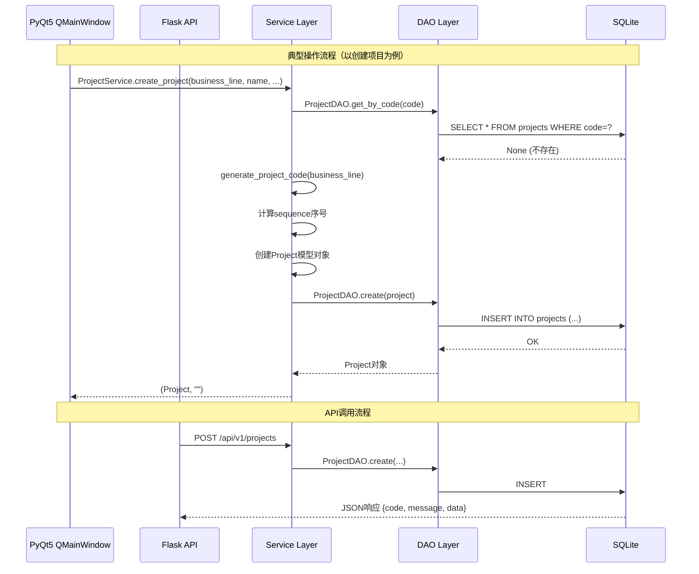
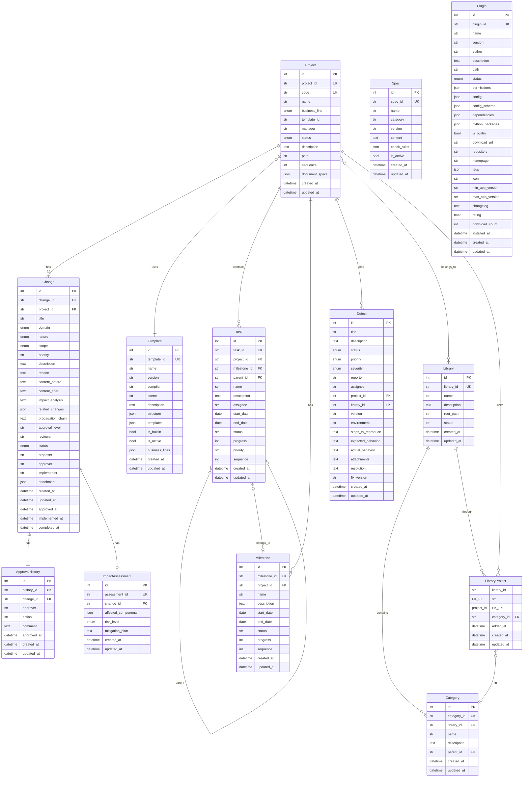

# Python项目管理工具详细设计文档

## 1. 文档基础信息

| 项目 | 内容 |
|------|------|
| **文档标题** | Python项目管理工具详细设计文档 |
| **文档版本** | DES V2.8.0 |
| **编制日期** | 2026-06-14 |
| **编制人** | 技术负责人 |
| **审核人** | 技术负责人 |
| **对应项目** | SW-2026-004 Python项目管理工具 |

## 2. 设计概述

### 2.1 设计目标

- 实现Python项目管理工具的全功能体系：项目管理、模板管理、插件管理、规范中心、变更管理、进度管理、报告中心、总库管理
- 采用分层架构，确保系统模块化、可扩展、可维护
- 同时提供PyQt5桌面GUI和Flask REST API两种交互方式
- 本机单用户工具定位，无登录界面（桌面版），API端提供JWT认证

### 2.2 设计原则

- **模块化设计**：按业务领域划分独立模块，降低耦合度
- **分层架构**：表现层 → 服务层 → 数据访问层 → 数据模型层
- **接口驱动**：Service层定义清晰的静态方法接口，GUI和API均通过Service层调用
- **可扩展性**：插件系统支持动态加载，模板系统支持JSON定义
- **数据安全**：SQLite本地数据库，参数化查询防注入，敏感信息不入库

### 2.3 技术栈

| 层级 | 技术选型 |
|------|----------|
| 桌面GUI | PyQt5 (QMainWindow + QTabWidget) |
| Web API | Flask + Blueprint + JWT认证 |
| ORM | SQLAlchemy (declarative_base) |
| 数据库 | SQLite（本地文件存储） |
| 数据库迁移 | Alembic |
| 测试框架 | PyTest |
| 打包部署 | PyInstaller |

## 3. 系统架构

### 3.1 分层架构图

```
┌─────────────────────────────────────────────────────────┐
│                      表现层                              │
│  ┌───────────────────┐  ┌─────────────────────────────┐ │
│  │  PyQt5 GUI        │  │  Flask REST API             │ │
│  │  (src/ui/)        │  │  (src/api/routes/)          │ │
│  │  9个Tab + 菜单栏   │  │  8个Blueprint + JWT Auth    │ │
│  └────────┬──────────┘  └──────────────┬──────────────┘ │
├───────────┼────────────────────────────┼────────────────┤
│           │         服务层              │                │
│  ┌────────┴────────────────────────────┴──────────────┐ │
│  │  ProjectService  TemplateService  ChangeService    │ │
│  │  LibraryService  SpecService      CheckService     │ │
│  │  PluginService   DefectService    ReportService     │ │
│  │  ProgressService ExportService    StatisticsService │ │
│  │  ApprovalService ImpactService    NotificationService│ │
│  │  LibraryChangeService  LibraryDashboardService     │ │
│  └────────┬───────────────────────────────────────────┘ │
├───────────┼──────────────────────────────────────────────┤
│           │         数据访问层                            │
│  ┌────────┴───────────────────────────────────────────┐ │
│  │  ProjectDAO  TemplateDAO  ChangeDAO  LibraryDAO    │ │
│  │  SpecDAO     PluginDAO    DefectDAO  ApprovalDAO   │ │
│  │  TaskDAO     MilestoneDAO                          │ │
│  └────────┬───────────────────────────────────────────┘ │
├───────────┼──────────────────────────────────────────────┤
│           │         数据模型层                            │
│  ┌────────┴───────────────────────────────────────────┐ │
│  │  BaseModel → Project/Template/Change/Library/       │ │
│  │  Spec/Plugin/Defect/Task/Milestone/                 │ │
│  │  ApprovalHistory/ImpactAssessment/                  │ │
│  │  LibraryProject/Category                            │ │
│  └────────────────────────────────────────────────────┘ │
└─────────────────────────────────────────────────────────┘
```

### 3.2 目录结构

```
src/
├── api/                    # Flask API
│   ├── app.py              # 应用工厂 (create_app)
│   ├── auth.py             # JWT认证 (login, auth_required, role_required)
│   └── routes/             # Blueprint路由
│       ├── __init__.py
│       ├── projects.py
│       ├── templates.py
│       ├── plugins.py
│       ├── specs.py
│       ├── libraries.py
│       ├── library_changes.py
│       ├── library_dashboard.py
│       └── defects.py
├── core/                   # 核心基础
│   ├── app.py              # 应用启动
│   ├── config.py           # 配置管理
│   ├── constants.py        # 常量/枚举定义
│   ├── container.py        # 依赖注入容器
│   ├── exceptions/         # 异常定义
│   ├── settings.py         # 设置管理
│   ├── spec_manager.py     # 规范管理器
│   └── version.py          # 版本信息
├── dao/                    # 数据访问层
│   ├── database.py         # 数据库连接管理
│   ├── project_dao.py
│   ├── template_dao.py
│   ├── change_dao.py
│   ├── library_dao.py
│   ├── library_change_dao.py
│   ├── library_dependency_dao.py
│   ├── library_version_dao.py
│   ├── spec_dao.py
│   ├── plugin_dao.py
│   ├── defect_dao.py
│   ├── approval_dao.py
│   ├── task_dao.py
│   └── milestone_dao.py
├── models/                 # 数据模型
│   ├── base.py             # BaseModel, Base, SafeJSON
│   ├── project.py
│   ├── template.py
│   ├── change.py
│   ├── library.py          # Library, LibraryProject, Category
│   ├── library_change.py
│   ├── library_dependency.py
│   ├── library_version.py
│   ├── spec.py
│   ├── plugin.py
│   ├── defect.py
│   ├── approval.py
│   ├── impact.py
│   ├── task.py
│   └── milestone.py
├── services/               # 业务服务层
│   ├── project_service.py
│   ├── template_service.py
│   ├── change_service.py
│   ├── change_analytics_service.py
│   ├── library_service.py
│   ├── library_change_service.py
│   ├── library_dashboard_service.py
│   ├── library_dependency_service.py
│   ├── library_spec_service.py
│   ├── library_report_service.py
│   ├── library_version_service.py
│   ├── spec_service.py
│   ├── check_service.py
│   ├── plugin_service.py
│   ├── plugin_market_service.py
│   ├── defect_service.py
│   ├── approval_service.py
│   ├── impact_service.py
│   ├── notification_service.py
│   ├── report_service.py
│   ├── export_service.py
│   ├── progress_service.py
│   ├── statistics_service.py
│   └── build_deploy_service.py
├── plugins/                # 内置插件
│   ├── plc_variable_parser/  # PLC变量解析器
│   ├── code_check/           # 代码检查
│   └── document_generator/   # 文档生成器
├── ui/                     # GUI界面
│   ├── main_window.py
│   ├── dialogs/
│   │   ├── new_project_dialog.py
│   │   └── import_project_dialog.py
│   └── widgets/
│       ├── project_list.py
│       ├── template_manager.py
│       ├── plugin_manager.py
│       ├── spec_center.py
│       ├── change_manager.py
│       ├── progress_manager.py
│       ├── report_center.py
│       ├── plugin_config.py
│       └── library_manager.py
├── utils/                  # 工具类
│   ├── logger.py
│   ├── path_utils.py
│   ├── file_utils.py
│   ├── validators.py
│   ├── cache.py
│   ├── rate_limiter.py
│   └── security/
└── gui/
    └── spec_sync_dialog.py
```

### 3.3 模块交互序列图



## 4. 数据模型设计

### 4.1 ER图



### 4.2 基础模型（BaseModel）

所有数据模型继承自 `BaseModel`（定义于 `src/models/base.py`）：

| 字段名 | 数据类型 | 描述 | 约束 |
|--------|----------|------|------|
| id | Integer | 自增主键 | PRIMARY KEY, AUTO_INCREMENT |
| created_at | DateTime | 创建时间 | DEFAULT NOW |
| updated_at | DateTime | 更新时间 | DEFAULT NOW, ON UPDATE NOW |

BaseModel 提供通用方法：
- `to_dict()`：将模型实例转为字典
- `update_from_dict(data)`：从字典批量更新字段

### 4.3 核心枚举类型（src/core/constants.py）

| 枚举类 | 枚举值 | 使用场景 |
|--------|--------|----------|
| ProjectStatus | ACTIVE, COMPLETED, ARCHIVED | 项目状态 |
| BusinessLine | SINGLE_PLC, FULLLINE_AUTO, SINGLE_ROBOT, UPGRADE_STD, UPPER_STD | 业务线 |
| ChangeStatus | DRAFT, SUBMITTED, APPROVED, REJECTED, IMPLEMENTING, COMPLETED, CANCELLED | 变更状态 |
| Domain | PLC, HMI, ELEC, MECH, SCPT, DOCU, SAFE | 变更技术领域(WHO) |
| Nature | REQ, DEF, OPT, CFG, EMRG | 变更业务性质(WHY) |
| Scope | LOCAL, MODULE, SYSTEM, CROSS, SAFE | 变更影响范围(WHERE) |
| PluginStatus | INSTALLED, ENABLED, DISABLED, ERROR | 插件状态 |
| DefectStatus | OPEN, IN_PROGRESS, FIXED, VERIFIED, CLOSED, REJECTED | 缺陷状态 |
| DefectPriority | HIGH, MEDIUM, LOW | 缺陷优先级 |
| DefectSeverity | BLOCKER, CRITICAL, MAJOR, MINOR, TRIVIAL | 缺陷严重程度 |
| ImpactLevel | LOW, MEDIUM, HIGH, CRITICAL | 影响评估等级 |

### 4.4 Project模型（src/models/project.py）

| 字段名 | 数据类型 | 描述 | 约束 |
|--------|----------|------|------|
| id | Integer | 自增主键 | PK |
| project_id | String(32) | 项目唯一ID (UUID) | UNIQUE, NOT NULL |
| code | String(32) | 项目编号 (业务线缩写+年份+序号) | UNIQUE, NOT NULL |
| name | String(100) | 项目名称 | NOT NULL |
| business_line | Enum(BusinessLine) | 业务线类型 | NOT NULL |
| template_id | String(32) | 关联模板ID | NOT NULL |
| manager | String(50) | 项目负责人 | - |
| status | Enum(ProjectStatus) | 项目状态 | DEFAULT ACTIVE |
| description | Text | 项目描述 | - |
| path | String(500) | 项目本地路径 | NOT NULL |
| sequence | Integer | 当年序号 | NOT NULL |
| document_specs | SafeJSON | 文档规范追踪 | DEFAULT {} |

### 4.5 Template模型（src/models/template.py）

| 字段名 | 数据类型 | 描述 | 约束 |
|--------|----------|------|------|
| id | Integer | 自增主键 | PK |
| template_id | String(32) | 模板ID | UNIQUE, NOT NULL |
| name | String(100) | 模板名称 | NOT NULL |
| version | String(20) | 版本号 | NOT NULL |
| compiler | String(50) | 适用编译器/平台 | - |
| scene | String(100) | 适用场景 | - |
| description | Text | 模板描述 | - |
| structure | JSON | 目录结构定义 | NOT NULL |
| templates | JSON | 模板文件映射 | DEFAULT [] |
| is_builtin | Boolean | 是否内置模板 | DEFAULT False |
| is_active | Boolean | 是否可用 | DEFAULT True |
| business_lines | JSON | 适用业务线 | DEFAULT [] |

### 4.6 Change模型（src/models/change.py）

V2.1.0 版本升级，采用二维分类体系 (Domain×Nature×Scope)。

| 字段名 | 数据类型 | 描述 | 约束 |
|--------|----------|------|------|
| id | Integer | 自增主键 | PK |
| change_id | String(32) | 变更单ID (CHG-[DOMAIN]-[YYYY]-[XXX]) | UNIQUE, NOT NULL |
| project_id | String(32) | 所属项目ID | FK, NOT NULL |
| title | String(200) | 变更标题 | NOT NULL |
| domain | Enum(Domain) | 技术领域(WHO) | NOT NULL |
| nature | Enum(Nature) | 业务性质(WHY) | NOT NULL |
| scope | Enum(Scope) | 影响范围(WHERE) | NOT NULL |
| priority | String(10) | 优先级 P0/P1/P2/P3 | DEFAULT P2 |
| description | Text | 详细描述 | - |
| reason | Text | 变更原因(§4) | - |
| content_before | Text | 变更前状态(§5.1) | - |
| content_after | Text | 变更后状态(§5.2) | - |
| impact_analysis | Text | 影响分析结果(§6) | - |
| related_changes | JSON | 关联变更单ID列表 | DEFAULT [] |
| propagation_chain | Text | 传播链描述(ASCII图+关联编号) | - |
| approval_level | String(30) | 审批层级(自动按scope匹配) | - |
| reviewer | String(50) | 复审人(SYS/CROSS/SAFE时需要) | - |
| status | Enum(ChangeStatus) | 变更状态 | DEFAULT DRAFT |
| proposer | String(50) | 提出人 | - |
| approver | String(50) | 审批人 | - |
| implementer | String(50) | 实施人 | - |
| attachment | JSON | 附件列表 | DEFAULT [] |
| approved_at | DateTime | 审批时间 | - |
| implemented_at | DateTime | 实施时间 | - |
| completed_at | DateTime | 完成时间 | - |

### 4.7 Library模型（src/models/library.py）

| 字段名 | 数据类型 | 描述 | 约束 |
|--------|----------|------|------|
| id | Integer | 自增主键 | PK |
| library_id | String(32) | 总库唯一ID | UNIQUE, NOT NULL |
| name | String(100) | 总库名称 | NOT NULL |
| description | Text | 总库描述 | - |
| root_path | String(500) | 总库根路径 | NOT NULL |
| status | String(20) | 总库状态 | DEFAULT 'active' |

### 4.8 LibraryProject关联模型

| 字段名 | 数据类型 | 描述 | 约束 |
|--------|----------|------|------|
| library_id | String(32) | 总库ID | PK, FK |
| project_id | String(32) | 项目ID | PK, FK |
| category_id | String(32) | 分类ID | FK |
| added_at | DateTime | 添加时间 | - |

### 4.9 Category模型

| 字段名 | 数据类型 | 描述 | 约束 |
|--------|----------|------|------|
| id | Integer | 自增主键 | PK |
| category_id | String(32) | 分类唯一ID | UNIQUE, NOT NULL |
| library_id | String(32) | 所属总库ID | FK, NOT NULL |
| name | String(50) | 分类名称 | NOT NULL |
| description | Text | 分类描述 | - |
| parent_id | String(32) | 父分类ID（自关联） | FK |

### 4.10 Spec模型（src/models/spec.py）

| 字段名 | 数据类型 | 描述 | 约束 |
|--------|----------|------|------|
| id | Integer | 自增主键 | PK |
| spec_id | String(32) | 规范ID | UNIQUE, NOT NULL |
| name | String(100) | 规范名称 | NOT NULL |
| category | String(50) | 规范分类 | NOT NULL |
| version | String(20) | 版本号 | NOT NULL |
| content | Text | 规范内容(Markdown) | - |
| check_rules | JSON | 检查规则列表 | DEFAULT [] |
| is_active | Boolean | 是否启用 | DEFAULT True |

### 4.11 Plugin模型（src/models/plugin.py）

| 字段名 | 数据类型 | 描述 | 约束 |
|--------|----------|------|------|
| id | Integer | 自增主键 | PK |
| plugin_id | String(32) | 插件ID | UNIQUE, NOT NULL |
| name | String(100) | 插件名称 | NOT NULL |
| version | String(20) | 版本号 | NOT NULL |
| author | String(50) | 作者 | - |
| description | Text | 插件描述 | - |
| path | String(500) | 插件安装路径 | NOT NULL |
| status | Enum(PluginStatus) | 插件状态 | DEFAULT INSTALLED |
| permissions | JSON | 权限列表 | DEFAULT [] |
| config | JSON | 插件配置 | DEFAULT {} |
| config_schema | JSON | 配置定义 | DEFAULT {} |
| dependencies | JSON | 依赖插件ID列表 | DEFAULT [] |
| python_packages | JSON | 依赖Python包列表 | DEFAULT [] |
| is_builtin | Boolean | 是否内置 | DEFAULT False |
| download_url | String(500) | 下载地址 | - |
| repository | String(500) | 代码仓库 | - |
| homepage | String(500) | 主页 | - |
| tags | JSON | 标签列表 | DEFAULT [] |
| rating | Float | 评分(0-5) | DEFAULT 0.0 |
| download_count | Integer | 下载次数 | DEFAULT 0 |
| installed_at | DateTime | 安装时间 | - |

### 4.12 Defect模型（src/models/defect.py）

| 字段名 | 数据类型 | 描述 | 约束 |
|--------|----------|------|------|
| id | Integer | 自增主键 | PK |
| title | String(255) | 缺陷标题 | NOT NULL |
| description | Text | 缺陷描述 | NOT NULL |
| status | Enum(DefectStatus) | 缺陷状态 | NOT NULL, DEFAULT OPEN |
| priority | Enum(DefectPriority) | 优先级 | NOT NULL, DEFAULT MEDIUM |
| severity | Enum(DefectSeverity) | 严重程度 | NOT NULL, DEFAULT MAJOR |
| reporter | String(100) | 报告人 | NOT NULL |
| assignee | String(100) | 负责人 | - |
| project_id | Integer | 关联项目ID | FK |
| library_id | Integer | 关联库ID | FK |
| version | String(50) | 版本信息 | - |
| environment | String(255) | 环境信息 | - |
| steps_to_reproduce | Text | 复现步骤 | - |
| expected_behavior | Text | 期望行为 | - |
| actual_behavior | Text | 实际行为 | - |
| attachments | Text | 附件信息 | - |
| resolution | Text | 解决方案 | - |
| fix_version | String(50) | 修复版本 | - |

### 4.13 Task模型（src/models/task.py）

| 字段名 | 数据类型 | 描述 | 约束 |
|--------|----------|------|------|
| id | Integer | 自增主键 | PK |
| task_id | String(32) | 任务ID | UNIQUE, NOT NULL |
| project_id | String(32) | 所属项目ID | FK, NOT NULL |
| milestone_id | String(32) | 所属里程碑ID | FK |
| parent_id | String(32) | 父任务ID（自关联） | FK |
| name | String(100) | 任务名称 | NOT NULL |
| description | Text | 描述 | - |
| assignee | String(50) | 负责人 | - |
| start_date | Date | 开始日期 | - |
| end_date | Date | 结束日期 | - |
| status | String(20) | 状态 | DEFAULT 'pending' |
| progress | Integer | 进度百分比 | DEFAULT 0 |
| priority | String(10) | 优先级 | DEFAULT 'medium' |
| sequence | Integer | 排序序号 | DEFAULT 0 |

### 4.14 Milestone模型（src/models/milestone.py）

| 字段名 | 数据类型 | 描述 | 约束 |
|--------|----------|------|------|
| id | Integer | 自增主键 | PK |
| milestone_id | String(32) | 里程碑ID | UNIQUE, NOT NULL |
| project_id | String(32) | 所属项目ID | FK, NOT NULL |
| name | String(100) | 里程碑名称 | NOT NULL |
| description | Text | 描述 | - |
| start_date | Date | 开始日期 | - |
| end_date | Date | 结束日期 | - |
| status | String(20) | 状态 | DEFAULT 'pending' |
| progress | Integer | 进度百分比 | DEFAULT 0 |
| sequence | Integer | 排序序号 | DEFAULT 0 |

### 4.15 ApprovalHistory模型（src/models/approval.py）

| 字段名 | 数据类型 | 描述 | 约束 |
|--------|----------|------|------|
| id | Integer | 自增主键 | PK |
| history_id | String(32) | 历史记录ID | UNIQUE, NOT NULL |
| change_id | String(32) | 变更单ID | FK, NOT NULL |
| approver | String(50) | 审批人 | NOT NULL |
| action | String(20) | 审批动作 (approve/reject) | NOT NULL |
| comment | Text | 审批意见 | - |
| approved_at | DateTime | 审批时间 | - |

### 4.16 ImpactAssessment模型（src/models/impact.py）

| 字段名 | 数据类型 | 描述 | 约束 |
|--------|----------|------|------|
| id | Integer | 自增主键 | PK |
| assessment_id | String(32) | 评估ID | UNIQUE, NOT NULL |
| change_id | String(32) | 变更单ID | FK, NOT NULL |
| affected_components | JSON | 受影响组件 | DEFAULT [] |
| risk_level | Enum(ImpactLevel) | 风险等级 | DEFAULT LOW |
| mitigation_plan | Text | 缓解措施 | - |

## 5. 核心模块详细设计

### 5.1 项目管理模块 (ProjectService)

**文件**: `src/services/project_service.py`
**类**: `ProjectService` (实例方法，构造函数可选注入 DAO/Config)

#### 公开方法接口

| 方法签名 | 功能描述 | 返回类型 |
|----------|----------|----------|
| `create_project(business_line, name, description, template_id, manager, ...)` | 创建新项目（生成code、创建目录结构） | `tuple[Optional[Project], str]` |
| `get_project(project_id)` | 按project_id获取项目 | `Optional[Project]` |
| `get_project_by_code(code)` | 按项目编号获取项目 | `Optional[Project]` |
| `list_projects(status, business_line, keyword, page, ...)` | 条件查询项目列表 | `tuple[List[Project], int]` |
| `update_project(project_id, data)` | 更新项目信息 | `tuple[Optional[Project], str]` |
| `delete_project(project_id, hard_delete, delete_local_files)` | 删除项目（支持硬删除和本地文件删除） | `tuple[bool, str]` |
| `generate_project_code(business_line)` | 生成项目编号（业务线缩写+年份+序号） | `tuple[Optional[str], str]` |
| `get_statistics()` | 获取全局项目统计 | `dict` |
| `import_project(root_path, name, business_line, template_id, manager, ...)` | 导入已有项目目录 | `tuple[Optional[Project], str]` |
| `scan_and_import_projects(root_path, business_line, template_id)` | 批量扫描并导入项目 | `tuple[List[Project], List[str]]` |
| `change_template(project_id, template_id)` | 切换项目模板 | `tuple[Optional[Project], str]` |

#### 设计要点

- 项目编号生成规则：业务线缩写 + 年份（4位）+ 序号（2位），如 `PLC202601`
- 创建项目时自动按模板 structure 创建目录结构
- document_specs 字段（SafeJSON类型）追踪每个文档对应的规范版本，支持后续规范更新感知

### 5.2 模板管理模块 (TemplateService)

**文件**: `src/services/template_service.py`
**类**: `TemplateService` (静态方法)

#### 公开方法接口

| 方法签名 | 功能描述 | 返回类型 |
|----------|----------|----------|
| `initialize_builtin_templates()` | 初始化内置模板到数据库 | None |
| `get_template(template_id)` | 获取模板详情 | `Optional[Template]` |
| `list_templates(is_active, scene, keyword)` | 条件查询模板列表 | `List[Template]` |
| `create_template(data)` | 创建自定义模板 | `tuple[Optional[Template], str]` |
| `update_template(template_id, data)` | 更新模板 | `tuple[Optional[Template], str]` |
| `delete_template(template_id)` | 删除模板（内置模板不可删） | `tuple[bool, str]` |
| `export_template(template_id)` | 导出模板为JSON字符串 | `tuple[Optional[str], str]` |
| `import_template(json_data)` | 从JSON导入模板 | `tuple[Optional[Template], str]` |
| `validate_template_structure(structure)` | 验证模板目录结构定义 | `tuple[bool, str]` |
| `get_template_types()` | 获取模板类型列表 | `List[Dict]` |

#### 设计要点

- 内置模板定义在 `src/core/constants.py` 的 `DEFAULT_TEMPLATES` 常量中
- template.structure 为 JSON 格式的目录树定义，由 `validate_template_structure` 校验合法性
- 导出/导入支持模板的跨实例共享

### 5.3 变更管理模块 (ChangeService)

**文件**: `src/services/change_service.py`
**类**: `ChangeService` (静态方法，V2.1.0)

#### 公开方法接口

| 方法签名 | 功能描述 | 返回类型 |
|----------|----------|----------|
| `create_change(project_id, title, type, description, reason, impact, proposer, attachment)` | 创建变更单 | `tuple[Optional[Change], str]` |
| `get_change(change_id)` | 获取变更单详情 | `Optional[Change]` |
| `list_changes(project_id, status, domain, nature, scope, page, ...)` | 条件查询变更列表 | `tuple[List[Change], int]` |
| `get_project_changes(project_id, **kwargs)` | 获取项目的变更列表 | `List[Change]` |
| `update_change(change_id, data)` | 更新变更单 | `tuple[Optional[Change], str]` |
| `delete_change(change_id)` | 删除变更单 | `tuple[bool, str]` |
| `submit_change(change_id)` | 提交变更（DRAFT→SUBMITTED） | `tuple[bool, str]` |
| `approve_change(change_id, approver)` | 审批通过（含审批历史记录） | `tuple[bool, str]` |
| `reject_change(change_id, approver, reason)` | 审批驳回 | `tuple[bool, str]` |
| `start_implement(change_id, implementer)` | 开始实施（APPROVED→IMPLEMENTING） | `tuple[bool, str]` |
| `complete_change(change_id)` | 完成变更（IMPLEMENTING→COMPLETED） | `tuple[bool, str]` |
| `cancel_change(change_id)` | 取消变更 | `tuple[bool, str]` |
| `get_statistics(project_id)` | 获取项目4D变更统计（领域/性质/范围/状态维度） | `dict` |
| `export_change(change_id, format)` | 导出变更单（markdown/json） | `tuple[Optional[str], str]` |
| `generate_ledger(project_id, output_path)` | 生成变更台账 | `tuple[Optional[str], str]` |
| `update_ledger(project_id)` | 更新变更台账 | `tuple[Optional[str], str]` |
| `check_propagation_required(change)` | 检查是否需要传播分析 | `bool` |
| `suggest_related_domains(change)` | 建议关联领域 | `List[Domain]` |

#### V2.1.0 变更状态机

```
DRAFT ──submit──→ SUBMITTED ──approve──→ APPROVED ──start_implement──→ IMPLEMENTING ──complete──→ COMPLETED
  │                   │                    │                                │
  └──cancel──→ CANCELLED  └──reject──→ REJECTED                             │
                                                                             └──cancel──→ CANCELLED
```

- `approve_change` 时自动生成 `ApprovalHistory` 记录
- `check_propagation_required` 根据 scope 值判断：SYSTEM/CROSS/SAFE 级别需要传播链分析
- `suggest_related_domains` 根据 domain 建议可能受影响的领域

### 5.4 总库管理模块 (LibraryService)

**文件**: `src/services/library_service.py`
**类**: `LibraryService` (静态方法)

#### 公开方法接口

| 方法签名 | 功能描述 | 返回类型 |
|----------|----------|----------|
| `create_library(name, root_path, description)` | 创建总库 | `tuple[Optional[Library], str]` |
| `get_library(library_id)` | 获取总库详情 | `Optional[Library]` |
| `list_libraries(status, keyword)` | 条件查询总库列表 | `List[Library]` |
| `update_library(library_id, data)` | 更新总库信息 | `tuple[Optional[Library], str]` |
| `delete_library(library_id, hard_delete)` | 删除总库 | `tuple[bool, str]` |
| `add_project_to_library(library_id, project_id, category_id)` | 将项目加入总库 | `tuple[bool, str]` |
| `remove_project_from_library(library_id, project_id)` | 从总库移除项目 | `tuple[bool, str]` |
| `list_library_projects(library_id, category_id, status, keyword, page, ...)` | 查询总库项目列表 | `tuple[List, int]` |
| `get_unassociated_projects(library_id, page, size)` | 获取未关联到总库的项目 | `tuple[List[Project], int]` |
| `create_category(library_id, name, description, parent_id)` | 创建分类 | `tuple[Optional[Category], str]` |
| `list_categories(library_id)` | 获取分类列表 | `List[Category]` |
| `get_library_statistics(library_id)` | 获取总库统计（项目数、分类数、状态分布等） | `dict` |
| `scan_and_import_projects(root_path, library_id, library, ...)` | 批量扫描并导入到总库 | `tuple[List, List[str]]` |
| `initialize_default_library()` | 初始化默认总库 | `tuple[Optional[Library], str]` |

### 5.5 规范管理模块 (SpecService)

**文件**: `src/services/spec_service.py`
**类**: `SpecService` (静态方法)

#### 公开方法接口

| 方法签名 | 功能描述 | 返回类型 |
|----------|----------|----------|
| `initialize_builtin_specs()` | 初始化内置规范到数据库 | None |
| `list_specs(category, keyword, is_active)` | 条件查询规范列表 | `List[Spec]` |
| `get_spec(spec_id)` | 获取规范详情 | `Optional[Spec]` |
| `create_spec(data)` | 创建规范 | `tuple[Optional[Spec], str]` |
| `update_spec(spec_id, data)` | 更新规范 | `tuple[Optional[Spec], str]` |
| `delete_spec(spec_id)` | 删除规范 | `tuple[bool, str]` |
| `get_spec_content(spec_id)` | 获取规范Markdown内容 | `tuple[Optional[str], str]` |
| `get_check_rules(spec_id)` | 获取规范检查规则 | `tuple[Optional[list], str]` |
| `list_categories()` | 获取所有规范分类 | `List[str]` |
| `get_quick_reference(category)` | 获取规范速查手册 | `List[Dict]` |
| `get_project_specs(project_id)` | 获取项目的规范列表 | `List[Spec]` |
| `search(keyword)` | 搜索规范（名称+内容） | `List[Dict]` |
| `check_document_updates(project_id)` | 检查项目文档规范的更新状态 | `dict` |
| `update_project_document(project_id, file_path, spec_id)` | 用最新规范更新项目单个文档 | `tuple[bool, str]` |
| `batch_update_documents(project_id, file_paths)` | 批量更新多个文档 | `tuple[int, int, list]` |

#### 设计要点

- 内置规范定义在 `BUILTIN_SPECS` 列表常量中，含6类：目录结构、文件命名、代码风格、文档规范、Git规范、API规范，以及14个文档模板类规范
- `check_document_updates` 利用 Project.document_specs 字段与 Spec.version 比对，识别可更新的文档
- 支持规范版本漂移检测（major/minor/patch三级）

### 5.6 规范检查模块 (CheckService)

**文件**: `src/services/check_service.py`
**类**: `CheckService`, `CheckResult`

#### 公开方法接口

| 方法签名 | 功能描述 | 返回类型 |
|----------|----------|----------|
| `check_project(project, check_types)` | 对项目执行4类规范检查 | `tuple[Optional[CheckResult], str]` |
| `run_custom_check(project, rules)` | 执行自定义规则检查 | `tuple[Optional[CheckResult], str]` |

#### 4类检查

| 检查类型 | 检查内容 | 来源规范 |
|----------|----------|----------|
| 目录结构检查 | 必需目录是否存在、目录命名是否符合规范 | SPEC-DIR-001 |
| 文件命名检查 | Python/文档/配置文件命名是否符合规范 | SPEC-FILE-001 |
| 代码风格检查 | 编码声明、缩进、行长度等 | SPEC-CODE-001 |
| 文档完整性检查 | 文档标题、变更记录等 | SPEC-DOC-001 |

#### CheckResult 结构

```python
{
    "summary": {
        "total": int,     # 检查项总数
        "passed": int,    # 通过数
        "warnings": int,  # 警告数
        "errors": int,    # 错误数
        "pass_rate": float  # 通过率(%)
    },
    "items": [
        {"level": "pass|warning|error", "rule": str, "message": str, "path": str, "line": int}
    ]
}
```

### 5.7 插件管理模块 (PluginService)

**文件**: `src/services/plugin_service.py`
**类**: `PluginService` (静态方法)

#### 公开方法接口

| 方法签名 | 功能描述 | 返回类型 |
|----------|----------|----------|
| `initialize_builtin_plugins()` | 初始化内置插件 | None |
| `load_plugins()` | 加载所有已安装插件 | None |
| `get_plugin(plugin_id)` | 获取插件信息(字典) | `Optional[dict]` |
| `get_plugin_info(plugin_id)` | 获取插件详细信息 | `Optional[dict]` |
| `list_plugins(status)` | 条件查询插件列表 | `List[Plugin]` |
| `get_plugins()` | 获取所有插件 | `List[Plugin]` |
| `get_installed_plugins()` | 获取已安装的插件 | `List[Plugin]` |
| `update_plugin(plugin_id, new_version, new_path)` | 更新插件版本 | `tuple[bool, str]` |
| `update_plugin_config(plugin_id, config)` | 更新插件配置 | `tuple[bool, str]` |

#### 内置插件

| 插件 | 路径 | 功能 |
|------|------|------|
| PLC变量解析器 | `src/plugins/plc_variable_parser/` | 解析 AutoShop/CodeSys/Work3 变量表 |
| 代码检查 | `src/plugins/code_check/` | 代码规范检查 |
| 文档生成器 | `src/plugins/document_generator/` | 自动生成项目文档 |

## 6. GUI界面设计

### 6.1 主窗口架构

**文件**: `src/ui/main_window.py`
**基类**: `QMainWindow`
**最小尺寸**: 1200×800

#### 菜单栏

| 菜单 | 菜单项 | 快捷键 |
|------|--------|--------|
| 文件 | 新建项目 | Ctrl+N |
| | 导入项目 | - |
| | --- | |
| | 设置 | Ctrl+, |
| | --- | |
| | 退出 | Ctrl+Q |
| 工具 | 规范检查 | F5 |
| | 生成报告 | - |
| 帮助 | 关于 | - |

**特点**：无登录界面——本机单用户工具，启动后直接显示主界面。

### 6.2 9个Tab页面

| Tab序号 | Tab名称 | 对应Widget类 | 核心功能 |
|---------|---------|-------------|----------|
| 1 | 项目管理 | `ProjectListWidget` | 项目列表、新建/编辑/删除/导入、按状态/业务线筛选 |
| 2 | 模板管理 | `TemplateManagerWidget` | 模板列表、新建/编辑/删除、导入/导出、目录预览 |
| 3 | 插件管理 | `PluginManagerWidget` | 插件列表、安装/卸载/启用/禁用、插件市场浏览 |
| 4 | 规范中心 | `SpecCenterWidget` | 规范列表/详情/搜索、规范更新检测、文档更新同步 |
| 5 | 变更管理 | `ChangeManagerWidget` | 变更单列表、新建/编辑/删除、提交/审批/实施/完成、变更台账 |
| 6 | 进度管理 | `ProgressManagerWidget` | 里程碑管理、任务管理、甘特图、进度统计 |
| 7 | 报告中心 | `ReportCenterWidget` | 生成/导出各类报告 |
| 8 | 插件配置 | `PluginConfigWidget` | 已安装插件的配置管理 |
| 9 | 总库管理 | `LibraryManagerWidget` | 总库列表、项目关联、分类管理、仪表盘 |

### 6.3 样式风格

- 字体: Microsoft YaHei, 10pt
- 配色: 淡蓝主题 (#3b82f6 为主色调)
- 背景: #f8fafc（浅灰蓝白）
- 圆角: 4-8px
- 采用 QSS 样式表定义（内置于 `_setup_styles` 方法）

## 7. API接口设计

### 7.1 接口规范

- **基础URL**: `/api/v1`
- **请求格式**: JSON
- **响应格式**: `{"code": int, "message": str, "data": any, "timestamp": str, "request_id": str}`
- **认证方式**: JWT Token（Bearer Authorization头）
- **CORS**: 已启用

### 7.2 路由注册表

**文件**: `src/api/app.py` → `create_app()`

#### 公共路由

| 方法 | 路径 | 功能 | 认证 |
|------|------|------|------|
| POST | `/api/v1/login` | 用户登录，返回JWT token | 否 |
| GET | `/api/v1/health` | 健康检查 | 否 |

#### 项目管理路由 (`src/api/routes/projects.py`)

| 方法 | 路径 | 功能 |
|------|------|------|
| GET | `/api/v1/projects` | 获取项目列表 |
| POST | `/api/v1/projects` | 创建项目 |
| GET | `/api/v1/projects/<project_id>` | 获取项目详情 |
| PUT | `/api/v1/projects/<project_id>` | 更新项目信息 |
| DELETE | `/api/v1/projects/<project_id>` | 删除项目 |
| GET | `/api/v1/projects/statistics` | 获取项目统计 |

#### 模板管理路由 (`src/api/routes/templates.py`)

| 方法 | 路径 | 功能 |
|------|------|------|
| GET | `/api/v1/templates` | 获取模板列表 |
| GET | `/api/v1/templates/<template_id>` | 获取模板详情 |
| POST | `/api/v1/templates` | 创建模板 |
| PUT | `/api/v1/templates/<template_id>` | 更新模板 |
| DELETE | `/api/v1/templates/<template_id>` | 删除模板 |

#### 插件管理路由 (`src/api/routes/plugins.py`)

| 方法 | 路径 | 功能 |
|------|------|------|
| GET | `/api/v1/plugins` | 获取插件列表 |
| GET | `/api/v1/plugins/<plugin_id>` | 获取插件详情 |
| PUT | `/api/v1/plugins/<plugin_id>/config` | 更新插件配置 |

#### 规范管理路由 (`src/api/routes/specs.py`)

| 方法 | 路径 | 功能 |
|------|------|------|
| GET | `/api/v1/specs` | 获取规范列表 |
| GET | `/api/v1/specs/<spec_id>` | 获取规范详情 |
| GET | `/api/v1/specs/<spec_id>/content` | 获取规范内容 |
| POST | `/api/v1/specs` | 创建规范 |

#### 总库管理路由 (`src/api/routes/libraries.py`)

| 方法 | 路径 | 功能 |
|------|------|------|
| GET | `/api/v1/libraries` | 获取总库列表 |
| POST | `/api/v1/libraries` | 创建总库 |
| GET | `/api/v1/libraries/<library_id>` | 获取总库详情 |
| PUT | `/api/v1/libraries/<library_id>` | 更新总库信息 |
| DELETE | `/api/v1/libraries/<library_id>` | 删除总库 |
| GET | `/api/v1/libraries/<library_id>/projects` | 获取总库项目列表 |
| GET | `/api/v1/libraries/<library_id>/categories` | 获取总库分类列表 |
| POST | `/api/v1/libraries/<library_id>/categories` | 创建总库分类 |
| GET | `/api/v1/libraries/<library_id>/statistics` | 获取总库统计 |

#### 总库变更路由 (`src/api/routes/library_changes.py`)

| 方法 | 路径 | 功能 |
|------|------|------|
| GET | `/api/v1/library-changes` | 获取总库变更列表 |
| POST | `/api/v1/library-changes` | 创建总库变更 |
| GET | `/api/v1/library-changes/<change_id>` | 获取总库变更详情 |
| PUT | `/api/v1/library-changes/<change_id>` | 更新总库变更 |
| DELETE | `/api/v1/library-changes/<change_id>` | 删除总库变更 |
| GET | `/api/v1/library-changes/statistics` | 获取总库变更统计 |

#### 总库仪表盘路由 (`src/api/routes/library_dashboard.py`)

| 方法 | 路径 | 功能 |
|------|------|------|
| GET | `/api/v1/library-dashboard/<library_id>/overview` | 获取总库概览 |
| GET | `/api/v1/library-dashboard/<library_id>/trends` | 获取总库趋势 |
| GET | `/api/v1/library-dashboard/<library_id>/health` | 获取总库健康评估 |

#### 缺陷管理路由 (`src/api/routes/defects.py`)

| 方法 | 路径 | 功能 |
|------|------|------|
| GET | `/api/v1/defects` | 获取缺陷列表 |
| POST | `/api/v1/defects` | 创建缺陷 |
| GET | `/api/v1/defects/<defect_id>` | 获取缺陷详情 |
| PUT | `/api/v1/defects/<defect_id>` | 更新缺陷信息 |
| DELETE | `/api/v1/defects/<defect_id>` | 删除缺陷 |
| GET | `/api/v1/defects/statistics` | 获取缺陷统计 |
| GET | `/api/v1/defects/project/<project_id>` | 按项目获取缺陷 |
| GET | `/api/v1/defects/library/<library_id>` | 按总库获取缺陷 |

### 7.3 认证机制

**文件**: `src/api/auth.py`

- `login(username, password)`: 验证用户名密码，返回 JWT token
- `auth_required`: 装饰器，验证请求头中的 Bearer Token
- `role_required(role)`: 装饰器，验证用户角色权限

## 8. 数据库设计

### 8.1 数据库信息

- **数据库类型**: SQLite
- **ORM**: SQLAlchemy (declarative_base)
- **迁移工具**: Alembic (`alembic/versions/`)
- **连接管理**: `src/dao/database.py` (session上下文管理器)

### 8.2 核心表结构

#### projects表

| 字段名 | SQLite类型 | 约束 |
|--------|-----------|------|
| id | INTEGER | PRIMARY KEY AUTOINCREMENT |
| project_id | VARCHAR(32) | UNIQUE NOT NULL |
| code | VARCHAR(32) | UNIQUE NOT NULL |
| name | VARCHAR(100) | NOT NULL |
| business_line | VARCHAR(20) | NOT NULL |
| template_id | VARCHAR(32) | NOT NULL |
| manager | VARCHAR(50) | |
| status | VARCHAR(20) | DEFAULT 'active' |
| description | TEXT | |
| path | VARCHAR(500) | NOT NULL |
| sequence | INTEGER | NOT NULL |
| document_specs | JSON | DEFAULT '{}' |
| created_at | DATETIME | DEFAULT CURRENT_TIMESTAMP |
| updated_at | DATETIME | DEFAULT CURRENT_TIMESTAMP |

#### templates表

| 字段名 | SQLite类型 | 约束 |
|--------|-----------|------|
| id | INTEGER | PRIMARY KEY AUTOINCREMENT |
| template_id | VARCHAR(32) | UNIQUE NOT NULL |
| name | VARCHAR(100) | NOT NULL |
| version | VARCHAR(20) | NOT NULL |
| compiler | VARCHAR(50) | |
| scene | VARCHAR(100) | |
| description | TEXT | |
| structure | JSON | NOT NULL |
| templates | JSON | DEFAULT '[]' |
| is_builtin | BOOLEAN | DEFAULT 0 |
| is_active | BOOLEAN | DEFAULT 1 |
| business_lines | JSON | DEFAULT '[]' |
| created_at | DATETIME | DEFAULT CURRENT_TIMESTAMP |
| updated_at | DATETIME | DEFAULT CURRENT_TIMESTAMP |

#### changes表

| 字段名 | SQLite类型 | 约束 |
|--------|-----------|------|
| id | INTEGER | PRIMARY KEY AUTOINCREMENT |
| change_id | VARCHAR(32) | UNIQUE NOT NULL |
| project_id | VARCHAR(32) | NOT NULL, FK→projects.project_id |
| title | VARCHAR(200) | NOT NULL |
| domain | VARCHAR(10) | NOT NULL |
| nature | VARCHAR(10) | NOT NULL |
| scope | VARCHAR(10) | NOT NULL |
| priority | VARCHAR(10) | DEFAULT 'P2' |
| type | VARCHAR(50) | V1.x兼容字段 |
| description | TEXT | |
| reason | TEXT | |
| impact | TEXT | V1.x兼容字段 |
| content_before | TEXT | |
| content_after | TEXT | |
| impact_analysis | TEXT | |
| related_changes | JSON | DEFAULT '[]' |
| propagation_chain | TEXT | |
| approval_level | VARCHAR(30) | |
| reviewer | VARCHAR(50) | |
| status | VARCHAR(20) | DEFAULT 'draft' |
| proposer | VARCHAR(50) | |
| approver | VARCHAR(50) | |
| implementer | VARCHAR(50) | |
| attachment | JSON | DEFAULT '[]' |
| created_at | DATETIME | DEFAULT CURRENT_TIMESTAMP |
| updated_at | DATETIME | |
| approved_at | DATETIME | |
| implemented_at | DATETIME | |
| completed_at | DATETIME | |

#### libraries表

| 字段名 | SQLite类型 | 约束 |
|--------|-----------|------|
| id | INTEGER | PRIMARY KEY AUTOINCREMENT |
| library_id | VARCHAR(32) | UNIQUE NOT NULL |
| name | VARCHAR(100) | NOT NULL |
| description | TEXT | |
| root_path | VARCHAR(500) | NOT NULL |
| status | VARCHAR(20) | DEFAULT 'active' |
| created_at | DATETIME | DEFAULT CURRENT_TIMESTAMP |
| updated_at | DATETIME | DEFAULT CURRENT_TIMESTAMP |

#### library_projects表

| 字段名 | SQLite类型 | 约束 |
|--------|-----------|------|
| library_id | VARCHAR(32) | PK, FK→libraries.library_id |
| project_id | VARCHAR(32) | PK, FK→projects.project_id |
| category_id | VARCHAR(32) | FK→categories.category_id |
| added_at | DATETIME | DEFAULT CURRENT_TIMESTAMP |
| created_at | DATETIME | DEFAULT CURRENT_TIMESTAMP |
| updated_at | DATETIME | DEFAULT CURRENT_TIMESTAMP |

#### categories表

| 字段名 | SQLite类型 | 约束 |
|--------|-----------|------|
| id | INTEGER | PRIMARY KEY AUTOINCREMENT |
| category_id | VARCHAR(32) | UNIQUE NOT NULL |
| library_id | VARCHAR(32) | NOT NULL, FK→libraries.library_id |
| name | VARCHAR(50) | NOT NULL |
| description | TEXT | |
| parent_id | VARCHAR(32) | FK→categories.category_id |
| created_at | DATETIME | DEFAULT CURRENT_TIMESTAMP |
| updated_at | DATETIME | DEFAULT CURRENT_TIMESTAMP |

#### specs表

| 字段名 | SQLite类型 | 约束 |
|--------|-----------|------|
| id | INTEGER | PRIMARY KEY AUTOINCREMENT |
| spec_id | VARCHAR(32) | UNIQUE NOT NULL |
| name | VARCHAR(100) | NOT NULL |
| category | VARCHAR(50) | NOT NULL |
| version | VARCHAR(20) | NOT NULL |
| content | TEXT | |
| check_rules | JSON | DEFAULT '[]' |
| is_active | BOOLEAN | DEFAULT 1 |
| created_at | DATETIME | DEFAULT CURRENT_TIMESTAMP |
| updated_at | DATETIME | DEFAULT CURRENT_TIMESTAMP |

#### plugins表

| 字段名 | SQLite类型 | 约束 |
|--------|-----------|------|
| id | INTEGER | PRIMARY KEY AUTOINCREMENT |
| plugin_id | VARCHAR(32) | UNIQUE NOT NULL |
| name | VARCHAR(100) | NOT NULL |
| version | VARCHAR(20) | NOT NULL |
| author | VARCHAR(50) | |
| description | TEXT | |
| path | VARCHAR(500) | NOT NULL |
| status | VARCHAR(20) | DEFAULT 'installed' |
| permissions | JSON | DEFAULT '[]' |
| config | JSON | DEFAULT '{}' |
| config_schema | JSON | DEFAULT '{}' |
| dependencies | JSON | DEFAULT '[]' |
| python_packages | JSON | DEFAULT '[]' |
| is_builtin | BOOLEAN | DEFAULT 0 |
| download_url | VARCHAR(500) | |
| repository | VARCHAR(500) | |
| homepage | VARCHAR(500) | |
| tags | JSON | DEFAULT '[]' |
| icon | VARCHAR(200) | |
| min_app_version | VARCHAR(20) | |
| max_app_version | VARCHAR(20) | |
| changelog | TEXT | |
| rating | FLOAT | DEFAULT 0.0 |
| download_count | INTEGER | DEFAULT 0 |
| installed_at | DATETIME | |
| created_at | DATETIME | DEFAULT CURRENT_TIMESTAMP |
| updated_at | DATETIME | DEFAULT CURRENT_TIMESTAMP |

#### defects表

| 字段名 | SQLite类型 | 约束 |
|--------|-----------|------|
| id | INTEGER | PRIMARY KEY AUTOINCREMENT |
| title | VARCHAR(255) | NOT NULL |
| description | TEXT | NOT NULL |
| status | VARCHAR(20) | NOT NULL, DEFAULT 'open' |
| priority | VARCHAR(10) | NOT NULL, DEFAULT 'medium' |
| severity | VARCHAR(10) | NOT NULL, DEFAULT 'major' |
| reporter | VARCHAR(100) | NOT NULL |
| assignee | VARCHAR(100) | |
| project_id | INTEGER | FK→projects.id |
| library_id | INTEGER | FK→libraries.id |
| version | VARCHAR(50) | |
| environment | VARCHAR(255) | |
| steps_to_reproduce | TEXT | |
| expected_behavior | TEXT | |
| actual_behavior | TEXT | |
| attachments | TEXT | |
| resolution | TEXT | |
| fix_version | VARCHAR(50) | |
| created_at | DATETIME | DEFAULT CURRENT_TIMESTAMP |
| updated_at | DATETIME | DEFAULT CURRENT_TIMESTAMP |

#### tasks表 / milestones表 / approval_histories表 / impact_assessments表

对应 models 中定义，字段结构参见 §4 数据模型设计。

### 8.3 索引设计

| 表名 | 索引字段 | 索引类型 | 用途 |
|------|----------|----------|------|
| projects | project_id | UNIQUE | 主查询键 |
| projects | code | UNIQUE | 项目编号查询 |
| projects | status | INDEX | 按状态筛选 |
| projects | business_line | INDEX | 按业务线筛选 |
| projects | template_id | INDEX | 按模板关联 |
| templates | template_id | UNIQUE | 主查询键 |
| templates | is_active | INDEX | 活跃模板筛选 |
| changes | change_id | UNIQUE | 主查询键 |
| changes | project_id | INDEX | 按项目关联 |
| changes | status | INDEX | 按状态筛选 |
| changes | domain | INDEX | 按领域筛选 |
| changes | scope | INDEX | 按范围筛选 |
| libraries | library_id | UNIQUE | 主查询键 |
| library_projects | (library_id, project_id) | PK | 关联查询 |
| categories | category_id | UNIQUE | 主查询键 |
| categories | library_id | INDEX | 按总库筛选 |
| specs | spec_id | UNIQUE | 主查询键 |
| specs | category | INDEX | 按分类筛选 |
| plugins | plugin_id | UNIQUE | 主查询键 |
| defects | project_id | INDEX | 按项目关联 |
| defects | status | INDEX | 按状态筛选 |
| approval_histories | change_id | INDEX | 按变更单筛选 |
| tasks | project_id | INDEX | 按项目关联 |
| tasks | milestone_id | INDEX | 按里程碑关联 |
| milestones | project_id | INDEX | 按项目关联 |

## 9. 安全设计

### 9.1 认证与授权

- **桌面版**：无认证，本机单用户工具，直接访问全部功能
- **API版**：JWT Token 认证，登录接口 `/api/v1/login` 返回 token
  - `auth_required` 装饰器验证请求 Authorization 头
  - `role_required` 装饰器验证角色权限
- **密钥管理**：API secret_key 通过 Config 配置，不支持硬编码

### 9.2 数据安全

- **数据库**：本地 SQLite 文件，无网络暴露
- **参数化查询**：使用 SQLAlchemy ORM，内置参数绑定防 SQL 注入
- **SafeJSON类型**：自定义 TypeDecorator 处理 JSON 字段的空字符串和NULL兼容
- **输入验证**：`src/utils/validators.py` 提供统一验证函数
  - `validate_project_name()`: 项目名称验证
  - `validate_business_line()`: 业务线验证
  - `validate_template_id()`: 模板ID验证
  - `validate_library_name()`: 总库名称验证
  - `validate_category_name()`: 分类名称验证

### 9.3 系统安全

- **敏感信息**：密码不在代码中硬编码，通过配置注入
- **日志安全**：日志文件记录关键操作，不含敏感信息
- **异常处理**：Flask 统一错误处理（400/401/403/404/500），避免堆栈泄露
- **Rate Limiter**：`src/utils/rate_limiter.py` 提供请求速率限制

## 10. 性能优化

### 10.1 数据库优化

- SQLAlchemy session 管理：每个DAO操作使用独立的 session 上下文
- 索引覆盖常用查询（project_id, status, business_line, domain等）
- SafeJSON 自定义类型确保 JSON 字段的高效序列化/反序列化

### 10.2 缓存机制

- `src/utils/cache.py` 提供通用缓存能力
- 规范内容缓存：内置规范在首次加载后保留在内存

### 10.3 代码优化

- 延迟导入：大型模块（如 SpecService）采用延迟导入避免循环依赖
- 批量操作：`scan_and_import_projects` 和 `batch_update_documents` 批量处理减少IO
- 分页查询：list方法统一支持 page/page_size 分页

## 11. 部署方式

### 11.1 桌面应用

- **打包工具**: PyInstaller
- **打包脚本**: `scripts/build.py` → `scripts/package.py`
- **入口**: `main.py` → 初始化数据库 → 初始化内置数据 → 启动 QMainWindow
- **交付目录**: `06_交付物/01_可执行文件/`

### 11.2 Web API

- **启动**: `python -m src.api.app` (Flask 开发服务器)
- **环境**: 生产环境建议使用 Gunicorn + Nginx 反向代理
- **配置**: `src/core/config.py` 管理配置项，支持配置文件和命令行参数

### 11.3 数据库迁移

- **工具**: Alembic
- **迁移文件**: `alembic/versions/`
  - `initial_schema.py`: 初始表结构
  - `v21_change_mgmt_upgrade.py`: V2.1.0 变更管理升级（新增 domain/nature/scope 字段）

## 12. 测试设计

### 12.1 测试框架与策略

- **框架**: PyTest
- **测试目录**: `tests/`
- **目标覆盖率**: ≥80%

### 12.2 测试分类

| 测试类型 | 测试目录/文件 | 测试内容 |
|----------|-------------|----------|
| 基础导入测试 | `test_basic_imports.py` | 验证所有核心模块可正确导入 |
| 单位测试 | `tests/unit/test_security.py` | 安全模块独立测试 |
| 服务层测试 | `test_api_service.py`, `test_api_client.py` | API服务端和客户端测试 |
| GUI测试 | `test_main_window.py`, `test_gui.py`, `test_gui_functional.py`, `test_gui_comprehensive.py`, `test_gui_headless.py` | PyQt5 界面功能测试 |
| 规范测试 | `test_spec_center.py`, `test_spec_sync.py`, `test_spec_sync_dialog.py` | 规范中心和同步功能 |
| 变更测试 | `test_change_module.py`, `test_change_approval.py`, `test_change_document.py`, `test_change_impact.py`, `test_change_notification.py`, `test_change_performance.py`, `test_change_statistics.py`, `test_change_document_generation.py` | 变更管理全流程 |
| 审批测试 | `test_approval_history_and_impact.py` | 审批历史和影响评估 |
| 总库测试 | `test_library.py` | 总库管理功能 |
| 插件测试 | `test_plugin_market.py`, `test_plc_parser_plugin.py`, `test_plc_parser_gui.py` | 插件和PLC解析器 |
| 跨机测试 | `test_cross_machine_project_creation.py` | 跨机器项目创建 |

### 12.3 测试套件

- 交付物测试文件位于 `06_交付物/03_测试文件/`
  - `run_full_test_suite.py`: 完整测试套件入口
  - `comprehensive_test_framework.py`: 综合测试框架
  - `auto_test_all.py`: 自动测试全部模块
  - `full_functional_test.py`: 全功能测试

## 13. 其他辅助服务

| 服务类 | 文件 | 功能 |
|--------|------|------|
| ReportService | `src/services/report_service.py` | 报告生成 |
| ExportService | `src/services/export_service.py` | 数据导出 |
| ProgressService | `src/services/progress_service.py` | 进度管理 |
| StatisticsService | `src/services/statistics_service.py` | 统计分析 |
| ApprovalService | `src/services/approval_service.py` | 审批流程 |
| ImpactService | `src/services/impact_service.py` | 影响评估 |
| NotificationService | `src/services/notification_service.py` | 变更通知 |
| ChangeAnalyticsService | `src/services/change_analytics_service.py` | 变更分析 |
| BuildDeployService | `src/services/build_deploy_service.py` | 构建部署 |
| LibraryChangeService | `src/services/library_change_service.py` | 总库变更 |
| LibraryDashboardService | `src/services/library_dashboard_service.py` | 总库仪表盘 |
| LibraryDependencyService | `src/services/library_dependency_service.py` | 总库依赖 |
| LibrarySpecService | `src/services/library_spec_service.py` | 总库规范 |
| LibraryReportService | `src/services/library_report_service.py` | 总库报告 |
| LibraryVersionService | `src/services/library_version_service.py` | 总库版本管理 |

---

**文档版本**：DES V2.8.0
**编制日期**：2026-06-14
**编制人**：技术负责人
**审核人**：技术负责人