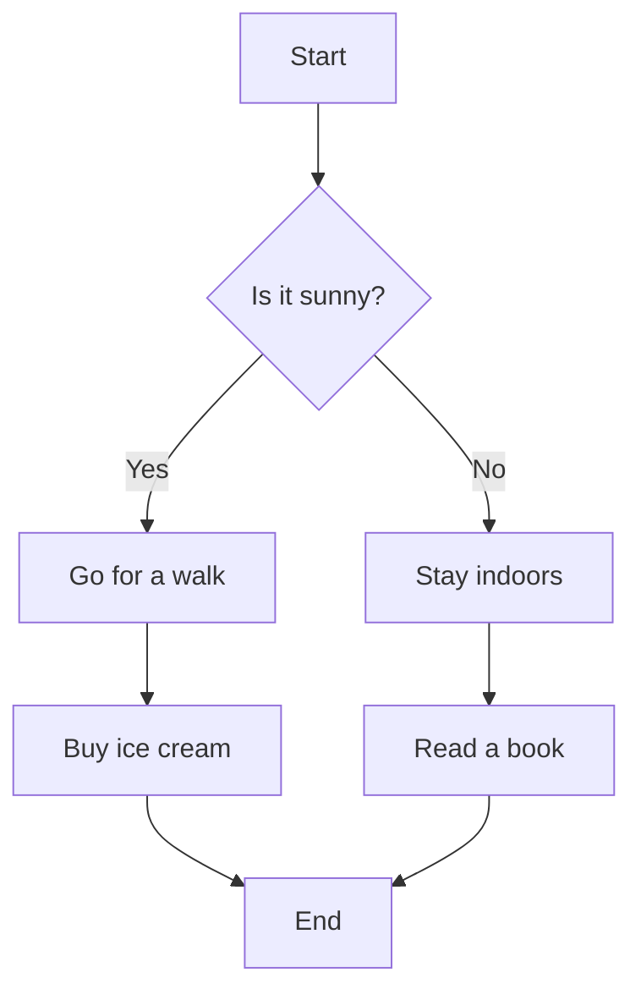

> **[DEPRECATED] 本文档已废弃**
> 废弃原因：Copier 模板自动生成的示例文件，非项目实际文档，无参考价值。
> 废弃日期：2026-06-22
> 替代文档：无（此文件可安全删除）

# Architecture

Here are some extra docs. With mermaid diagram support.

```mermaid
graph TD
    A[Start] --> B{Is it sunny?}
    B -->|Yes| C[Go for a walk]
    B -->|No| D[Stay indoors]
    C --> E[Buy ice cream]
    D --> F[Read a book]
    E --> G[End]
    F --> G

```
